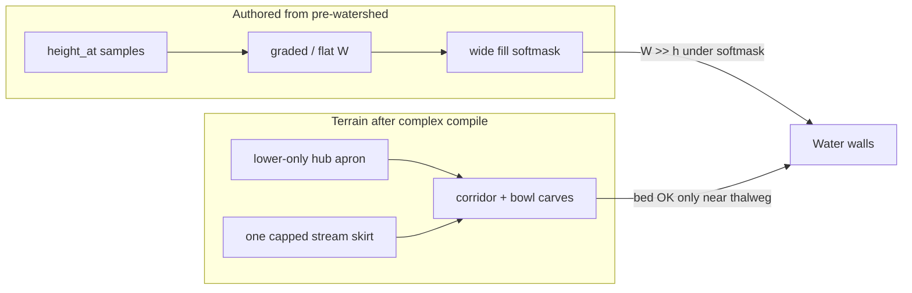

# Pocket Complex Autopsy

**Status:** failed iteration — visual product still unacceptable (`HEAD` = [`b42d3a6`](https://github.com/ramate-io/maybraid/commit/b42d3a676b9ff3d6201bfde09b84938bbb5fb267))  
**Branch:** `l-monninger/marazion-pocket-complex`  
**Spec mood wall:** [RFC-127 §3.1.3.4](https://github.com/ramate-io/maybraid/blob/main/rfc/rfc-000-000-127-marazion-watersheds/README.md#3134-pocket-complex) / milestone [§4.7](https://github.com/ramate-io/maybraid/blob/main/rfc/rfc-000-000-127-marazion-watersheds/README.md#47-pocket-complex)  
**Primary code:** [`pocket_complex.rs`](src/pocket_complex.rs), [`complex.rs`](src/complex.rs), stream/lake build helpers, Durham `band_macro` / debug occupancy

This note is a postmortem of the Pocket Complex construction attempts on this branch: what we tried, what actually broke, and why the current scene still reads as **water walls** rather than mixed pocket hydrology.

---

## 1. Verdict

We do **not** yet have a Pocket Complex. We have a **hub-and-spoke collage of solo Lake/Stream primitives** glued through `WatershedDepressionComplex`, with apron/rim policy repeatedly rewritten to chase elevation artifacts.

Each “fix” treated a **symptom in the heightfield** (pillars, missing skirts) while leaving the **water/terrain contract** broken:

> Water \(W\) and wet softmasks are authored from **pre-watershed** grades and liberal fill ribbons; terrain carves / aprons are then **patched** so they no longer explode. The result is tall wet columns against uncarved or only-weakly-modified banks — i.e. **water walls**.

Unit tests that check “max rise &lt; N meters” or “toe \(W\) ≈ hub \(W\)” can pass while the playground still looks catastrophic, because they never assert **bank freeboard under the fill softmask** or **shore continuity between hub pool and inflow grades**.

---

## 2. Intended product (RFC)

RFC-127 §3.1.3.4 asks for a **deterministic composition inside one pocket cell**:

1. Optional lake (or at least a lake-centroid **hub**).
2. Bounded streams with far endpoints, hysteresis spines, mouth on hub/shore.
3. Optional bog with attenuation near channels / lake interior.
4. Stable order + overlap policy: min floors, max skirts, **bounded rim uplift**, monotone drainage, no uphill mouths.

Done when (§4.7): composition order and overlap policy produce mixed hydrology **without breaking monotonicity or double-carving invariants**.

What we shipped instead oscillated between graph decoration and hub-spoke reuse of solo stamps, without a dedicated overlap / freeboard / rim budget for the *composition*.

---

## 3. Commit timeline (this branch + prerequisites)

| Commit | What it introduced | Relevance |
|--------|-------------------|-----------|
| [`e0affa3`](https://github.com/ramate-io/maybraid/commit/e0affa3af878d818176dfc6b583a49e0480e18b0) | Stream stamps + graded water fill | Fill softmask + graded \(W\) become first-class |
| [`836d9f0`](https://github.com/ramate-io/maybraid/commit/836d9f00ae71ade88eb663807d85c3eb772d3318) | Carve channel a freeboard below \(W\) | Correct for **solo** streams; complexes inherit it per edge |
| [`b5d4bc6`](https://github.com/ramate-io/maybraid/commit/b5d4bc617cb4370f328873c52152a748fb202c9d) | Lake rim from **ring median** shelf survey | Solo lakes resist centroid spikes; complexes later **bypassed** this with forced hub \(W\) |
| [`8b0e4d7`](https://github.com/ramate-io/maybraid/commit/8b0e4d7d956167a03bf9bf1479ec019883643b1e) / [`384ccc7`](https://github.com/ramate-io/maybraid/commit/384ccc76637a683a876f4652614686446d0deec0) | “Convincing” add-only rim height (defaults eventually **15–120 m**) on lake + stream aprons | Pillar ammunition once multiple aprons coexist |
| [`8511d15`](https://github.com/ramate-io/maybraid/commit/8511d1521575d130b95ed4ca2ae1b0e6fcdeadf7) | `WatershedDepressionComplex` unify | Necessary graph/compile substrate; also the place multi-apron emit became easy to abuse |
| [`ee30c38`](https://github.com/ramate-io/maybraid/commit/ee30c382f6b457e8b3955f5d40dc1c002e156783) | Plans realize complexes; defer leaf compile | Durham pulls compiled modulations/fills from plans |
| [`956ac70`](https://github.com/ramate-io/maybraid/commit/956ac7029880efa36f3e5a1621defb87060e828f) | Bog = lake bowl + basin backfill | Add-only basin mounds; later dropped inside complexes as “pillars” |
| [`3aa117b`](https://github.com/ramate-io/maybraid/commit/3aa117b028ddecca401513ad32de9dea22c6775d) | **v1 Pocket Complex:** `HysteresisGraph` → corridors + lake/bog node decoration | First end-to-end complex; multi-apron by construction |
| [`1537c82`](https://github.com/ramate-io/maybraid/commit/1537c820f66df6f802c51a7503536d48db73fa16) | **v1.1:** apronless cores + **one** muted `StreamRaiseOnly` | Treated pillars as “too many aprons”; discarded hub plateau |
| [`b42d3a6`](https://github.com/ramate-io/maybraid/commit/b42d3a676b9ff3d6201bfde09b84938bbb5fb267) | **v2:** hub-spoke rewrite + grade-explosion fix + lower-only hub / capped skirt | Current code; pillars mostly gone; **water walls dominate** |

Uncommitted / in-commit dialogue on this branch also includes a temporary “complex-only” Durham occupancy (`complex_frac = 1` on both bands) so every leaf is a complex — that maximizes visual damage and dual-band stacking while debugging.

---

## 4. Construction epochs

### Epoch A — Graph decoration ([`3aa117b`](https://github.com/ramate-io/maybraid/commit/3aa117b028ddecca401513ad32de9dea22c6775d))

**Idea:** Walk a degree-2..4 `HysteresisGraph`, collapse chains to stream corridors, decorate a subset of nodes as lake/bog, emit one `WatershedDepressionComplex`.

**What went wrong:**

- Each corridor/lake brought its own **apron shelf** with default add-only rim noise (amp up to ~120 m from the “convincing rim” era).
- Compile order is `aprons → carves → backfills`. Multiple `StreamRaiseOnly` / `LakeFlatten` shelves with `+|noise|` stacked into **needle pillars**.
- Graph topology did not match the RFC mood (hub at lake centroid + inflows); it optimized for “reuse `HysteresisGraph`” over hydrology motif.

### Epoch B — Single muted apron ([`1537c82`](https://github.com/ramate-io/maybraid/commit/1537c820f66df6f802c51a7503536d48db73fa16))

**Idea:** Split core vs apron builders; complexes emit **apronless** wet cores + **one** muted stream apron on a primary spine; scale graph knobs by leaf short-half.

**What went wrong:**

- Pillars reduced but **rimming disappeared** — the hub lake/bog apron was discarded (`into_depression` / `into_depression_parts`), so there was no plateau shelf.
- Remaining muted stream skirt (rim amp ~1.5–4 m) was easy to miss against dual-band macro relief.
- Root cause of the worst spikes was **not yet identified** (see Epoch C).

### Epoch C — Hub-spoke + explosion fix ([`b42d3a6`](https://github.com/ramate-io/maybraid/commit/b42d3a676b9ff3d6201bfde09b84938bbb5fb267))

**Idea:** Match RFC hub: `Lake::planned_center` basin + 1–3 uphill degree-1 inflows; restore hub apron; collapse degenerate spine vertices; harden jersey node-pitch math; lower-only hub flatten; one raise-capped stream skirt.

**What improved:**

- Confirmed smoking gun for “crazy pillars”: hysteresis spines emit **zero-length segments**; with `node_blend > 0`, pitch ≈ \(\Delta W / 10^{-6}\) → grades on the order of **\(10^7\) m**, then `RaiseOnly` stamped them. Probe on canyon-like heightfields hit ~15e6 m rise before the jersey fix.
- Degenerate vertex collapse + zero pitch on short segments stops that class of explosion.
- Lower-only hub + single capped skirt stops **stacked canyon-fill** from absolute `LakeFlatten` / uncapped `RaiseOnly`.

**What is still bad (current complaint): water walls.**

---

## 5. Failure mode catalog

### 5.1 Pillars (mostly explained)

| Mechanism | Where | Status |
|-----------|--------|--------|
| Add-only rim height 15–120 m on each apron | `WatershedApronParams` defaults; `LakeFlatten` / `StreamRaiseOnly` | Mitigated in complexes by zeroing rim-height amp |
| Stacked raise-only / flatten shelves | Multi-apron emit in Epoch A | Mitigated by fewer aprons + caps |
| Bog basin backfill (`add_only` mounds) | `Bog::into_depression_parts` | Skipped in complex path |
| **Zero-length spine × node_blend pitch** | `grade_along_polyline` / hysteresis | Fixed in jersey + path collapse ([`b42d3a6`](https://github.com/ramate-io/maybraid/commit/b42d3a676b9ff3d6201bfde09b84938bbb5fb267)) |

### 5.2 Missing apron / rim (Epoch B side effect)

Dropping the hub `LakeFlatten` while muting the only stream skirt produced “no rimming.” Restoring hub apron without a coherent **raise policy** then reintroduced fill/raise conflict (Epoch C’s lower-only compromise).

### 5.3 Water walls (current dominant failure)

“Water wall” here means: a **tall wet column** or **vertical water/terrain interface** that reads as a cliff of water, not a shoreline.

Likely cooperating causes in the **current** hub-spoke design:

1. **Fill ribbon ≫ carve ribbon**  
   Stream fills use `fill_half_width_scale` (default ~1.55) plus `shore_fade` and `fill_undercut` (~2.75). Wet-column gate: \(W > h - u\). Terrain may only be depression-carved near `half_width`, while water still claims a wider stadium. Where banks were not raised to \(W\) (hub is **lower-only**; only one inflow has a **capped** skirt), \(W\) sits meters above \(h\) → tall water.

2. **Graded inflow \(W\) from pre-watershed heads**  
   `node_water_levels` samples `height_at - sink` along the path, then `pin_toe_to_hub` forces the toe to hub \(W\). Heads remain high. The graded surface therefore climbs with the far ridge. Liberal fill around that grade paints high \(W\) across side slopes that were never carved to freeboard.

3. **Hub \(W\) pinned from a single centroid sample**  
   Complexes force `hub_w = height(hub) - sink` into `Lake::at_center(..., Some(hub_w))`, skipping the ring-median shelf survey that made solo lakes sane ([`b5d4bc6`](https://github.com/ramate-io/maybraid/commit/b5d4bc617cb4370f328873c52152a748fb202c9d)). A local high/low at the hub desynchronizes pool \(W\) from the surrounding shelf the apron is trying (and now mostly failing) to express.

4. **Lower-only hub apron cannot build a shelf under water**  
   Lower-only `LakeFlatten` cuts highs down to `rim_level` but **refuses to fill lows**. Water remains a flat half-space at hub \(W\). Any low patch inside the fill disc becomes a deep pool; any high bank left standing beside a wide fill becomes a wall. Solo lakes relied on absolute flatten (raise lows + cut highs) — we disabled the raise half to stop pillars, and thereby disabled the shelf that makes shorelines read.

5. **Dual-band complex-only debug**  
   Both low- and high-pass bands at `complex_frac = 1` stack independent hubs/fills on the same landscape. Even “correct” single-leaf water can look like layered walls when two bands disagree on \(W\) and footprints.

6. **Multiple graded fills into one hub**  
   Each inflow edge still emits its own `WaterFill` with its own graded surface. Overlap policy for **fills** is not the RFC’s careful min/max composition — it is “all fills exist; meshing sees whatever the lattice does with overlapping half-spaces.” Conflicting \(W\) near the shore attach point produces discontinuous free surfaces that mesh as slabs/walls.

---

## 6. Why the iteration loop kept failing

1. **Optimized for elevation probes, not shore contracts.**  
   Tests like `apron_overlap_does_not_pillar` / `rough_relief_does_not_explode_grades` bound **terrain rise**. They do not sample “for every wet softmask point, \(h \le W - \varepsilon\)” or “shore SDF band has gentle \(\nabla h\)”.

2. **Treated solo stamps as composable atoms.**  
   Lake/stream/bog were tuned as **sole occupants** of a leaf ([`8511d15`](https://github.com/ramate-io/maybraid/commit/8511d1521575d130b95ed4ca2ae1b0e6fcdeadf7) onward). Their apron noise, fill undercut, and absolute flatten assume they own the shelf. Multiplying them inside one cell without a **composition budget** (one rim field, one wet union, one \(W\) field) recreates solo assumptions at overlaps.

3. **Symptom chasing inverted apron policy.**  
   - Too much raise → pillars → strip aprons → no rim.  
   - Restore apron → pillars/canyon fill → lower-only + caps → no shelf under water → walls.  
   Each step was locally rational and globally incoherent.

4. **Debug occupancy lied about density.**  
   Complex-only dual-band packing made every failure mode omnipresent, which is good for finding bugs and bad for judging whether a single motif is almost right.

5. **RFC step 8 (final invariants) was never implemented.**  
   No pass enforces bounded rim uplift, monotone mouths, or overlap attenuation for bog/streams. We stopped at “emit a graph of depressions.”

---

## 7. What is actually true in code today (`b42d3a6`)

- Hub: lake or bog via `at_center` + forced \(W\), `basin_scale ~ 0.3`.
- Inflows: uphill far endpoints → shore attach → hysteresis path → pin toe to hub \(W\) → collapse degenerates → apronless corridor cores.
- Aprons: hub `LakeFlatten` **lower_only**, rim-height amp 0; **one** `StreamRaiseOnly` on longest inflow with raise cap ~6 m, rim-height amp 0.
- Bog basin backfill: omitted in complex path.
- Durham: complex-preferred / complex-only debug paths still in play on this branch’s configs.

This is a reasonable **anti-pillar** configuration. It is a poor **shoreline** configuration.

---

## 8. Recommended direction (for whoever picks this up)

Not a patch list — design constraints the next attempt must satisfy:

1. **One wet field per complex.** Union wet cores; author a single \(W(x,z)\) (flat hub + graded corridors with shared toe) before fill meshing. Do not emit N independent `WaterFill`s that disagree at overlaps.

2. **Fill ⊆ carved freeboard.** Either shrink fill softmask to the carve, or carve (and skirt) every wet column to \(W - \mathrm{freeboard}\) before fill. Water walls are almost always “wet without a bed.”

3. **Shelf survey for hub \(W\)/rim**, not a single centroid sample — reuse [`b5d4bc6`](https://github.com/ramate-io/maybraid/commit/b5d4bc617cb4370f328873c52152a748fb202c9d) semantics, then pin stream toes to that shelf.

4. **One rim field with a hard uplift budget** (RFC step 8), applied once after carves — not per-edge add-only noise from solo defaults ([`8b0e4d7`](https://github.com/ramate-io/maybraid/commit/8b0e4d7d956167a03bf9bf1479ec019883643b1e) / [`384ccc7`](https://github.com/ramate-io/maybraid/commit/384ccc76637a683a876f4652614686446d0deec0)).

5. **Keep the jersey degenerate-segment fix** — that bug is real and will return in solo streams under relief if reverted.

6. **Turn off complex-only dual-band debug** before judging aesthetics; evaluate one band, mixed leaf types, then both bands at production fracs.

7. **Add contract tests:** grid-sample fill softmasks and assert bed freeboard; assert max \(|W_{\mathrm{stream}} - W_{\mathrm{hub}}|\) near shore attach; assert max terrain rise **and** max \(W - h\) under wet mask.

---

## 9. Bottom line

Pocket Complex failed so far because we **composed solo hydrology stamps** and then **fought their elevation side effects**, instead of implementing the RFC’s **composition pass** (one hub shelf, ordered streams, bounded rim, fill/carve contract).

- Epoch A: multi-apron pillars.  
- Epoch B: mute aprons → no rim.  
- Epoch C: stop grade explosions and canyon pillars → **water walls** from wide graded fills against a lower-only / under-skirted terrain.

The next attempt should start from the **water/terrain contract**, not from another apron amplitude tweak.
