# Maybraid Storyboard

Maybraid is a fantasy sci-fi game set in a vast (procedurally-generated) universe. The game leans on themes of the arcane and mystic--while placing them in a retro-futuristic setting. The particular kind of retro-futurism in which it indulges echoes forms from the deep human past into the future replete with many forms of life and culture.

The name, Maybraid, comes from the intended peer-to-peer multiplayer which allows game state to drift and then be resolved--i.e., it may be braided back into one universe. 

While the game is sci-fi, it will not feature space exploration in initial releases. It will be terrestrial, though flying machines will be included. 

## Inspiration

The Maybraid universe draws particular inspiration from the _Star Wars_ and _Avatar the Last Airbender_ franchises. In particular, its themes and aesthetics are meant to echo the following features of both franchises:

- The sense of nomadism
- The use of a mystic energy system
- The many layers and modes of society and development
- The density, variety, and largess of the mystical, technological, and cultural
- The balance between light and heavy moods.

### [_Star Wars_: Jedi Temple](https://lumiere-a.akamaihd.net/v1/images/coruscant-main_d2fad5f2.jpeg?region=558%2C0%2C804%2C804)

> The ancient Jedi Temple rises above Coruscant's dense cityscape--layer upon layer of old mysticism set against sprawling urban strata. That juxtaposition echoes the retro-futurist blend Maybraid aims for: deep past forms carried forward into a teeming world of the technological future.
>
> — [_Jedi Temple_](https://www.starwars.com/databank/jedi-temple), *Star Wars* Databank (Lucasfilm Ltd.)

### [_Avatar: The Last Airbender_: Southern Air Temple](https://i.redd.it/gkbik1bs3d551.jpg)

> The Southern Air Temple sits high above the clouds--a monastic refuge of stone terraces, pagoda spires, and quiet mountain paths. Not every place in Maybraid is meant to be dense or overbearingly technological; secluded monastic areas are a pronounced feature of the world.
>
> — [_Southern Air Temple_](https://avatar.fandom.com/wiki/Southern_Air_Temple), *Avatar* Wiki; [reference image](https://i.redd.it/gkbik1bs3d551.jpg) (Nickelodeon / Viacom)

In fact, many areas of Maybraid will emphasize the natural, the hidden, the aching, and the forlorn--landscapes where grandeur, solitude, and weathered antiquity outweigh technological density.

### [Himalayan stupas and prayer flags](https://encrypted-tbn0.gstatic.com/images?q=tbn:ANd9GcRcq4rI_rGfhAO6mGIB-tvCCcNecE9BjvpeiDyYPBGM5A&s=10)

> Ancient stupas and prayer flags at the edge of eroded cliffs and snow-capped peaks--a remote, high-altitude refuge where sacred structures feel carved into the mountain itself.
>
> — [reference image](https://encrypted-tbn0.gstatic.com/images?q=tbn:ANd9GcRcq4rI_rGfhAO6mGIB-tvCCcNecE9BjvpeiDyYPBGM5A&s=10)

### [Agiofaraggo Chapel beneath the cliff](https://encrypted-tbn0.gstatic.com/images?q=tbn:ANd9GcR_-DcyrJyxtztytRlrihWACRLlGTLyuW_d0a3dGr6CDw&s=10)

> A small stone chapel tucked under a sheer rock face far along a canyon trail before it opens to the sea--hidden, solitary, and dwarfed by the landscape around it.
>
> — [reference image](https://encrypted-tbn0.gstatic.com/images?q=tbn:ANd9GcR_-DcyrJyxtztytRlrihWACRLlGTLyuW_d0a3dGr6CDw&s=10)

### ['Iao Valley stream](https://www.wondersofmaui.com/wp-content/uploads/2015/09/iao-needle-stream.jpg)

> Lush valley floor, mist between jagged peaks, and a stream winding over volcanic stone--a sacred, rain-soaked hollow where nature overwhelms any trace of the modern.
>
> — ['Iao Needle Lookout Trail](https://www.wondersofmaui.com/iao-needle/), *Wonders of Maui*; [reference image](https://www.wondersofmaui.com/wp-content/uploads/2015/09/iao-needle-stream.jpg)

### [Winding river valley](https://encrypted-tbn0.gstatic.com/images?q=tbn:ANd9GcTYYnnM2umhqixvJ0BEJIg5sFCEvnvMLcOjdEJc9Cs-1X_-MSkLnkICqJRs&s=10)

> A turquoise river bending through a wide green valley, mountains fading into distant blue--open, aching country that stretches beyond sight.
>
> — [reference image](https://encrypted-tbn0.gstatic.com/images?q=tbn:ANd9GcTYYnnM2umhqixvJ0BEJIg5sFCEvnvMLcOjdEJc9Cs-1X_-MSkLnkICqJRs&s=10)

### [Avenue of the Baobabs](https://www.washingtonpost.com/wp-apps/imrs.php?src=http://img.washingtonpost.com/rf/image_960w/2010-2019/WashingtonPost/2018/06/11/Interactivity/Images/Baobab.jpg&w=1800&h=1800)

> Towering baobabs line a dusty road through open savanna--living monuments with prehistoric silhouettes, their bare trunks and sparse crowns suggesting both endurance and forlorn antiquity.
>
> — [reference image](https://www.washingtonpost.com/wp-apps/imrs.php?src=http://img.washingtonpost.com/rf/image_960w/2010-2019/WashingtonPost/2018/06/11/Interactivity/Images/Baobab.jpg&w=1800&h=1800), *The Washington Post*

### [Osun-Osogbo Sacred Grove](https://encrypted-tbn0.gstatic.com/images?q=tbn:ANd9GcRf8PzxrDakcbWnyuOkKuFGJ4Eo3_M3PtloFJ1xXHi9PQ&s=10)

> Sculpted earthen archways and watchful figures line a path through dense forest--a Yoruba sacred grove where ritual art and jungle have grown together into something hidden, ancient, and quietly alive.
>
> — [_Osun-Osogbo Sacred Grove_](https://whc.unesco.org/en/list/1118/), UNESCO World Heritage Centre; [reference image](https://encrypted-tbn0.gstatic.com/images?q=tbn:ANd9GcRf8PzxrDakcbWnyuOkKuFGJ4Eo3_M3PtloFJ1xXHi9PQ&s=10)

The lines, both of sight and gameplay, will be drawn across landscapes that hide in plain sight--whether beneath the bustle or in the solitude. Amongst these landscapes, the characters will be bright and colorful--collages of cultures and traditions that emerge with distinctiveness.

The distinctive lines and patterns of Kokopelli--zigzags, spirals, suns, and tribal ornament packed into a single dancing silhouette--offer a model for how Maybraid's figures and motifs can carry layered cultural meaning at a glance.

### [Kokopelli](https://encrypted-tbn0.gstatic.com/images?q=tbn:ANd9GcS3cJTvlLuG9BFCnhF-le29X-0_qyfPE5qwSh-9uKumPw&s=10)

> The humpbacked flute player rendered in bold Southwestern graphic style--a nomadic spirit whose body is itself a collage of chevrons, spirals, and symbolic fauna.
>
> — [_Kokopelli_](https://en.wikipedia.org/wiki/Kokopelli), Wikipedia; [reference image](https://encrypted-tbn0.gstatic.com/images?q=tbn:ANd9GcS3cJTvlLuG9BFCnhF-le29X-0_qyfPE5qwSh-9uKumPw&s=10)

About the scenes and characters, there should be a certain childlike whimsy and creativity--not to the point of Nintendo-level cuteness--but evoking a similar wonder, curiosity, and disregard for realism.

### [_Yoshi and the Mysterious Book_](https://cdn.mos.cms.futurecdn.net/VqfThWgNj8XR3UmMyDtGQV-1920-80.jpg)

> A world built from felt, cardboard, and wire--grass painted in soft strokes, fluffy creatures on dandelion stalks, hills that look cut from corrugated paper. Tactile, handmade surfaces that prize wonder over realism.
>
> — [_Yoshi and the Mysterious Book_](https://www.gamesradar.com/games/platformer/new-yoshi-game-on-switch-2-follows-tomodachi-life-down-a-dark-path-gives-fans-the-sort-of-creative-control-nintendo-will-probably-regret/), *GamesRadar+* (Nintendo); [reference image](https://cdn.mos.cms.futurecdn.net/VqfThWgNj8XR3UmMyDtGQV-1920-80.jpg)

### [_LEGO Star Wars: The Skywalker Saga_](https://encrypted-tbn0.gstatic.com/images?q=tbn:ANd9GcSW6Hm_F9W_IL3uRQIBqmAxZjJiGNhq1YqAvClaHxEIzw&s=10)

> A dense neon city street at night--skyscrapers, holograms, and searchlights rendered as plastic bricks. Even Maybraid's most bustling retro-futurist quarters can carry this kind of playful, toy-logic energy rather than grim photorealism.
>
> — [_LEGO Star Wars: The Skywalker Saga_](https://en.wikipedia.org/wiki/Lego_Star_Wars:_The_Skywalker_Saga), Wikipedia (Lucasfilm Ltd. / TT Games); [reference image](https://encrypted-tbn0.gstatic.com/images?q=tbn:ANd9GcSW6Hm_F9W_IL3uRQIBqmAxZjJiGNhq1YqAvClaHxEIzw&s=10)

About the magic itself, there shall be a quietness. The spritely emissions of the arcane, may be bright, colorful, and powerful--but their source is shrouded in a transcendental sense of mystery:

### [_Ori and the Will of the Wisps_](https://encrypted-tbn0.gstatic.com/images?q=tbn:ANd9GcRFGLIKVgcNF0ICKIb21aPj-0JuwrJ9xv7yPM9YO6TBWA&s=10)

> A hidden forest clearing, golden light through the canopy, and a small glowing spirit gathered with unlikely companions around a fragile new life--magic here is luminous but hushed, aching, and intimate rather than spectacular.
>
> — [_Ori and the Will of the Wisps_](https://en.wikipedia.org/wiki/Ori_and_the_Will_of_the_Wisps), Wikipedia (Moon Studios / Xbox Game Studios); [reference image](https://encrypted-tbn0.gstatic.com/images?q=tbn:ANd9GcRFGLIKVgcNF0ICKIb21aPj-0JuwrJ9xv7yPM9YO6TBWA&s=10)

## Lore

About Maybraid is a quiet course of arcane potential--one that flows through the player's character. As the character interacts with the world, they happen upon eddies in the cosmic ether that lend new learnings and abilities. Not only does the player character accumulate abilities, but she also adapts her control over them. To do this, she builds a temple in a paradimension--the aesthetics of which may please or displease a pantheon emerging from deep inside herself. Her learnings accumulate, her abilities morph, her temple grows, and the appearance of her world changes. 

## Plot

Maybraid does not feature a strictly fixed plot. The alliances of characters in the world develop and guide events. Rivalries are not forgotten easily. However, amidst the jawing emerges a theme: a series of elder spirits that attempt to challenge--to trick, to fight, and to manipulate--those who have indulged in the arcane. 

## Gameplay

The player controls a character in first or third person. The character is able to equip items such as clothing and weapons which they find about the world. 

The character may also discover [skill maps](https://www.loom.com/share/ef2066f76fba45988cfdd16ce496b6eb), lending them a parallel realm--their movements over which produce arcane effects. 

Players movements focus heavily on fisticuffs, melee, projectile, and magic combat. 

The character may play in two game modes:

1. **Discover:** a shared open-world exploration mode without bounds. The player is allowed simply to explore and encounter subplots within the world. 
2. **Reliquary:** a capture-the-flag mode set in the open world but with a define objective: capture the artifact from the opponent's reliquary and return it to your own. Designed for fast-paced action. As an optional add-on, reliquary features a wager mode wherein players must wager an item of a certain minimum rarity to enter the match. 

When your character discovers waypoints in **Discover** mode, they may pay a fee to post them as maps for the reliquary mode. 

All items acquired in either mode are stored in the character's active inventory and may be transferred to their secondary inventory. Inventories are shared between modes. 

When a character dies in **Discover** mode, they must drop a random selection of items from their active inventory. This random selection is determined by the rarity of the items and the player's skill development. 

When a character dies in **Reliquary** mode, they drop all the items from their active inventory for the duration of the match. Non-wagered inventory is restored at the end of the match. Each victor may also choose to retain one collected inventory item instead of a wagered item. 

## Aesthetics

[Inspiration](#inspiration) is a great source for aesthetic concepts. However, below, we provide more specific guidance on the aesthetic direction of the game.

### Existing Concepts

The [`assets/existing-aesthetics/`](assets/existing-aesthetics/) folder collects in-engine screenshots from current Maybraid builds. Each image is a bet on how a visual choice supports the intended feel--the natural and forlorn, the whimsical and patterned, the layered and quietly mysterious--rather than a catalog of isolated techniques.

<figure style="margin: 1.5em 0;">
  <a href="assets/existing-aesthetics/a-nice-vista.png">
    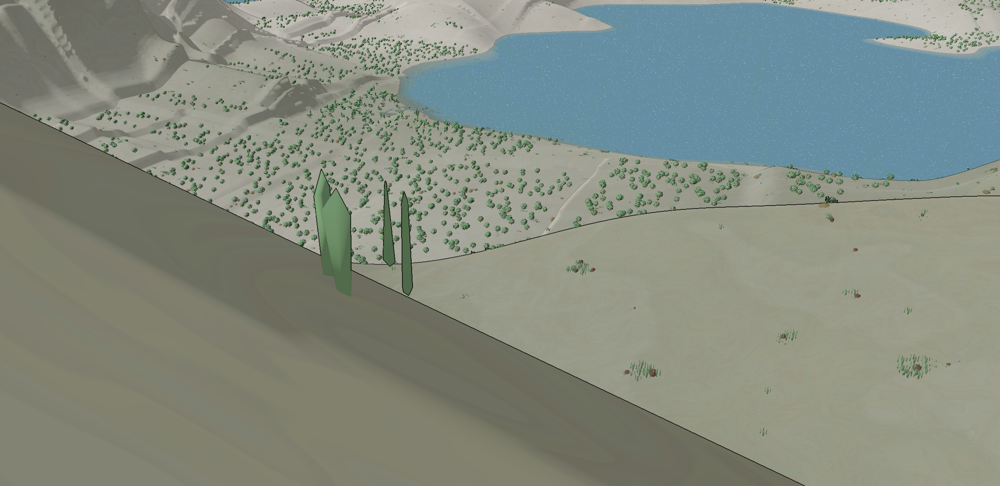
  </a>
  <figcaption style="margin-top: 0.75em;">
    <strong>A nice vista.</strong> A restrained sand–sage–blue palette and wide, uncluttered horizon give open country the aching solitude described in <a href="#inspiration">Inspiration</a>--grand landscape first, technology nowhere in sight. The sharp crystalline trees hint at retro-futurist flora without breaking the quiet.
  </figcaption>
</figure>

<figure style="margin: 1.5em 0;">
  <a href="assets/existing-aesthetics/good-contrast.png">
    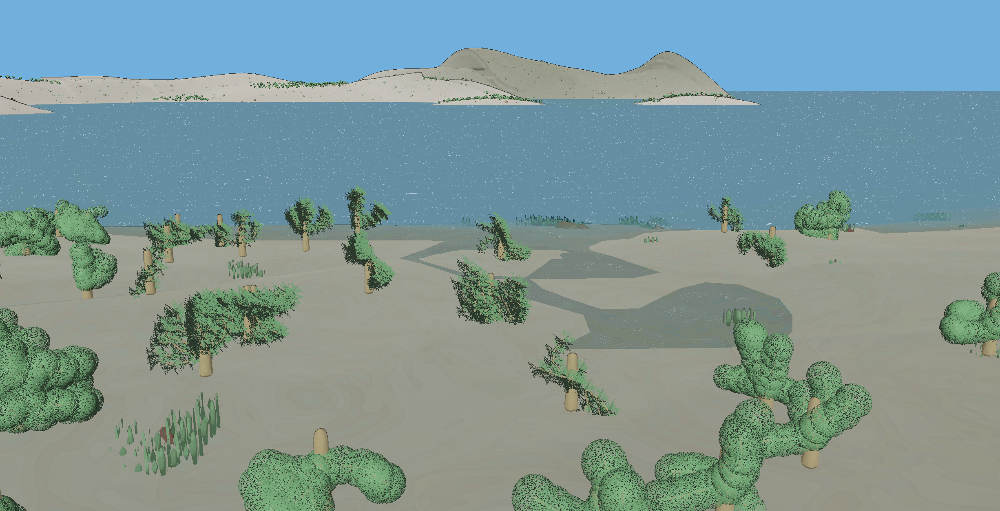
  </a>
  <figcaption style="margin-top: 0.75em;">
    <strong>Good contrast.</strong> Braided cross-hatch canopies, bubbly rounded foliage, and baobab-like silhouettes sit side by side--a small collage of cultural and botanical idioms that reads clearly against flat sand and water. This is the density and variety of form we want in vegetation: distinctive at a glance, like Kokopelli's packed ornament or a grove of unlike trees.
  </figcaption>
</figure>

<figure style="margin: 1.5em 0;">
  <a href="assets/existing-aesthetics/terrain-marbling.png">
    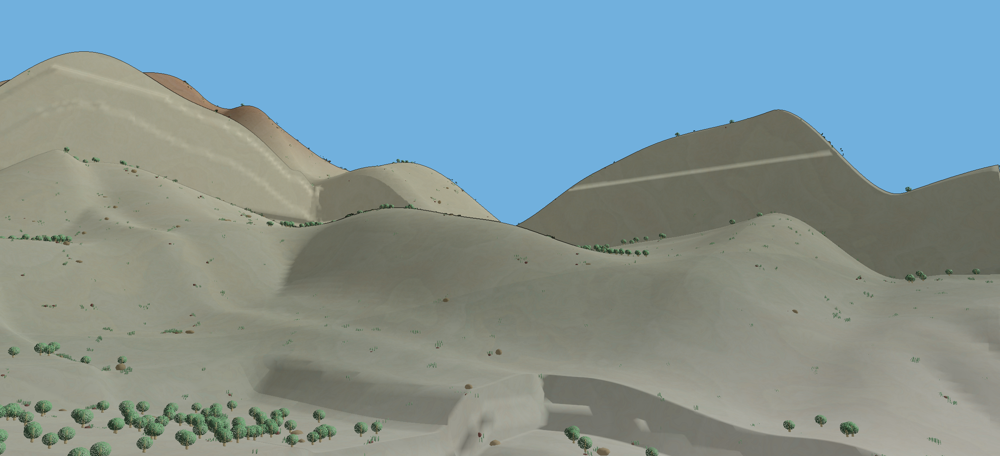
  </a>
  <figcaption style="margin-top: 0.75em;">
    <strong>Terrain marbling.</strong> Subtle horizontal bands on rolling hills suggest geological time and layered history beneath the player's feet--the same retro-futurist impulse as ancient temple strata rising through a dense city, translated into open terrain.
  </figcaption>
</figure>

<figure style="margin: 1.5em 0;">
  <a href="assets/existing-aesthetics/terrain-marbling-red.png">
    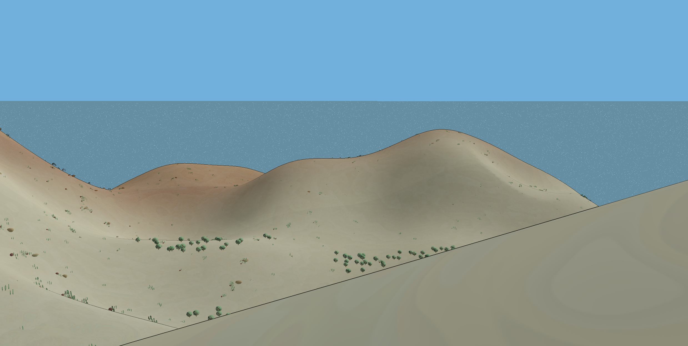
  </a>
  <figcaption style="margin-top: 0.75em;">
    <strong>Terrain marbling (red).</strong> Red earth patches and inked slope edges add accent and illustration to otherwise pale dunes--a touch of forlorn color and graphic line that keeps even barren ground emotionally legible rather than neutral filler.
  </figcaption>
</figure>

<figure style="margin: 1.5em 0;">
  <a href="assets/existing-aesthetics/depth-based-edge-shading.png">
    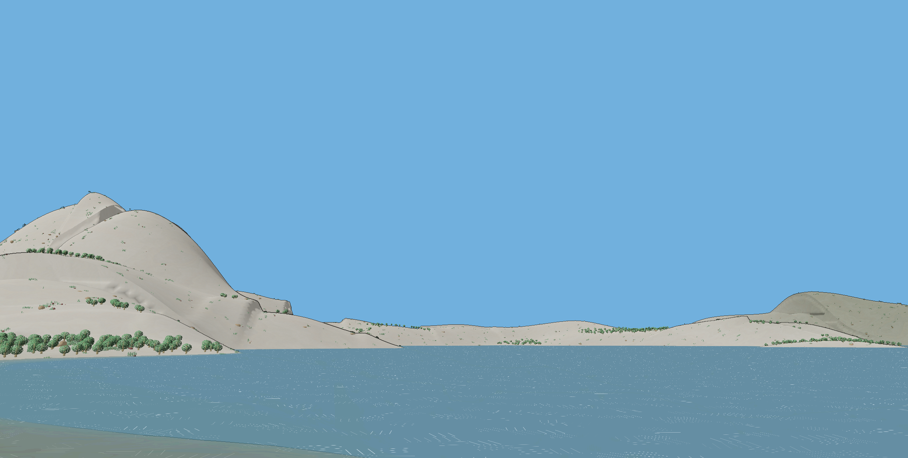
  </a>
  <figcaption style="margin-top: 0.75em;">
    <strong>Depth-based edge shading.</strong> Thin black contours at depth breaks give hills and shoreline a drawn, storybook quality--closer to handcrafted whimsy than photoreal grit, and aligned with the graphic clarity of pattern-heavy reference art.
  </figcaption>
</figure>

<figure style="margin: 1.5em 0;">
  <a href="assets/existing-aesthetics/stylized-water-banding.png">
    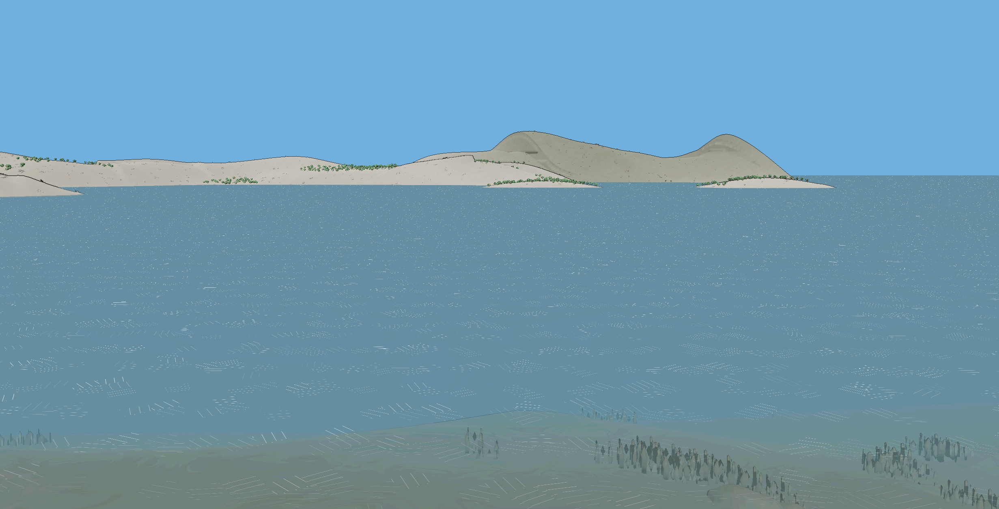
  </a>
  <figcaption style="margin-top: 0.75em;">
    <strong>Stylized water banding.</strong> Hatched ripple lines across a calm grey-blue surface keep water readable at distance without spectacle--magic and atmosphere can live in quiet surface texture rather than flashy effects.
  </figcaption>
</figure>

<figure style="margin: 1.5em 0;">
  <a href="assets/existing-aesthetics/stylized-water-banding-close-up.png">
    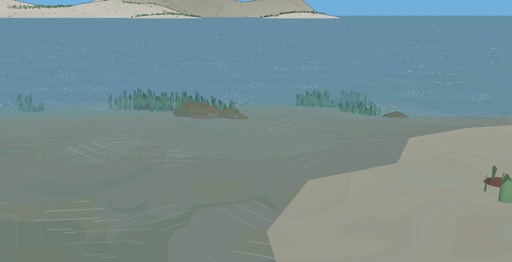
  </a>
  <figcaption style="margin-top: 0.75em;">
    <strong>Stylized water banding (close-up).</strong> Semi-transparent shallows and sandy bottom at the shore make water feel intimate and discoverable--a hidden, tactile zone at the edge of the world, in the spirit of sacred streams and quiet forest pools.
  </figcaption>
</figure>

<figure style="margin: 1.5em 0;">
  <a href="assets/existing-aesthetics/jungle-good-canopy-variagation-poor-softness.png">
    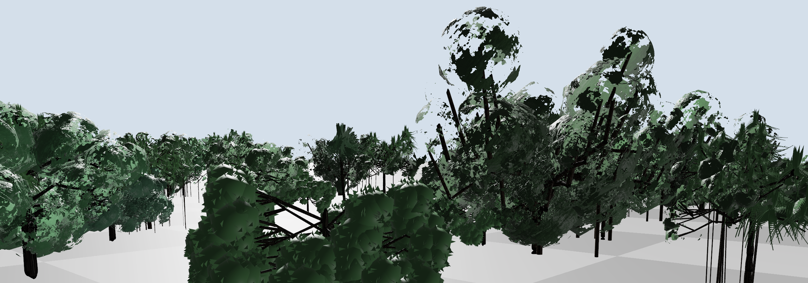
  </a>
  <figcaption style="margin-top: 0.75em;">
    <strong>Jungle: good canopy variation, poor softness.</strong> Varied green canopy clusters begin to evoke a sacred grove's layered density, but the stark black stick trunks are too harsh for the soft, aching mood we want. A useful half-step: the canopy collage works; branch silhouettes still need warmth.
  </figcaption>
</figure>

<figure style="margin: 1.5em 0;">
  <a href="assets/existing-aesthetics/poorly-varied-early-tree.png">
    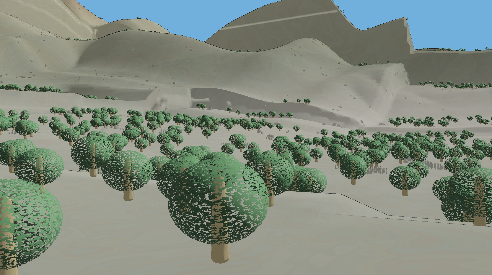
  </a>
  <figcaption style="margin-top: 0.75em;">
    <strong>Poorly varied early tree.</strong> Identical lollipop trees tiled across rolling hills read as procedural filler, not a world of many cultures and forms. Maybraid's landscapes should feel braided from unlike sources--not stamped from one primitive.
  </figcaption>
</figure>

<figure style="margin: 1.5em 0;">
  <a href="assets/existing-aesthetics/poor-shadowing.png">
    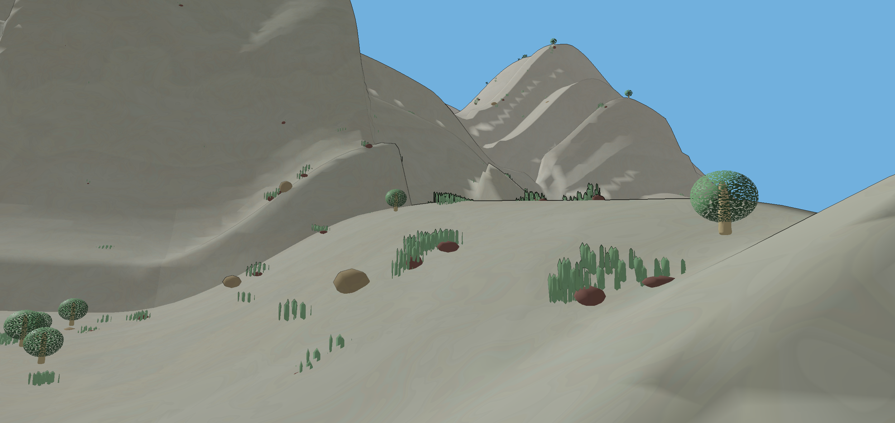
  </a>
  <figcaption style="margin-top: 0.75em;">
    <strong>Poor shadowing.</strong> Flat, directionless light flattens terraced dunes and lollipop trees into the same emotional register--neither the heavy mood of a hidden chapel nor the bright whimsy of a toy-brick city. Light and shadow need to carry the balance between light and heavy moods the game aims for.
  </figcaption>
</figure>

### Intentions

The landscapes and characters of Maybraid are meant to be soft and colorful--but not flat. Surfaces should carry kaleidoscopic pattern and ornament at a local scale, with enough contrast that those patterns stay readable up close without turning harsh at a distance.

### [Soft watercolor trees](https://i.etsystatic.com/16977637/r/il/be59e3/5886528117/il_1080xN.5886528117_hz9m.jpg)

> Wet-on-wet washes, bleeding greens and autumn hints, and spindly inked trunks--a hand-painted register where color stays luminous and edges stay forgiving. Maybraid's foliage and figures should aim for this kind of organic softness rather than hard digital precision.
>
> — [reference image](https://i.etsystatic.com/16977637/r/il/be59e3/5886528117/il_1080xN.5886528117_hz9m.jpg) (Etsy)

### Paint and sketch

The [`assets/paint-and-sketch/`](assets/paint-and-sketch/) folder holds hand-painted and drawn studies--reference for how soft material and busy pattern can coexist. The target is Kokopelli-like density of motif inside a watercolor-like envelope: tessellation, repetition, and cultural collage, but always with crisp local contrast so forms do not melt together.

<figure style="margin: 1.5em 0;">
  <a href="assets/paint-and-sketch/soft-kaledeiscopic-patterns.png">
    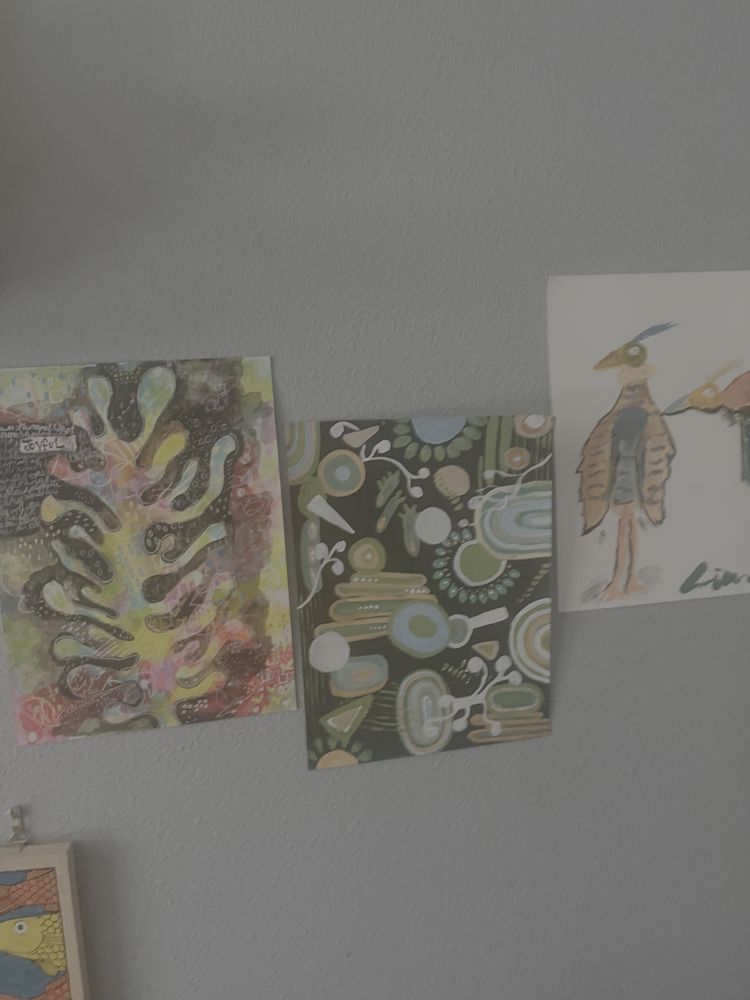
  </a>
  <figcaption style="margin-top: 0.75em;">
    <strong>Soft kaleidoscopic patterns.</strong> Three studies on a studio wall: an abstract panel of interlocking circles, triangles, and vine squiggles on a dark ground; a branching organic form on a loose pink–yellow–green wash marked <em>JOYFUL</em>; and a loose bird sketch with patterned wings. Together they show the intended marriage--soft, painterly grounds and edges, but kaleidoscopic repetition and ornament that stays legible because each motif punches against its neighbor.
  </figcaption>
</figure>

<figure style="margin: 1.5em 0;">
  <a href="assets/paint-and-sketch/good-local-contrast.png">
    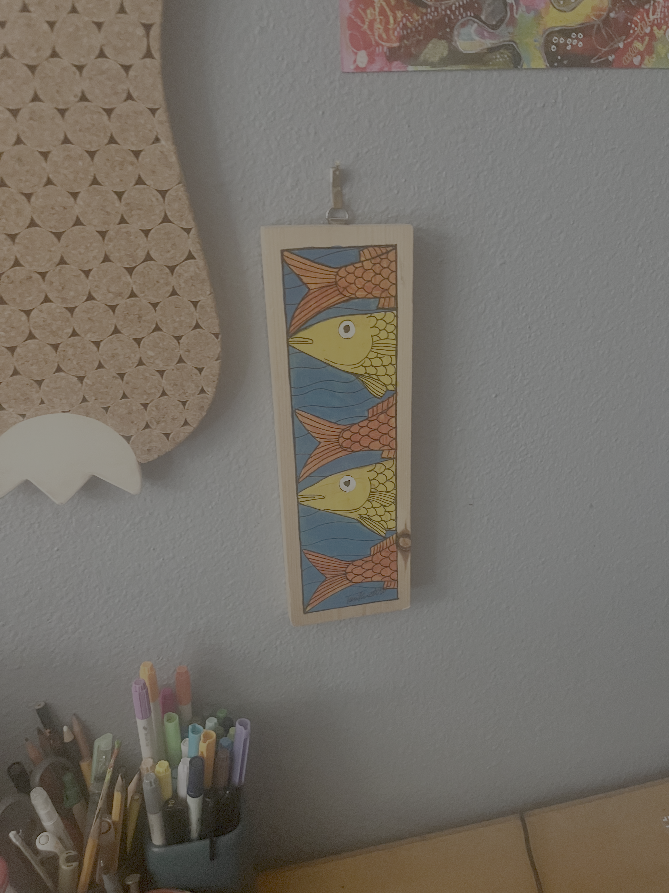
  </a>
  <figcaption style="margin-top: 0.75em;">
    <strong>Good local contrast.</strong> A narrow wooden plaque of interlocking fish--golden yellow and burnt orange on blue water, every scale and ripple outlined in ink. The pattern is dense and tessellation-like, yet each fish reads distinctly because value and line weight shift locally. Maybraid textures (bark, cloth, masonry, arcane filigree) should follow this rule: busy up close, coherent at a glance.
  </figcaption>
</figure>

## Artistic Strategies

### Softened Hues

Softness is not only a property of geometry and edges; it is also a property of color. Highly saturated hues with sharp transitions tend to read as crisp, graphic, or synthetic. By gently compressing saturation, reducing local color contrast, or nudging neighboring hues toward one another, a scene can take on the appearance of pigments bleeding across paper or light scattering through mist.

Importantly, this does not require artists to paint every texture with muted colors. The renderer can perform a great deal of this work after the fact. As part of post-processing—or even integrated into the same passes responsible for blurring—Maybraid can soften hue transitions, slightly desaturate distant colors, blend adjacent color regions, or bias saturated colors toward a common palette. This keeps texture authoring straightforward while allowing the overall world to converge toward a cohesive painterly aesthetic.

Because these adjustments occur after lighting, they also respond naturally to time of day, atmosphere, and depth. A sunset can remain richly colored while still feeling gentle, and distant forests can dissolve into cooler, more unified tones without requiring separate texture sets. Rather than replacing artistic textures, softened hues become another layer of atmosphere that ties disparate assets together.

### [*Dordogne*](https://gameluster.com/wp-content/uploads/2023/06/20230611153623_1.jpg)

> Warm yellows, muted greens, and blue reflections gently merge rather than competing for attention. The palette feels unified because neighboring hues drift toward one another, while distant regions lose chromatic contrast. This softness could be authored directly into textures, but it can also emerge from post-processing that subtly compresses saturation and blends colors as part of the final image.
>
> — [*Dordogne*](https://en.wikipedia.org/wiki/Dordogne_%28video_game%29), Wikipedia (Unfold Games); [reference image](https://gameluster.com/wp-content/uploads/2023/06/20230611153623_1.jpg) (*Game Luster*)

### Blurring

Maybraid will likely rely on blurring at various distances and intensities to create a softness to the deep world. While some of the overall blurred effect will depend on textures and base geometry, a great deal of the effect can be achieved simply in post-processing.

### [_Dordogne_](https://gameluster.com/wp-content/uploads/2023/06/20230611153623_1.jpg)

> A canoe on sunlit river water, valley foliage dissolving into wet-on-wet washes, and a god-ray bloom that feathers tree edges into haze--softness here comes as much from atmospheric light and painterly abstraction as from any lens blur. A useful reference for how post-processing and material treatment can work together to soften the deep world without losing local contrast up close.
>
> — [_Dordogne_](https://en.wikipedia.org/wiki/Dordogne_(video_game)), Wikipedia (Unfold Games); [reference image](https://gameluster.com/wp-content/uploads/2023/06/20230611153623_1.jpg) (*Game Luster*)

### Look Up Textures

2D textures are painted onto a 3D mesh at render time. However, the manner in which those textures are painted does not have to be simple coordinate scaling. We can map from the mesh to the texture along all the following and more:

- position
- normal
- scene depth
- Laplacian depth/steepness
- pre-applied masks
- time

This allows us to do things like take a wave texture with white-caps higher in the image and map that to high Laplacian depth areas on the actual mesh. Or, even use the wave texture both to increase the height of the geometry and shade it:

### [Stylized wave texture lookup](https://blenderartists.org/uploads/default/optimized/4X/b/4/b/b4ba66f3c0f95bbad62bc19ef26ae7d2bba38730_2_1000x1000.png)

> Turquoise swells and dense white foam in a repeating wave sheet--the white caps sit higher in the texture and read as crests when mapped onto steep Laplacian areas of the mesh. The peeled square sections show the same 2D pattern driving both surface relief and shading: one lookup texture, multiple channels of meaning.
>
> — [reference image](https://blenderartists.org/uploads/default/optimized/4X/b/4/b/b4ba66f3c0f95bbad62bc19ef26ae7d2bba38730_2_1000x1000.png) ([Blender Artists](https://blenderartists.org))

### Albedos

Albedos describe which colors should go where on the mesh. Often they can be treated like paint over which the render pipeline will add light and shadow--i.e., realism. You can paint an eye, a tattoo, the pattern for a tunic as an albedo. You can even take an albedo, grayscale it, and paint a swatch to the desired gray bands--making the variations in hue relative as opposed to absolute.

An albedo does not have to strive for realism. It can be highly stylized so long as it remains a description of *what the surface is*, rather than *how it should respond* to some condition. A brick wall albedo might contain chipped paint and moss, a character albedo might contain blush, freckles, and makeup, and a sword albedo might include engraved runes or painted enamel. These are all intrinsic properties of the object.

Likewise, artists often "cheat" by baking subtle gradients into albedos. Faces may have a warmer nose and cheeks, cooler jawline, or darker upper eyelids. Cloth may be painted darker toward seams, and foliage may become more saturated toward leaf tips. These additions are not physically accurate lighting, but they establish an artistic baseline before the renderer contributes shadows, reflections, or ambient light.

Albedos are also frequently reused in procedural workflows. Instead of treating the colors as fixed, a shader may:

- remap grayscale values through a color ramp to produce different palettes;
- multiply the albedo by team colors, seasonal tints, or biome colors;
- blend multiple albedos together using masks;
- derive roughness, emission, or wear masks from painted color channels.

The texture remains an albedo because it still answers the question: **what color belongs on this part of the surface?** The shader simply transforms that information into different appearances.

### [Stylized eye albedo](https://www.filterforge.com/filters/1174-diffuse.html)

> A flat-painted anime eye texture with a dark upper iris, bright lower gradient, crisp pupil, and clean linework. Little of its appearance comes from physically simulated lighting; instead, the artist has already encoded the desired look into the texture itself. At render time the shader primarily places and composites the image, optionally adding specular highlights or subtle lighting on top.
>
> — [reference image](https://www.filterforge.com/filters/1174-diffuse.jpg) ([FilterForge](https://www.filterforge.com))

### [Character face albedo](https://learnopengl.com/img/pbr/rusted_iron/albedo.png)

> The face's complexion, lips, freckles, eyebrows, and other painted features exist independently of the scene lighting. Whether illuminated by the sun or a torch, these colors remain the surface's intrinsic appearance, while the renderer computes shadows, highlights, and reflections separately.
>
> — [reference image](https://learnopengl.com/img/pbr/rusted_iron/albedo.png) ([LearnOpenGL](https://learnopengl.com/PBR/Theory))

### [Painted fabric albedo](https://encrypted-tbn0.gstatic.com/images?q=tbn:ANd9GcS3Do6s3QPa1Bg1DT4Fp2w9MuLIZsfQZNtPCA2Rq8IgH4drTfct0wEEAk_Y&s=10)

> The weave, dyed stripes, stains, and stitching are all encoded directly into the texture. Even if the cloth bends or wrinkles, these markings move with the surface because they describe the material itself rather than the current lighting conditions. Full face albedos with features won't be common in Maybraid, as the nose and mouth are separate meshes. 
>
> — [reference image](https://encrypted-tbn0.gstatic.com/images?q=tbn:ANd9GcS3Do6s3QPa1Bg1DT4Fp2w9MuLIZsfQZNtPCA2Rq8IgH4drTfct0wEEAk_Y&s=10) ([ResearchGate](https://www.researchgate.net/figure/Examples-of-simple-albedo-texture-editing-using-our-method-adding-a-star-decal-changing_fig3_403211392))

### [Brick wall albedo](https://cdnb.artstation.com/p/marketplace/presentation_assets/000/553/407/large/file.jpg?1602795841)

> Variations in brick color, mortar, chipped paint, and accumulated dirt are painted into the albedo. Directional shadows between bricks are intentionally omitted so that illumination can be computed consistently from any light source.
>
> — [reference image](https://cdnb.artstation.com/p/marketplace/presentation_assets/000/553/407/large/file.jpg?1602795841) ([ArtStation](https://gbaran.artstation.com/store/mP18/brick-wall-248-photogrammetry-based-environment-texture))
