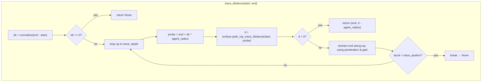
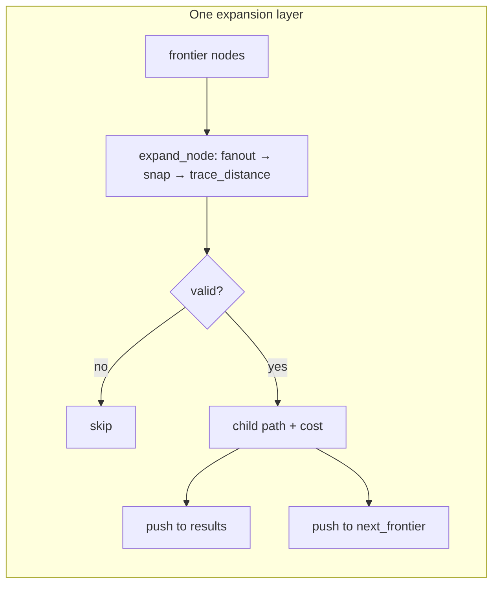
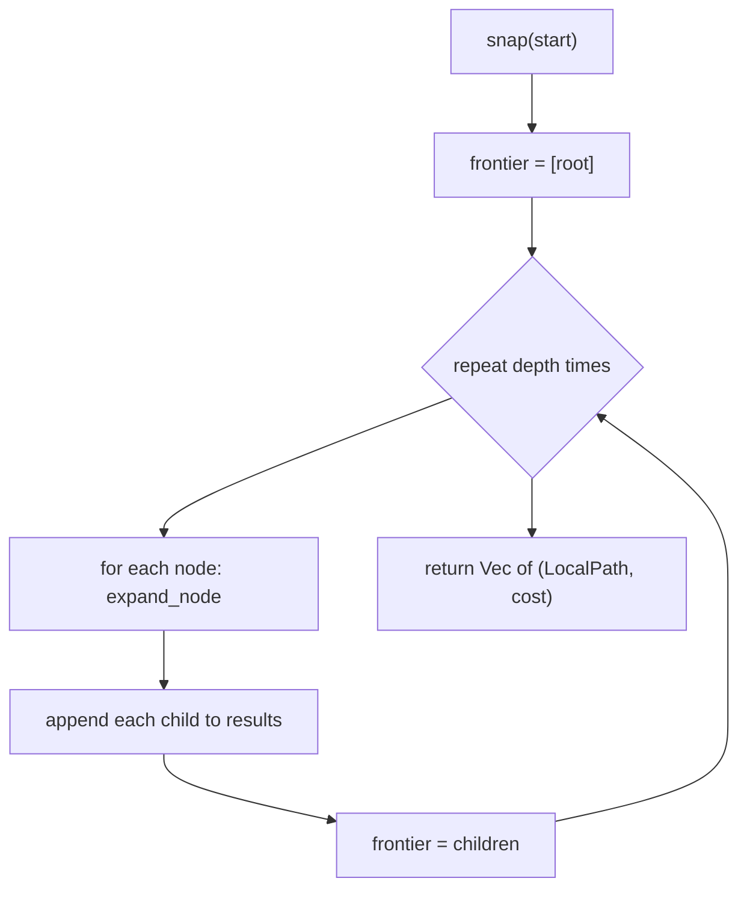

# Local pathfinding

Short-horizon **rollout search** over a navigable **surface**: from a start pose it proposes many **partial paths** (sequences of waypoints) scored with a small hand-tuned objective. It is meant for **local steering / replanning**, not globally optimal routing.

## Pieces

### `LocalPathfindingSurface`

- **`snap_for_local_pathfinding`** — Projects a world position onto the surface (e.g. ground height).
- **`path_ray_trace_distance(start, end)`** — Query along the segment from `start` toward `end`:
  - **Positive** — Segment is treated as passable; the value is a **clearance-like** distance (how far along the probe the surface reports free space).
  - **Negative** — Obstacle hit; **`-value`** is the distance along that ray to the hit (see `trace_distance` in code for how that drives shortening).
- **`local_path_cost`** — Cost of moving between two snapped points (default: Euclidean length); override for uneven terrain or graph edges.

### `LocalPathFindingFanout`

- **`local_path_fanout(position)`** — Discrete **candidates** for the next step (neighbors, sampled directions, etc.).

### `LocalPathfinding`

Configurable **breadth expansion** for `depth` steps. Each frontier node is expanded by trying every fanout child, validating the segment, then scoring the child.

**Weights** scale additive terms: attraction to goal, repulsion from low clearance, segment length, progress toward goal, and **direction hysteresis** (penalize sharp turns vs. last step).

## Segment validation: `trace_distance`

The planner does not assume raw fanout points are valid. For each segment it traces with **`agent_radius`**: the ray target is offset along the motion direction, so the surface sees a **body-sized** probe. If the trace reports a hit, it **shortens** the segment along the same direction (using **`collision_response_gain`** and up to **`trace_depth`** iterations) until the trace is free or gives up.

## Rollout: `find_partial_paths`

The start is **snapped** once. The frontier starts as a single node (path = `[start]`). For each of **`depth`** layers, every frontier node is **expanded**; each valid child is appended to **`results`** *and* to the next frontier. So you get **all prefix paths** from length 2 up to length **`depth + 1`** waypoints, each with an accumulated cost — not only the deepest leaves.

## When to use it

Use when you already have a coarse goal or direction and need **several plausible short trajectories** that respect **collision probes** and **surface projection**. Tune **`fanout`**, **`depth`**, and weights for your agent and time budget.

## Tests

Unit tests and shared fakes live under **`testing/`** (`OpenGround`, `GroundWithWallX`, fanouts, etc.).
