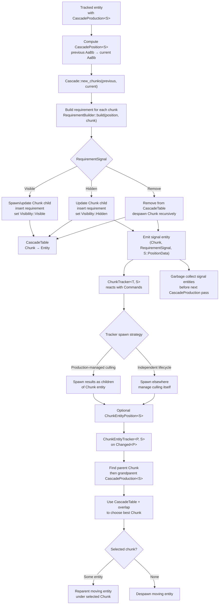
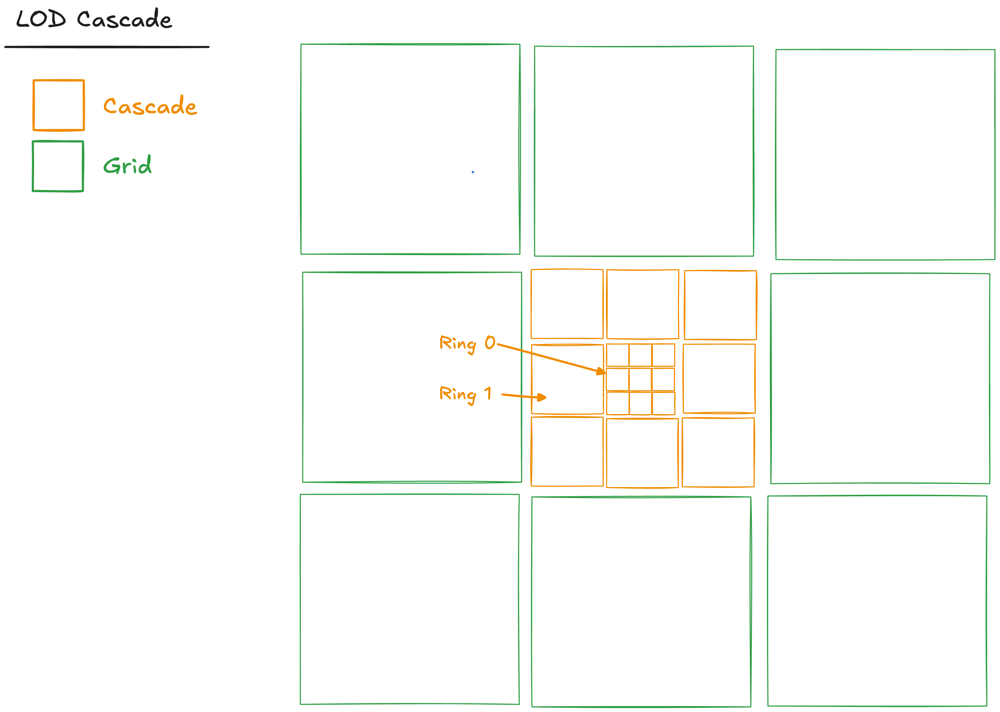

# RFC-N: Generalized LOD

## Table of Contents

## 1: Summary

To this point, Maybraid has used its cascade-based LOD system in an ad hoc manner. While we propose maintaining the base cascade, we provide a common pattern for its intended usage. Namely: 

1. `CascadeProduction<S>` tracks spatial state and produces chunk entities. It computes `CascadePosition<S>`, updates chunk children, and applies requirement-driven actions (`Visible`, `Hidden`, `Remove`). It also emits short-lived `(Chunk, RequirementSignal, S::PositionData)` signals for downstream systems.

2. `ChunkTracker<T, S>` reacts to chunk signals and dispatches work (e.g., spatial queries or generation). It may attach results as chunk children (for production-managed culling) or manage them independently.

3. `ChunkEntityTracker<P, S>` maintains correct chunk parentage for moving entities, reassigning them between chunks based on updated bounds to prevent premature culling.

## 2: Prior Art

This design builds on established approaches in spatial partitioning, chunk streaming, and ECS-driven world management, while extending them into a multi-resolution and multi-typed pipeline.

- **Spatial partitioning systems:**
  Classic approaches such as grids, quadtrees, and octrees partition space into manageable regions for culling and lookup. These are widely used across engines and are well described in *Game Programming Patterns* [https://gameprogrammingpatterns.com/spatial-partition.html](https://gameprogrammingpatterns.com/spatial-partition.html) and in octree implementations such as [https://github.com/michaelg29/yt-tutorials](https://github.com/michaelg29/yt-tutorials). These systems typically assume a single partition structure and a single ownership model.

- **Chunk-based world streaming:**
  Engines such as Minecraft and open-source voxel engines organize the world into chunks that are loaded, updated, and culled based on player position. See examples like Veloren [https://github.com/veloren/veloren](https://github.com/veloren/veloren) and Bevy voxel experiments [https://github.com/bonsairobo/building-blocks](https://github.com/bonsairobo/building-blocks). These systems establish the pattern of chunk ownership and spatially-driven lifecycle, but usually operate on a single grid resolution.

- **Hierarchical and multi-resolution spatial structures:**
  Systems such as clipmaps and cascaded shadow maps use multiple spatial layers at different resolutions to maintain detail near the viewer and coarser representation further away. See geometry clipmaps [https://developer.nvidia.com/gpugems/gpugems2/part-i-geometric-complexity/chapter-2-terrain-rendering-using-gpu-based-geometry](https://developer.nvidia.com/gpugems/gpugems2/part-i-geometric-complexity/chapter-2-terrain-rendering-using-gpu-based-geometry) and cascaded shadow maps [https://developer.nvidia.com/gpugems/GPUGems3/gpugems3_ch10.html](https://developer.nvidia.com/gpugems/GPUGems3/gpugems3_ch10.html). These introduce the idea of overlapping spatial regions with different levels of detail, which the cascade model generalizes for entity ownership and simulation.

- **ECS-based streaming and region systems:**
  Modern ECS engines such as Bevy [https://bevyengine.org](https://bevyengine.org) and Unity DOTS [https://docs.unity3d.com/Packages/com.unity.entities@6.5/manual/index.html](https://docs.unity3d.com/Packages/com.unity.entities@6.5/manual/index.html) use data-oriented pipelines where systems react to spatial changes rather than owning control flow. Bevy examples such as hierarchical transforms and scene spawning demonstrate parent-child ownership, while community projects extend this toward region-based streaming.

- **Event-driven or reactive pipelines in ECS:**
  ECS systems often decouple producers and consumers using events or transient entities. Bevy events [https://bevy-cheatbook.github.io/programming/events.html](https://bevy-cheatbook.github.io/programming/events.html) and signal-entity patterns in community projects show how systems can react without tight coupling. The `(Chunk, RequirementSignal, S::PositionData)` pattern follows this approach, but keeps everything in ECS storage rather than a separate event channel.

- **Dynamic spatial reassignment for moving entities:**
  Many engines must handle entities crossing region boundaries and reassigning ownership. This is commonly handled by reinsertion into spatial indices or manual region tracking. See discussions in spatial partitioning literature [https://gameprogrammingpatterns.com/spatial-partition.html](https://gameprogrammingpatterns.com/spatial-partition.html). The `ChunkEntityTracker` system formalizes this as an explicit ECS system using parent reassignment and a table lookup.

Overall, existing systems typically combine one or two of these ideas: a single spatial partition, chunk streaming, or ECS-driven updates. This design combines all of them into a unified pipeline: multi-resolution cascades, type-separated flows, explicit ownership via chunk tables, and reactive systems connected through short-lived signal entities.


## 3: Design

1. A variably-typed `CascadeProduction<S>` system is responsible for both tracking spatial state and producing chunks. It computes and maintains a `CascadePosition<S>` on each tracked entity, capturing the transition between previous and current spatial regions. Using this position, it drives a concrete `Cascade` to determine relevant chunks and produces or updates child `Chunk` entities accordingly. Each chunk is assigned a requirement component built from the current `CascadePosition<S>`, which encodes both desired state and an associated `RequirementSignal` (`Visible`, `Hidden`, or `Remove`).

   `CascadeProduction<S>` maintains an internal `CascadeTable` mapping chunks to their corresponding child entities. Based on the requirement’s signal, it applies the endemic action directly: ensuring visibility, hiding the chunk, or despawning it (including all children). For non-visible outcomes (`Hidden` or `Remove`), it also emits short-lived signal entities of the form `(Chunk, RequirementSignal, Marker<S>)`, which are consumed by downstream systems and garbage-collected on the following frame.

2. A variably-typed `ChunkTracker<T, S>` system is responsible for reacting to chunk signals and dispatching work to satisfy chunk requirements. Typically, this involves querying or generating data over a spatial index (e.g., [RFC-142: Gimme]). A `ChunkTracker` receives only `(Chunk, RequirementSignal, Marker<S>)` and `Commands`, and may respond as it sees fit. When a `ChunkTracker` wishes to delegate lifecycle management to `CascadeProduction<S>`, it should insert results as children of the chunk entity. Otherwise, it may spawn entities independently and manage their lifecycle itself.

3. A variably-typed `ChunkEntityTracker<P, S>` system is responsible for maintaining correct chunk parentage for moving entities. It responds to updates in components implementing `ChunkEntityPosition<S>` and uses the parent `CascadeProduction<S>` and its `CascadeTable` to determine the most appropriate chunk for the entity based on updated spatial bounds. This ensures that entities are reassigned between chunks as they move and are not prematurely culled due to stale parentage.




### 3.1: Cascade



`Cascade` is the pure-geometry core `CascadeProduction` consults when it turns a focal point into chunk work. The layout matches commit [`28b8a11`](https://github.com/ramate-io/maybraid/blob/28b8a11d59244d7826b5634387b13a1b94fc9454/util/chunk/src/cascade.rs) from Maybraid’s exploratory phase. Resolution is **not** part of this layer: sampling density is attached later (typically by `ChunkTracker`). The historical implementation still carries a `ResolutionMap` alongside the same shapes; this RFC treats that as convenience only.

`Cascade` maps $\mathbf{p} \in \mathbb{R}^3$ to a finite set of axis-aligned **chunk footprints**. In order, it:

1. Snaps $\mathbf{p}$ to the minimum-scale lattice and emits the **leaf** cube.
2. For each ring $k = 0,\ldots,K-1$, emits the **hollow** $3^3$ shell at scale $s_k = s_0\,3^k$ (26 cubes per ring; the center cell is omitted).
3. Nests those shells, so their union with the leaf is a solid cube of side $\sigma = s_0\,3^{K}$, the **hull** $H(\mathbf{p})$.
4. Optionally tiles a **coarse grid** of cubes of edge $G \ge \sigma$, each sharing omission $O = H(\mathbf{p})$, so the skirt does not overlap the hull.
5. Exposes the union of cascade and grid footprints as the active work set $\mathcal{W}(\mathbf{p})$, and set differences $\Delta\mathcal{W}$ when $\mathbf{p}$ moves.

#### 3.1.1: Rings

Fix **leaf scale** $s_0 > 0$ and **depth** $K \in \mathbb{N}$. A footprint is $(B, O)$: an axis-aligned cube $B \subset \mathbb{R}^3$ and an optional AABB subtraction $O$, so the effective region is $B \setminus O$ when $O$ is present. No resolution tag $r$ appears at this layer.

The innermost cell is anchored on the $s_0$-grid:

$$
\mathbf{o}_0(\mathbf{p}) \;=\; s_0 \left\lfloor \frac{\mathbf{p}}{s_0} \right\rfloor,
\qquad
B_0 \;=\; [\mathbf{o}_0,\, \mathbf{o}_0 + s_0 \mathbf{1}].
$$

For each ring $k = 0,\ldots,K-1$, the shell uses edge $s_k = s_0\,3^{k}$. Nesting the leaf and all rings yields a solid cube of side

$$
\sigma \;=\; s_0\,3^{K},
$$

...the **hull** $H(\mathbf{p})$.

#### 3.1.2: Outer Grid

If configured, choose $G \ge \sigma$ (often $G = \sigma\,2^m$), a bounded index set $\mathcal{I} \subset \mathbb{Z}^3$, and place $G$-cubes around $\mathbf{p}$ according to the implementation’s tiling rule. Every grid tile carries omission $O = H(\mathbf{p})$. If the grid is disabled, $\mathcal{W}_{\mathrm{grid}}(\mathbf{p}) = \emptyset$.

#### 3.1.3: Work Set and Motion

The active geometric footprints at $\mathbf{p}$ are

$$
\mathcal{W}(\mathbf{p}) \;=\; \mathcal{W}_{\mathrm{cascade}}(\mathbf{p}) \;\cup\; \mathcal{W}_{\mathrm{grid}}(\mathbf{p}).
$$

A cheap **recenter** test when $\mathbf{p}' \to \mathbf{p}$ is

$$
\mathrm{needs}(\mathbf{p}, \mathbf{p}') \;\Longleftrightarrow\; \mathbf{o}_0(\mathbf{p}) \neq \mathbf{o}_0(\mathbf{p}').
$$

Incremental footprints are set differences on both parts:

$$
\Delta \mathcal{W} \;=\; \bigl(\mathcal{W}_{\mathrm{cascade}}(\mathbf{p}) \setminus \mathcal{W}_{\mathrm{cascade}}(\mathbf{p}')\bigr) \;\cup\; \bigl(\mathcal{W}_{\mathrm{grid}}(\mathbf{p}) \setminus \mathcal{W}_{\mathrm{grid}}(\mathbf{p}')\bigr).
$$

Footprint identity follows the same structural key as in code (origin, size, omission, and so on), **excluding** resolution, so $\Delta\mathcal{W}$ stays well-defined after $r$ is assigned downstream.

#### 3.1.4: Pseudocode

```rust
let s = |k: u32| s0 * 3f32.powi(k as i32); // s(k) = s0 * 3^k

let mut w_cascade = HashSet::new();
w_cascade.insert(leaf(o0(p), s0)); // geometry only; ChunkTracker assigns resolution

let mut anchor = o0(p) - Vec3::splat(s0);
for k in 0..K {
    w_cascade.extend(hollow_shell(anchor, s(k))); // 26 cubes, not 27
    anchor -= Vec3::splat(s(k + 1));
}

let w_grid = coarse_tiles(p, G, &indices, /* omit = */ hull(p));
(w_cascade, w_grid)
```

```rust
if needs(p_old, p_new) {
    let mut delta = HashSet::new();
    delta.extend(w_cascade(p_new).difference(&w_cascade(p_old)).copied());
    delta.extend(w_grid(p_new).difference(&w_grid(p_old)).copied());
    return (delta, w_union(p_new)); // new work only; full snapshot optional
}
```

Net result: nested shells at $s_0,\,3s_0,\,9s_0,\,\ldots$ and an optional coarse band with a **single hull-shaped hole**—high detail near $\mathbf{p}$, cheaper coverage beyond, without double-covering $H(\mathbf{p})$. Resolution enters when consumers interpret $\mathcal{W}$, not when these footprints are generated.

### 3.2: `CascadeProduction`

`CascadeProduction<S>` owns a concrete `Cascade`, maintains its local chunk table, and listens to source data selected by `S::QueryData`. On update, it:

1. Computes and inserts/updates `CascadePosition<S::PositionData>`.
2. Uses `Cascade::new_chunks(previous, current)` to identify newly relevant chunks.
3. Runs the requirement builder over both new chunks and existing chunks.
4. Uses the requirement’s signal to decide whether each chunk should be visible, hidden, or removed.
5. Spawns short-lived signal entities for indirect listeners as `(Chunk, RequirementSignal, S::PositionData)`.
6. Garbage-collects previous-frame signal entities before producing the next cascade update.

#### 3.2.1: Core Components

```rust
#[derive(Component)]
pub struct CascadeProduction<S> {
    pub cascade: Cascade,
    pub table: CascadeTable,
    pub marker: PhantomData<S>,
}

pub struct CascadeTable {
    pub table: HashMap<Chunk, Entity>,
}

#[derive(Component, Clone)]
pub struct CascadePosition<S> {
    pub previous: Option<AaBb>,
    pub current: AaBb,
    pub data: S,
}
```

`Chunk`, `Cascade`, and `AaBb` are concrete types. `S` is only used to distinguish typed production flows.

#### 3.2.2: Requirement Signal

Requirements are inserted directly as components. They also describe the desired endemic action for a chunk.

```rust
#[derive(Component, Clone, Copy, PartialEq, Eq)]
pub enum RequirementSignal {
    Visible,
    Hidden,
    Remove,
}

pub trait CascadeRequirement: Component + Clone {
    fn signal(&self) -> RequirementSignal;
}
```

`RequirementSignal` is itself a component because production emits short-lived signal entities of the form:

```rust
(Chunk, RequirementSignal, Marker<S>)
```

...for `ChunkTracker` listeners.

#### 3.2.3: Requirement Builder

```rust
pub trait RequirementBuilder<R>: Component + Default + Clone
where
    R: CascadeRequirement,
{
    fn build<S>(
        &self,
        position: &CascadePosition<S>,
        chunk: Chunk,
    ) -> R;
}
```

The builder receives both the current cascade position and the chunk, so requirements can depend on metadata in `CascadePosition<S>` as well as spatial chunk identity.

If a producer entity has no builder, the system inserts `S::Builder::default()` and uses that default builder immediately.

#### 3.2.4: Source Trait

```rust
pub trait CascadeProductionSource: Send + Sync + 'static {
    type PositionData: Component + Clone + Send + Sync + 'static;
    type Requirement: CascadeRequirement;
    type Builder: RequirementBuilder<Self::Requirement>;

    type QueryData: QueryData;
    type QueryFilter: QueryFilter = ();

    fn entity(item: &<Self::QueryData as QueryData>::Item<'_, '_>) -> Entity;

    fn current_position(
        item: &<Self::QueryData as QueryData>::Item<'_, '_>,
    ) -> AaBb;

    fn position_data(
        item: &<Self::QueryData as QueryData>::Item<'_, '_>,
    ) -> Self::PositionData;
}
```

`S` is the type marker distinguishing one production flow from another. This allows the same entity to hold multiple independent flows like:

```rust
CascadeProduction<Foo>
CascadePosition<Foo>

CascadeProduction<Bar>
CascadePosition<Bar>
```

Each `CascadeProduction<S>` owns its own concrete `Cascade` and its own `CascadeTable`.

## 3.2.5: Signal Entities

When a chunk is hidden or removed, production acts directly on the chunk entity and also spawns:

```rust
(Chunk, RequirementSignal, Marker<S>)
```

These entities are intentionally frame-local. They allow indirect systems to observe chunk visibility/removal decisions without requiring production to know about those systems.

Signal entities are garbage-collected before the next cascade production pass.

#### 3.2.6: System

```rust
pub fn produce_cascade<S>(
    mut commands: Commands,
    mut query: Query<
        (
            S::QueryData,
            &mut CascadeProduction<S>,
            Option<&CascadePosition<S::PositionData>>,
            Option<&S::Builder>,
        ),
        S::QueryFilter,
    >,
)
where
    S: CascadeProductionSource,
{
    for (item, mut production, old_position, builder) in &mut query {
        let entity = S::entity(&item);

        let position = update_cascade_position::<S>(
            &mut commands,
            entity,
            &item,
            old_position,
        );

        let builder = resolve_requirement_builder::<S>(
            &mut commands,
            entity,
            builder,
        );

        update_cascade_chunks::<S>(
            &mut commands,
            entity,
            &item,
            &mut production,
            &position,
            &builder,
        );
    }
}
```

#### 3.2.7: Phase 1: Update `CascadePosition`

```rust
fn update_cascade_position<S>(
    commands: &mut Commands,
    entity: Entity,
    item: &<S::QueryData as QueryData>::Item<'_, '_>,
    old_position: Option<&CascadePosition<S::PositionData>>,
) -> CascadePosition<S::PositionData>
where
    S: CascadeProductionSource,
{
    let current = S::current_position(item);

    let position = CascadePosition {
        previous: old_position.map(|old| old.current),
        current,
        data: S::position_data(item),
    };

    commands.entity(entity).insert(position.clone());

    position
}
```

`previous` is derived from the prior stored `CascadePosition<S::PositionData>`. `current` is derived from the source query item.

#### 3.2.8: Phase 2: Resolve Builder

```rust
fn resolve_requirement_builder<S>(
    commands: &mut Commands,
    entity: Entity,
    builder: Option<&S::Builder>,
) -> S::Builder
where
    S: CascadeProductionSource,
{
    match builder {
        Some(builder) => builder.clone(),
        None => {
            let builder = S::Builder::default();
            commands.entity(entity).insert(builder.clone());
            builder
        }
    }
}
```

#### 3.2.9: Phase 3: Update Chunks

```rust
fn update_cascade_chunks<S>(
    commands: &mut Commands,
    producer: Entity,
    item: &<S::QueryData as QueryData>::Item<'_, '_>,
    production: &mut CascadeProduction<S>,
    position: &CascadePosition<S::PositionData>,
    builder: &S::Builder,
)
where
    S: CascadeProductionSource,
{
    let new_chunks: Vec<Chunk> = production
        .cascade
        .new_chunks(position.previous, position.current)
        .collect();

    apply_requirements_to_new_chunks::<S>(
        commands,
        producer,
        item,
        production,
        position,
        builder,
        &new_chunks,
    );

    apply_requirements_to_existing_chunks::<S>(
        commands,
        item,
        production,
        position,
        builder,
    );
}
```

The system runs the requirement builder over both:

1. `Chunks` newly reported by `Cascade::new_chunks`, and
2. `Chunks` already present in `production.table`.

The requirement’s signal determines the endemic action.

#### 3.2.10: Apply Requirements to New Chunks

```rust
fn apply_requirements_to_new_chunks<S>(
    commands: &mut Commands,
    producer: Entity,
    item: &<S::QueryData as QueryData>::Item<'_, '_>,
    production: &mut CascadeProduction<S>,
    position: &CascadePosition<S::PositionData>,
    builder: &S::Builder,
    new_chunks: &[Chunk],
)
where
    S: CascadeProductionSource,
{
    for &chunk in new_chunks {
        let requirement = builder.build(position, chunk);
        let signal = requirement.signal();

        match signal {
            RequirementSignal::Visible => {
                let chunk_entity = production
                    .table
                    .table
                    .get(&chunk)
                    .copied()
                    .unwrap_or_else(|| {
                        let entity = commands.spawn(chunk).id();
                        commands.entity(producer).add_child(entity);
                        production.table.table.insert(chunk, entity);
                        entity
                    });

                commands
                    .entity(chunk_entity)
                    .insert((requirement, Visibility::Visible));
            }

            RequirementSignal::Hidden => {
                let chunk_entity = production
                    .table
                    .table
                    .get(&chunk)
                    .copied()
                    .unwrap_or_else(|| {
                        let entity = commands.spawn(chunk).id();
                        commands.entity(producer).add_child(entity);
                        production.table.table.insert(chunk, entity);
                        entity
                    });

                commands
                    .entity(chunk_entity)
                    .insert((requirement, Visibility::Hidden));

                spawn_requirement_signal::<S>(
                    commands,
                    item,
                    chunk,
                    signal,
                );
            }

            RequirementSignal::Remove => {
                spawn_requirement_signal::<S>(
                    commands,
                    item,
                    chunk,
                    signal,
                );
            }
        }
    }
}
```

For new chunks, `Visible` and `Hidden` both ensure a chunk entity exists. `Remove` does not spawn the chunk entity; it only emits the signal entity.

#### 3.2.11: Apply Requirements to Existing Chunks

```rust
fn apply_requirements_to_existing_chunks<S>(
    commands: &mut Commands,
    item: &<S::QueryData as QueryData>::Item<'_, '_>,
    production: &mut CascadeProduction<S>,
    position: &CascadePosition<S::PositionData>,
    builder: &S::Builder,
)
where
    S: CascadeProductionSource,
{
    let existing: Vec<(Chunk, Entity)> = production
        .table
        .table
        .iter()
        .map(|(&chunk, &entity)| (chunk, entity))
        .collect();

    for (chunk, entity) in existing {
        let requirement = builder.build(position, chunk);
        let signal = requirement.signal();

        match signal {
            RequirementSignal::Visible => {
                commands
                    .entity(entity)
                    .insert((requirement, Visibility::Visible));
            }

            RequirementSignal::Hidden => {
                commands
                    .entity(entity)
                    .insert((requirement, Visibility::Hidden));

                spawn_requirement_signal::<S>(
                    commands,
                    item,
                    chunk,
                    signal,
                );
            }

            RequirementSignal::Remove => {
                production.table.table.remove(&chunk);

                commands.entity(entity).despawn_recursive();

                spawn_requirement_signal::<S>(
                    commands,
                    item,
                    chunk,
                    signal,
                );
            }
        }
    }
}
```

For existing chunks, `Remove` removes the table entry and despawns the chunk entity recursively.

#### 3.2.12: Spawn Requirement Signal

```rust
fn spawn_requirement_signal<S>(
    commands: &mut Commands,
    item: &<S::QueryData as QueryData>::Item<'_, '_>,
    chunk: Chunk,
    signal: RequirementSignal,
)
where
    S: CascadeProductionSource,
{
    commands.spawn((
        chunk,
        signal,
        S::position_data(item),
    ));
}
```

This keeps indirect notifications typed by the same `S::PositionData` used by the production flow.

#### 3.2.13: Garbage Collect Requirement Signals

```rust
pub fn garbage_collect_requirement_signals<S>(
    mut commands: Commands,
    signals: Query<
        Entity,
        (
            With<Chunk>,
            With<RequirementSignal>,
            With<Marker<S>>,
        ),
    >,
)
where
    S: CascadeProductionSource,
{
    for entity in &signals {
        commands.entity(entity).despawn();
    }
}
```

This system should run before `produce_cascade::<S>`. This gives downstream systems one frame to observe signal entities before they are removed.

#### 3.2.14: Plugin

```rust
pub struct CascadeProductionPlugin<S> {
    marker: PhantomData<S>,
}

impl<S> Default for CascadeProductionPlugin<S> {
    fn default() -> Self {
        Self {
            marker: PhantomData,
        }
    }
}

impl<S> Plugin for CascadeProductionPlugin<S>
where
    S: CascadeProductionSource,
{
    fn build(&self, app: &mut App) {
        app.add_systems(
            Update,
            (
                garbage_collect_requirement_signals::<S>,
                produce_cascade::<S>,
            )
                .chain(),
        );
    }
}
```

The important ordering constraint is:

```rust
garbage_collect_requirement_signals::<S>
    .before(produce_cascade::<S>)
```

Using `.chain()` is the concise version when both systems are registered together.


### 3.3: `ChunkTracker`

`ChunkTracker<T, S>` is a lightweight reactor system for chunk signal entities emitted by `CascadeProduction<S>`.

It listens for entities matching:

```rust
(
    Chunk,
    RequirementSignal,
    Marker<S>,
)
```

with:

```rust
Changed<RequirementSignal>
```

The tracker does not receive extra query data and does not return anything. It is simply handed `Commands` plus the chunk signal data and may react however it chooses.

This is reasonably described as a **reactor pattern**: `CascadeProduction<S>` emits short-lived chunk state signals, and `ChunkTracker<T, S>` reacts to those signals without participating in cascade production itself.

#### 3.3.1: Tracker Trait

```rust
pub trait ChunkTracker<S>: Send + Sync + 'static
where
    S: CascadeProductionSource,
{
    fn react(
        commands: &mut Commands,
        chunk: Chunk,
        signal: RequirementSignal,
    );
}
```

The trait intentionally has no return value. A tracker may:

```rust
commands.spawn(...);
commands.entity(...).insert(...);
commands.entity(...).despawn_recursive();
```

...or do nothing.

If spawned entities should later participate in `ChunkEntityTracker`, the tracker must explicitly insert the appropriate `ChunkEntityPosition` component itself.

#### 3.3.2: System

```rust
pub fn track_chunks<T, S>(
    mut commands: Commands,
    signals: Query<
        (&Chunk, &RequirementSignal),
        (
            With<Marker<S>>,
            Changed<RequirementSignal>,
        ),
    >,
)
where
    S: CascadeProductionSource,
    T: ChunkTracker<S>,
{
    for (chunk, signal, data) in &signals {
        T::react(
            &mut commands,
            *chunk,
            *signal,
            data,
        );
    }
}
```

#### 3.3.3: Closure-Based Alternative

If we want the tracker to feel more like a handler than a trait object, the same pattern can be modeled as a function-like type:

```rust
pub trait ChunkTracker<S>: Send + Sync + 'static
where
    S: CascadeProductionSource,
{
    fn call(
        commands: &mut Commands,
        chunk: Chunk,
        signal: RequirementSignal,
    );
}
```

The trait form is probably preferable because Bevy plugins and systems need named, type-level registration:

```rust
app.add_systems(Update, track_chunks::<MyTracker, MyCascadeSource>);
```

#### 3.3.4: Plugin

```rust
pub struct ChunkTrackerPlugin<T, S> {
    marker: PhantomData<(T, S)>,
}

impl<T, S> Default for ChunkTrackerPlugin<T, S> {
    fn default() -> Self {
        Self {
            marker: PhantomData,
        }
    }
}

impl<T, S> Plugin for ChunkTrackerPlugin<T, S>
where
    S: CascadeProductionSource,
    T: ChunkTracker<S>,
{
    fn build(&self, app: &mut App) {
        app.add_systems(Update, track_chunks::<T, S>);
    }
}
```

#### 3.3.5: Design Notes

`ChunkTracker` is intentionally minimal. It does not own chunk lifecycle, does not query the cascade table, and does not infer parentage.

If a tracker wants production-managed culling, it should spawn results as children of the appropriate chunk entity. If it wants independent lifecycle management, it can spawn elsewhere and manage removal itself. Otherwise, if it wants moving entities to be re-parented as they cross chunk boundaries, it must insert the relevant `ChunkEntityPosition` component when spawning them.


#### 3.3.6: Integration with RFC-142: Gimme

The proposed spatial storage engine is currently [Gimme](/rfc/rfc-000-000-142-gimme/README.md). Accordingly, we have prepared an integration guide [here](./integration-with-gimme/README.md).

Yes — agreed. `S` should remain the cascade/production marker, while `P` is the concrete component tracking entity bounds.

### 3.4: `ChunkEntityTracker`

`ChunkEntityTracker<P, S>` is responsible for maintaining the chunk parentage of entities whose spatial bounds change after they are spawned.

`S` identifies the cascade production flow:

```rust
CascadeProduction<S>
CascadePosition<S::PositionData>
```

`P` is the component placed on managed entities:

```rust
P: ChunkEntityPosition<S>
```

#### 3.4.1: Core Trait

```rust
pub trait ChunkEntityPosition<S>: Component {
    fn previous(&self) -> Option<AaBb>;

    fn current(&self) -> AaBb;

    fn select_chunk(
        &self,
        current_parent_chunk: Chunk,
        production: &CascadeProduction<S>,
        position: &CascadePosition<S::PositionData>,
    ) -> Option<Entity>
    where
        S: CascadeProductionSource,
    {
        select_best_overlapping_chunk::<S>(
            current_parent_chunk,
            production,
            position,
            self.previous(),
            self.current(),
        )
    }
}
```

#### 3.4.2: Parent Lookup

The hierarchy is expected to be:

```text
CascadeProduction<S>
└── Chunk
    └── entity with P
```

The tracker performs a manual join:

```rust
managed entity -> parent chunk -> grandparent production
```

The grandparent should contain:

```rust
CascadeProduction<S>
CascadePosition<S::PositionData>
```

#### 3.4.3: System

```rust
pub fn track_chunk_entities<P, S>(
    mut commands: Commands,
    managed: Query<
        (Entity, &P, &Parent),
        Changed<P>,
    >,
    chunks: Query<(&Chunk, &Parent)>,
    productions: Query<(
        &CascadeProduction<S>,
        &CascadePosition<S::PositionData>,
    )>,
)
where
    S: CascadeProductionSource,
    P: ChunkEntityPosition<S>,
{
    for (entity, chunk_entity_position, parent) in &managed {
        let current_parent_entity = parent.get();

        let Ok((current_parent_chunk, production_parent)) =
            chunks.get(current_parent_entity)
        else {
            commands.entity(entity).despawn_recursive();
            continue;
        };

        let production_entity = production_parent.get();

        let Ok((production, cascade_position)) =
            productions.get(production_entity)
        else {
            commands.entity(entity).despawn_recursive();
            continue;
        };

        match chunk_entity_position.select_chunk(
            *current_parent_chunk,
            production,
            cascade_position,
        ) {
            Some(new_chunk_entity) => {
                if new_chunk_entity != current_parent_entity {
                    commands
                        .entity(new_chunk_entity)
                        .add_child(entity);
                }
            }

            None => {
                commands.entity(entity).despawn_recursive();
            }
        }
    }
}
```

#### 3.4.4: Default Chunk Selection

```rust
fn select_best_overlapping_chunk<S>(
    current_parent_chunk: Chunk,
    production: &CascadeProduction<S>,
    _position: &CascadePosition<S::PositionData>,
    previous: Option<AaBb>,
    current: AaBb,
) -> Option<Entity>
where
    S: CascadeProductionSource,
{
    let candidates = production
        .cascade
        .all_possible_new_chunks(previous, current);

    candidates
        .into_iter()
        .filter(|candidate| {
            production.cascade.ring_count() == 0
                || candidate.size() == current_parent_chunk.size()
        })
        .filter_map(|chunk| {
            let entity = production.table.table.get(&chunk).copied()?;
            let overlap = chunk.aabb().overlap_area(current);

            Some((entity, overlap))
        })
        .max_by(|(_, a), (_, b)| a.total_cmp(b))
        .map(|(entity, _)| entity)
}
```

The default behavior is level-preserving: if the cascade has rings, the entity is reassigned only among chunks matching its current parent chunk’s size. If the cascade is grid-only, the size filter is skipped.

#### 3.4.5: Plugin

```rust
pub struct ChunkEntityTrackerPlugin<P, S> {
    marker: PhantomData<(P, S)>,
}

impl<P, S> Default for ChunkEntityTrackerPlugin<P, S> {
    fn default() -> Self {
        Self {
            marker: PhantomData,
        }
    }
}

impl<P, S> Plugin for ChunkEntityTrackerPlugin<P, S>
where
    S: CascadeProductionSource,
    P: ChunkEntityPosition<S>,
{
    fn build(&self, app: &mut App) {
        app.add_systems(Update, track_chunk_entities::<P, S>);
    }
}
```

## 4: Milestones