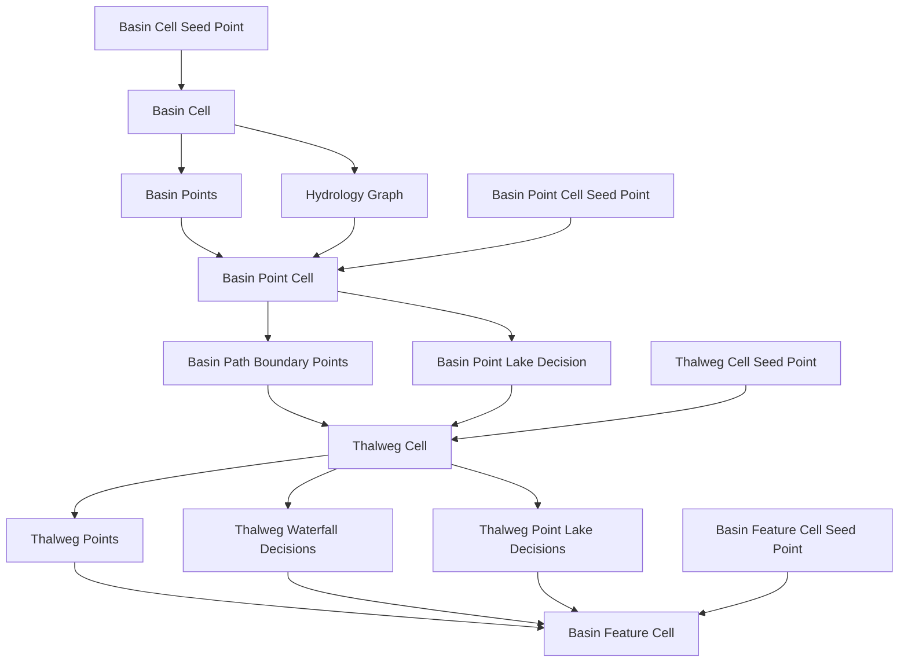
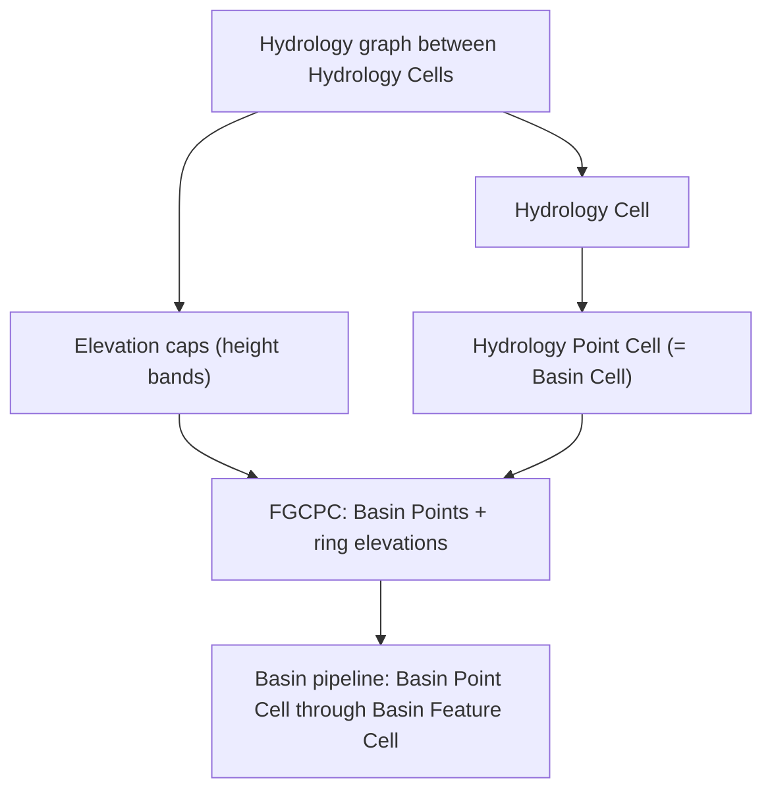

# RFC-n: Marazion Watersheds

## 1: Motivation

## 2: Prior Art

## 3: Design

The watershed designs proposed in this RFC are referred to as Marazion watersheds. All following the stamping framework proposed in [RFC-105](https://github.com/ramate-io/maybraid/tree/main/rfc/rfc-000-000-105-procedural-terrain). 

### 3.1: Marazion Pocket Water Stamping

Marazion Pocket Waters are used to satisfy the [Jersey Pocket Waters requirement of RFC-105](https://github.com/ramate-io/maybraid/tree/main/rfc/rfc-000-000-105-procedural-terrain#384-jersey-pocket-waters-small-hydrology-chains). 

Marazion pocket waters rely on three levels of cellular stamping hierarchy:

1. **[Pre-pocket Cells](#311-pre-pocket-cells):** the base parent cells representing the extents within which **Pocket Cells** are generated. For simplicity, they are a grid of fixed-size AABB cells and each fixes one cell size for all **Pocket Cells** contained within it, creating an internal grid. The role of **Pre-pocket Cell:** is to vary the extents of **Pocket Cells** over the game world, while keeping regional correlations. The noise value for the Pocket Cell size is given by the lower-left coordinate of Pre-pocket Cell, floored to a reasonable multiple.
2. **[Pocket Cells](#312-pocket-cells):** the cells within which certain simple hydrology types are selected. A **Pocket Cell** uses pseudo-random **Guillotine cuts** with bounded depth. The noise value for the Guillotine cuts is given by the lower-left coordinate of the Pocket Cell. 
3. **[Pocket Water Cells](#313-pocket-water-cells):** the cells within which independent pocket water types are generated. 

#### 3.1.1: Pre-pocket Cells

Pre-pocket cells tile the horizontal plane on a **world-anchored** axis-aligned grid, so streaming agrees across chunk boundaries.

- **Grid:** fix a **pre-pocket pitch** $W_{\text{pre}}$ (world units) and origin $(O_x, O_z)$. Any world point $(x,z)$ lies in the cell with indices
  $$
  i = \left\lfloor \frac{x - O_x}{W_{\text{pre}}} \right\rfloor,\qquad
  j = \left\lfloor \frac{z - O_z}{W_{\text{pre}}} \right\rfloor.
  $$
  The **anchor** for that pre-pocket is its **lower-left corner** $(O_x + i W_{\text{pre}},\, O_z + j W_{\text{pre}})$.
- **Pocket pitch inside the pre-pocket:** sample deterministic noise at the anchor (and a fixed salt). Map it to a **discrete** pocket pitch $W_{\text{pocket}}$ from a small allowed set (e.g. powers of two or fixed quanta). Require $W_{\text{pocket}}$ to **divide** $W_{\text{pre}}$ on both axes (or define a rule for leftover margin at the max- $x$ / max- $z$ edges). That yields an integer **$n_x \times n_z$** grid of **Pocket Cells** inside each pre-pocket.
- **Role:** $W_{\text{pocket}}$ is **constant** within one pre-pocket but **varies** between pre-pockets, so changes in pocket size over the world while staying **regionally correlated** along the pre-pocket grid.

```rust
// World xz. Pre-pocket containing (x, z):
let i = floor((x - ox) / w_pre);
let j = floor((z - oz) / w_pre);
let anchor_x = ox + i * w_pre;
let anchor_z = oz + j * w_pre;
let w_pocket = choose_pocket_pitch(anchor_x, anchor_z); // from noise, discrete set; divides w_pre
let nx = w_pre / w_pocket;
let nz = w_pre / w_pocket;

// Pocket cell indices inside this pre-pocket (0..nx, 0..nz):
let px = floor((x - anchor_x) / w_pocket).clamp(0, nx - 1);
let pz = floor((z - anchor_z) / w_pocket).clamp(0, nz - 1);
let pocket_rect = Rect::new(
    anchor_x + px * w_pocket,
    anchor_z + pz * w_pocket,
    w_pocket,
    w_pocket,
);
```

#### 3.1.2: Pocket Cells

Each **Pocket Cell** is one tile of the $n_x \times n_z$ grid inside its pre-pocket (see [3.1.1](#311-pre-pocket-cells)). Its footprint is the axis-aligned square $[x_p,\, x_p + W_{\text{pocket}}] \times [z_p,\, z_p + W_{\text{pocket}}]$.

Within that footprint, Marazion applies a **Guillotine partition** with **bounded depth** so you get **variable rectangular sub-regions** (the layout stage before **Pocket Water Cells** in [3.1.3](#313-pocket-water-cells)). Each cut is an axis-aligned line spanning the **full** width or height of the **current** piece; children tile the parent with no gaps.

- **Seed:** noise is keyed by the **lower-left** of the **current** sub-rectangle (and split depth / index), in the same deterministic style as the pre-pocket anchor.
- **Stop rule:** stop when `depth >= max_depth`, or when the next cut would leave a child smaller than a **minimum span** (world units or a fraction of $W_{\text{pocket}}$), or when the leaf is already at target granularity for hydrology typing—pick and document one scheme.
- **Split rule:** choose **vertical vs horizontal** from noise; choose **cut position** along that axis (optionally snap to a **sub-quantum** for stable BVH / hashing). Recurse on the two children.
- **Leaves:** each leaf is an axis-aligned **sub-rectangle** of the Pocket Cell; [3.1.3](#313-pocket-water-cells) treats each as a **Pocket Water Cell** for hydrology typing (lake, stream, …) and elevation stamps.

```rust
// pocket_rect from pre-pocket grid (3.1.1); lower-left (xp, zp) = (x_p, z_p).
fn guillotine_partition(rect: Rect, anchor_ll: (f64, f64), depth: u8) -> Vec<Rect> {
    if depth >= MAX_DEPTH || rect_too_small(rect, MIN_SUB_SPAN) {
        return vec![rect];
    }
    let vertical = n01(anchor_ll, depth, SPLIT_SALT) < 0.5;
    let t = choose_cut_ratio(anchor_ll, depth, vertical); // e.g. in [0.25, 0.75]
    let (a, b) = if vertical {
        guillotine_vertical(rect, t)
    } else {
        guillotine_horizontal(rect, t)
    };
    let mut out = Vec::new();
    out.extend(guillotine_partition(a, a.lower_left(), depth + 1));
    out.extend(guillotine_partition(b, b.lower_left(), depth + 1));
    out
}

// let leaves = guillotine_partition(pocket_rect, pocket_rect.lower_left(), 0);
```

#### 3.1.3: Pocket Water Cells

The following are the Pocket Water Cells which should be included in Marazion.

To ensure reliable rims, all construction rely on creating a plateau, then depressing everything within the plateau to ensure a rim around the body of water. 

##### 3.1.3.1: Lake

The **default** lake footprint is an **offset centroid** and a **noisy circular radius** inside the pocket water cell (steps 1–7). Elevation follows the usual plateau-then-depress rim recipe from the introduction to [3.1.3](#313-pocket-water-cells).

1. Sample noise to offset the lake **centroid** $(x_c, z_c)$ from the cell centroid. 
2. Compute **lake surface** elevation at $(x_c, z_c)$: add a signed noise value to the terrain height there. Derive a **depth** scale from noise (same anchor as the rest of the cell).
3. Compute **pre-radius:** distance from $(x_c, z_c)$ to the nearest point on the cell boundary, minus a margin $\mu$.
4. At each sample, **radius** $=$ pre-radius minus a noisy term (keyed, so the disc stays inside the cell). Points with horizontal distance to $(x_c, z_c)$ below that radius count as **inside the water disc** for the steps below.
5. Raise all points **inside** the radius to the lake surface elevation **plus** a noise value.
6. Raise all points inside **radius** $+\,\alpha \cdot \text{noise} \cdot \mu$ (with $\alpha,\, \text{noise} \in [0,1]$) to the surface elevation **plus or minus** noise (rim / transition band).
7. Depress all points inside **radius** $-\,\alpha \cdot \text{noise} \cdot \mu$ by subtracting $\text{dist to }(x_c,z_c) \cdot \text{noise} \cdot \text{depth}$ from the current elevation (bowl).

> [!NOTE]
> **Suggested alternative — inscribed footprint:** if the cell is long or thin, a circle around a centroid wastes extent. Use axis-aligned bounds $[x_0,x_1]\times[z_0,z_1]$, inward clearance $d_\cap(x,z)=\min(x-x_0,\,x_1-x,\,z-z_0,\,z_1-z)$, margin $m=\mu+\text{noise}(\text{anchor})$. **Water:** $d_\cap\ge m$; **shore:** $d_\cap=m$. Replace **dist to centroid** and **radius** bands in steps 5–7 with **depth from shore** monotone in $g=d_\cap-m$ (or the per-edge rectangle variant from the same section).

Rust pseudocode (default circular footprint; `g` hook matches the NOTE alternative):

```rust
// Pocket water cell AABB in xz; sample at (x, z). `base_h` is pre-stamp height.
// `n2`, `n01` = deterministic noise fns in [0,1] keyed by (anchor, salt).

let (xc, zc) = cell_centroid + noise_offset_xz(anchor);
let surface = base_h_at(xc, zc) + surface_noise(anchor);
let depth = depth_from_noise(anchor);
let pre_r = dist_to_rect_boundary(xc, zc, cell) - mu;
let r = pre_r - radius_jitter(x, z, anchor); // keep r positive inside cell

let d = hypot(x - xc, z - zc);
let inner = d < r;
let outer_band = d < r + alpha * n01(x, z, anchor) * mu;
let bowl = d < r - alpha * n01(x, z, anchor) * mu;

let mut h = base_h;
if inner {
    h = h.max(surface + n2(x, z, anchor) * rim_lift);
}
if outer_band {
    h = h.max(surface + rim_noise(x, z, anchor)); // ± noise per step 6
}
if bowl {
    h -= d * n2(x, z, anchor) * depth;
}

// Inscribed alternative: g = d_cap(x,z, cell) - m; use g instead of (r - d) for bands:
// let g = inward_clearance(x, z, cell) - m;
// same structure: inner = g > 0, outer_band = g > -..., bowl = g > +...
```

##### 3.1.3.2: Stream

Stream construction is similar to the lake, but uses a **distance to path** (polyline) rather than distance to a point.

1. Pick two endpoints in the pocket-water cell from deterministic noise (optionally constrained away from very steep source terrain).
2. Choose an initial heading from start to end and a target segment length in world units.
3. Build a polyline from start to end with a **noisy hysteresis** walk: at each step, blend the previous heading and the direct heading to the endpoint, then add bounded angular jitter. This keeps coherent turns and avoids white-noise zigzags.
4. Stop when either: (a) the walk comes within a snap radius of the endpoint and connects directly, (b) max segment count is reached, or (c) the next step exits the cell and cannot be projected back safely.
5. Define stream width from noise (base half-width plus variation), then compute band masks by distance to the polyline: thalweg, wet channel, and skirt or rim.
6. Set surface grade along path arc length from upstream to downstream. The monotone drop can be made slightly noisy, as long as the max elevation added is significantly less than the depth of the stream. 
7. Raise the skirt band toward bank grade, keep channel near water surface, and depress the thalweg by depth profile.

Hysteresis path search pseudocode:

```rust
// Build a deterministic stream centerline in one cell.
fn build_stream_path(cell: Rect, anchor: Seed, start: Vec2, end: Vec2) -> Vec<Vec2> {
    let mut p = start;
    let mut dir_prev = (end - start).normalize_or_zero();
    let mut out = vec![start];

    for k in 0..MAX_SEGMENTS {
        let to_end = end - p;
        if to_end.length() <= SNAP_RADIUS {
            out.push(end);
            break;
        }

        let dir_goal = to_end.normalize_or_zero();
        let theta = angle_jitter(anchor, k) * MAX_TURN_RADIANS; // in [-max,+max]
        let blended = normalize(lerp(dir_goal, dir_prev, HYSTERESIS));
        let dir = rotate(blended, theta);

        let mut q = p + dir * STEP_LEN;
        if !cell.contains(q) {
            q = project_to_rect(q, cell);
            if distance(q, p) < MIN_PROGRESS {
                break;
            }
        }

        out.push(q);
        p = q;
        dir_prev = dir;
    }

    // Ensure endpoint closure if still reasonably close.
    if distance(*out.last().unwrap_or(&start), end) <= CONNECT_RADIUS {
        out.push(end);
    }
    out
}
```

Elevation modulation pseudocode:

```rust
// Modulate terrain at sample (x,z) from stream polyline and graded surface.
fn stamp_stream_height(base_h: f32, x: f32, z: f32, path: &[Vec2], anchor: Seed) -> f32 {
    let (d, s) = distance_and_arclen_to_polyline(vec2(x, z), path);
    // d = shortest distance to centerline, s = arc length coordinate of closest point.

    let half_w = BASE_HALF_WIDTH + width_noise(anchor, x, z);
    let thalweg_w = THALWEG_RATIO * half_w;
    let skirt_w = half_w + SKIRT_EXTRA;

    // Monotone downstream grade along path.
    let surface = surface_at_head(anchor) - GRADE_PER_METER * s;
    let depth = depth_profile(anchor, s);

    let mut h = base_h;

    // Outer skirt / bank shaping.
    if d < skirt_w {
        let t = smoothstep(skirt_w, half_w, d);
        h = h.max(lerp(base_h, surface + bank_noise(anchor, x, z), t));
    }

    // Wet channel near surface.
    if d < half_w {
        h = h.min(surface + channel_noise(anchor, x, z));
    }

    // Thalweg depression.
    if d < thalweg_w {
        let u = 1.0 - (d / thalweg_w).clamp(0.0, 1.0);
        h -= u * depth;
    }

    h
}
```

> [!NOTE]
> If stream construction raises too many unnatural ridges, constrain it by increasing skirt width, lowering bank lift, reducing max turn per step, or rejecting start and end seeds on steep terrain.

##### 3.1.3.3: Bog

Bogs are a **cluster of small lake-like basins** generated from local candidate centroids on a coarse lattice. Compared to a lake, bogs favor many shallow pockets and wetter interstitial ground.

1. Choose a bog lattice pitch $W_{\text{bog}}$ and anchor from the pocket-water cell lower-left corner.
2. For each sample $(x,z)$, map into bog-lattice coordinates and gather nearby centroid candidates from floor and ceiling lattice corners (2x2 set around the sample).
3. Jitter each candidate centroid deterministically from its lattice coordinate; evaluate an activation threshold (noise + optional slope filter) so only some centroids are active.
4. Select the nearest active centroid. If none is active, we may treat the sample as bog fringe--i.e., no deep basin carve; optional slight wetting and flattening only.
5. For the chosen centroid, build a small basin exactly like Lake with local parameters (surface, depth, radius, rim widths), but with shallower depth and tighter radius ranges.
6. Blend overlapping candidate influence softly so transitions between adjacent micro-basins do not create hard seams.
7. Apply final bog mask noise to keep edges ragged and avoid a regular checker appearance from the lattice.

Bog centroid selection and elevation pseudocode:

```rust
// Returns modified height for one sample (x, z) inside a pocket-water cell.
fn stamp_bog_height(base_h: f32, x: f32, z: f32, cell: Rect, anchor: Seed) -> f32 {
    let mut best: Option<(Vec2, f32)> = None; // (centroid, distance)

    let uv = (vec2(x, z) - cell.min()) / W_BOG;
    let i0 = uv.x.floor() as i32;
    let j0 = uv.y.floor() as i32;

    // 2x2 floor/ceil candidate set around sample.
    for di in 0..=1 {
        for dj in 0..=1 {
            let gi = i0 + di;
            let gj = j0 + dj;
            let g_anchor = lattice_anchor(cell.min(), gi, gj, W_BOG);

            if !centroid_active(g_anchor, anchor) {
                continue;
            }

            let c = g_anchor + centroid_jitter(g_anchor, anchor);
            let d = distance(vec2(x, z), c);
            if best.map(|(_, bd)| d < bd).unwrap_or(true) {
                best = Some((c, d));
            }
        }
    }

    let Some((c, d)) = best else {
        // Fringe wetting only (optional): flatten slightly toward local mean.
        return base_h + fringe_wet_lift(anchor, x, z);
    };

    // Lake-like local basin, but shallow and small.
    let surface = base_h_at(c.x, c.y) + bog_surface_noise(anchor, c);
    let depth = BOG_DEPTH_SCALE * depth_from_noise(anchor, c);
    let pre_r = dist_to_rect_boundary(c.x, c.y, cell) - BOG_MU;
    let r = (pre_r - bog_radius_jitter(anchor, x, z)).max(BOG_MIN_R);

    let inner = d < r;
    let outer = d < r + BOG_SKIRT;
    let bowl  = d < r - BOG_THALWEG_PAD;

    let mut h = base_h;
    if inner { h = h.max(surface + bog_rim_noise(anchor, x, z)); }
    if outer { h = h.max(surface + bog_skirt_noise(anchor, x, z)); }
    if bowl {
        let u = 1.0 - (d / r).clamp(0.0, 1.0);
        h -= u * depth;
    }

    // Optional final ragged mask to break lattice regularity.
    h + bog_edge_mask_noise(anchor, x, z)
}
```

> [!NOTE]
> To avoid grid artifacts, keep centroid jitter at a meaningful fraction of `W_BOG`, avoid binary activation near threshold (use a small smooth band), and randomize bog pitch between neighboring pocket-water cells only at discrete, deterministic levels.

##### 3.1.3.4: Pocket Complex

A pocket complex is a deterministic composition of [Lake](#3131-lake), [Stream](#3132-stream), and [Bog](#3133-bog) constructions inside one pocket-water cell. The goal is to produce small mixed hydrology motifs (lake with inflows/outflows and nearby wet ground) without requiring cross-cell graph plumbing.

1. Sample control noise at the cell anchor to decide feature toggles: `has_lake`, `has_bog`, stream count `n_streams` (bounded), and composition weights.
2. Compute the **would-be lake centroid** `(x_c, z_c)` from the same offset rule as [Lake](#3131-lake), even if `has_lake == false`. This is the stream hub.
3. If `has_lake`, stamp the lake base first (surface, rim, bowl) and cache lake shoreline parameters for stream-mouth blending.
4. For each stream `k in 0..n_streams`, choose endpoint role by noise (`inflow` or `outflow`) and sample the far endpoint from cell-edge-aware noise.
5. Build each stream polyline with the [Stream](#3132-stream) hysteresis walk, forcing one endpoint at `(x_c, z_c)` (or nearest shoreline point if lake exists) and the other at the sampled far endpoint.
6. Stamp stream elevation bands in stable order (sorted by stream index), with a blend mode that avoids double-carving at overlaps (e.g. min for channel floor, max for skirts, capped additive for soft masks).
7. If `has_bog`, stamp bog micro-basins last, but attenuate bog carve depth near active stream channels and inside the lake interior, so water bodies do not fight each other.
8. Run a final composition pass that enforces invariants: monotone local drainage from stream head to outlet, no uphill stream mouths at lake contact, and bounded rim uplift.

Pocket complex orchestration pseudocode:

```rust
fn stamp_pocket_complex(base_h: f32, x: f32, z: f32, cell: Rect, anchor: Seed) -> f32 {
    // 1) Cell-level control toggles.
    let has_lake = n01(anchor, 10, 0) < P_LAKE;
    let has_bog = n01(anchor, 11, 0) < P_BOG;
    let n_streams = stream_count_from_noise(anchor).min(MAX_STREAMS);

    // 2) Shared hub from the lake centroid rule (even if lake is off).
    let lake_center = cell.centroid() + noise_offset_xz(anchor);

    let mut h = base_h;

    // 3) Optional lake base.
    let lake_ctx = if has_lake {
        let ctx = build_lake_context(cell, anchor, lake_center); // radius/surface/depth params
        h = stamp_lake_height(h, x, z, &ctx, anchor);
        Some(ctx)
    } else {
        None
    };

    // 4-6) Streams composed deterministically by index.
    for k in 0..n_streams {
        let far = sample_stream_endpoint(cell, anchor, k);
        let role = sample_stream_role(anchor, k); // inflow / outflow

        let hub = match (&lake_ctx, role) {
            (Some(ctx), _) => nearest_point_on_lake_shore(vec2(x, z), ctx),
            (None, _) => lake_center,
        };

        let (start, end) = if role == StreamRole::Inflow { (far, hub) } else { (hub, far) };
        let path = build_stream_path(cell, stream_seed(anchor, k), start, end);

        let hs = stamp_stream_height(base_h, x, z, &path, stream_seed(anchor, k));
        h = compose_stream_layers(h, hs); // stable overlap policy
    }

    // 7) Optional bog, attenuated near channel/lake interior.
    if has_bog {
        let hb = stamp_bog_height(base_h, x, z, cell, anchor);
        let att = complex_attenuation(x, z, &lake_ctx); // less bog carve in lake/channel cores
        h = lerp(h, hb, att);
    }

    // 8) Final invariant pass (local corrections / clamps).
    enforce_complex_invariants(h, x, z, cell, anchor)
}
```

> [!NOTE]
> Keep composition deterministic by fixing pass order (`Lake -> Streams[k] -> Bog -> Invariants`) and by keying every stochastic choice with `(cell_anchor, feature_kind, feature_index)`.

### 3.2: Marazion Basin Water Stamping

Marazion basin construction is effectively a step-up in hydrological realism from pocket waters, responding to [RFC-105.3.8.5: Jersey Basin Waters (Large Hydrology Chains)](https://github.com/ramate-io/maybraid/tree/main/rfc/rfc-000-000-105-procedural-terrain#385-jersey-basin-waters-large-hydrology-chains). It is designed to sit over larger regions and shape terrain sloping consistently down towards a zeroth-order basin (described below).

Marazion basins are constructed via a method we refer to as Fixed Grid Concentric Point Candidacy (FGCPC). A **Basin Cell** will have a bounded number of concentric regions within which it generates basin points. These concentric regions are discovered by sampling a new noise-determined point with hysteresis from an existing point in an adjacent **Basin Point Cell**. If the **Basin Point Cell** is already occupied, we discard. FGCPC not only builds the rings, but describes the highest-order hydrology graph. 

> [!NOTE]
> For best effects over existing terrain, it may help to discard points at which the original elevation is too far below the zeroth-order ring. Otherwise, you can risk creating extended spines, which may or may not match the intended look. 

The zeroth ring is the ring containing the points included in the zeroth-order basin. These must all describe an equal surface level at which their elevation sits below by some noise-determined amount. 

Each basin point in the `n+1` ring will sit higher than any basin point in the `n` ring. Constructing in this manner preserves the greatest candidacy for later connecting the hydrology graph. However, outer rings may vary the surface levels of their points.

Each point in a Marazion **Basin Point Cell** will be modulated by a distance-weighted average between its original elevation, the elevation of its basin point, and the elevation of connected basin points--both down and upstream. This construction provides higher-order shaping of hydrological realism. However, lower-order stamps will be used to ensure actual downhill flow. 

> [!NOTE]
> Because the adjacency set is already known, at sampling time we do not need to search amongst candidate basin points. This avoids creating the need to store in an accelerated structure, e.g., a quadtree, k-d tree, or ball tree.

Once the higher-order graph is determined, a series of lower-order cellular layers are used to perform the full modulation:

1. **[Basin Cell](#321-basin-cell):** determines whether there will be a basin, and generates the **Basin Points** and graph. Contains a fixed grid of **Basin Point Cells**.
2. **[Basin Point Cell](#322-basin-point-cell):** modulates elevation w.r.t. contained Basin Points and adjacencies, and chooses **Basin Path Boundary Points** via noisy projection of straight line path to each connection onto boundary. Contains a fixed grid of **Thalweg Cells**. May decide if it wants to stamp a potentially large lake at its Basin Point.
3. **[Thalweg Cell](#323-thalweg-cell):** noisily projects paths between **Basin Path Boundary Points** onto an internal grid, then uses a hysteresis search within a given cell to generate **Thalweg Points**, constituting a finer downward path between boundary points. May generate waterfall locations--points where elevation should drop off abruptly in an x-z oriented cone given in [Waterfall Stamp](#325-waterfall-stamp). May also choose to decide any non-waterfall Thalweg Point should stamp a moderate-size lake. Contains a grid of **Basin Feature Cells**.
4. **[Basin Feature Cell](#324-basin-feature-cell):** uses [Stream](#3132-stream) construction from [Marazion Pocket Waters](#31-marazion-pocket-water-stamping) to connect **Thalweg Points**. Any unbounded **Thalweg Segments** are projected noisily onto the boundary. May also decide to stamp a lake at a noisy offset from its centroid via borrowing from [Lake](#3131-lake) and/or stamp a bog via borrowing from [Bog](#3133-bog). 

The complete flow of data is thus:



> [!NOTE]
> When a special query trips an BVH intersection, it will generate down the hierarchy--excluding lower-order cells that do not yet intersect. Upon generation, a given level of the hierarchy will be fully-determined or "baked." It can pass on all of its information to arbitrary cells bound within it. To avoid repeat work, it should then be kept in spatial storage. 

#### 3.2.1: Basin Cell

A **Basin Cell** is the top layer of basin stamping. It answers whether this region hosts a Marazion basin at all, lays down a **fixed grid of [Basin Point Cells](#322-basin-point-cell)** over its footprint, and—when enabled—runs **FGCPC** to place **Basin Points** on that grid and build the **highest-order hydrology graph** (ring index, adjacency, and downstream relations). One **Basin Cell** generation pass is responsible for **resolving every Basin Point Cell** it contains: each slot ends up **occupied** (with a point and targets) or **explicitly vacant**, so the graph and slot table can be **baked once** and handed to lower layers. Everything here is keyed off the **Basin Cell seed** so streaming and replay stay deterministic.

1. **Extent and anchor:** take an axis-aligned **Basin Cell** AABB in the horizontal plane, with a stable anchor (typically lower-left + pitch, same spirit as pocket cells).
2. **Activation:** sample noise at the anchor. If below a threshold, **no basin**—skip basin stamping for this cell.
3. **Basin Point Cell grid:** choose integers $(N_x, N_z)$ and pitches so the Basin Cell partitions into a **regular lattice** of **Basin Point Cell** slots. Each slot has indices $(i,j)$ and a deterministic seed derived from `(basin_anchor, i, j)`.
4. **FGCPC:** if active, populate **Basin Points** ring-by-ring and record **edges** between neighboring basin points where the construction allows (see below). Enforce: **zeroth ring** shares one target **water surface** elevation; ring $n{+}1$ basin points sit **above** ring $n$; cap the **maximum ring count** and **maximum points** so work stays bounded.
5. **Output:** when this pass completes, the **Basin Cell** has assigned a **Basin Point** (or explicit **empty**) to **every [Basin Point Cell](#322-basin-point-cell) slot** it contains. The **hydrology graph** and per-point targets are **fully baked** here; lower layers **receive** that artifact (query by slot and seed) instead of rediscovering topology.

##### 3.2.1.1: Fixed Grid Concentric Point Candidacy (FGCPC)

FGCPC grows **concentric rings** of basin points on the **Basin Point Cell** grid (at most **one basin point per occupied slot**) without scanning the whole world: new slots are **candidacy-expanded** only from **cardinally adjacent** slots to points already accepted in the previous ring, with **collision discard** if a slot is already taken.

**Horizontal placement** inside a Basin Point Cell is **noise-driven**: sample $(x,z)$ deterministically within that slot’s AABB from `(basin_anchor, slot_i, slot_j, salt)`. **Hysteresis applies to elevation only**, e.g. blending the parent’s target band with the nominal step for the new ring so ring-to-ring height changes stay smooth and coherent.

**Initialization (ring 0).** Choose one or more **seed slots** $(i_0, j_0)$ from noise (e.g. near the cell center of mass of the grid). For each accepted seed, place a **Basin Point** at **noise-chosen** $(x,z)$ inside the slot’s footprint. Assign ring $= 0$. All ring-0 points share the same **target water surface** $S_0$; their terrain targets sit **below** $S_0$ by a noise-determined offset (see the introduction to [3.2](#32-marazion-basin-water-stamping)). Optionally **reject** seeds whose **original terrain** lies far below $S_0$ to avoid long spines (same concern as the NOTE there).

**Expansion (ring $n \to n{+}1$).** For each basin point accepted in ring $n$, consider **cardinally adjacent** Basin Point Cells (four neighbors on the grid). For each neighbor slot that is **not yet occupied**:

1. Propose **horizontal** coordinates inside that slot using **noise** only (same deterministic rule as ring 0).
2. If the slot is still free, **accept**: mark as occupied, assign ring $= n{+}1$, set **elevation targets** using **hysteresis** from the parent point’s elevation band, so the child sits **strictly above** ring $n$ (noise gives the nominal step; hysteresis smooths parent/child coupling). Add **graph edges** parent $\to$ child consistent with outward flow (direction fixed by construction policy, e.g. downhill from high ring to low ring toward ring 0).
3. If the slot is **already occupied**, **discard** (no double booking).

Stop when **no new slots** accept, **ring cap** is hit, or **point budget** is exhausted.

```rust
// Basin Cell footprint -> grid of Basin Point Cell slots.
fn run_fgcpc(
    basin_cell: Rect,
    anchor: Seed,
    grid: GridSpec,
) -> Option<FgcpcResult> {
    if !basin_active(anchor) {
        return None;
    }

    let mut occupied: HashSet<(i32, i32)> = HashSet::new();
    let mut points: Vec<BasinPoint> = Vec::new();
    let mut graph: BasinGraph = BasinGraph::new();

    let seeds = choose_ring0_seeds(grid, anchor);
    for (i, j) in seeds {
        if try_place_ring0(&mut occupied, &mut points, &mut graph, grid, anchor, (i, j)).is_none() {
            continue;
        }
    }

    let mut frontier: Vec<(usize /*point id*/, Ring)> = points.iter().enumerate().map(|(id, _)| (id, Ring(0))).collect();
    let mut ring: u8 = 0;

    while ring < MAX_RINGS && points.len() < MAX_BASIN_POINTS {
        let mut next_frontier = Vec::new();
        for &(pid, _) in &frontier {
            let p = &points[pid];
            for dir in CARDINALS {
                let slot = p.slot + dir;
                if occupied.contains(&slot) {
                    continue;
                }
                let xz = noise_xz_in_slot(slot, grid, anchor, ring);
                let elev = hysteresis_elevation_from_parent(&points[pid], ring, anchor);
                let q = BasinPoint { slot, xz, elev, ring: ring + 1 };
                let id = points.len();
                points.push(q);
                graph.add_edge(pid, id);
                occupied.insert(slot);
                next_frontier.push((id, Ring(ring + 1)));
            }
        }
        if next_frontier.is_empty() {
            break;
        }
        frontier = next_frontier;
        ring += 1;
    }

    Some(FgcpcResult { points, graph })
}
```

> [!NOTE]
> FGCPC only **candidacy** on the fixed grid: final **flow** and fine carving still belong to [Basin Point Cell](#322-basin-point-cell) and below. Keep ring monotonicity and zeroth-ring surface discipline, so downstream layers can rely on the graph without global retuning. The **baked** slot table (point or vacant) is what you store or stream alongside the graph.

#### 3.2.2: Basin Point Cell

A **Basin Point Cell** is one tile in the **Basin Cell** lattice. It **does not** rediscover the hydrology graph: it reads the **baked** record from [3.2.1](#321-basin-cell)—either **vacant** (skip or pass-through) or **occupied** with a **Basin Point** $(x_b,z_b)$, ring index, target elevation band, and **known** adjacency to neighboring basin points. Sampling never needs a spatial search over unknown candidates (see the NOTE in the introduction to [3.2](#32-marazion-basin-water-stamping)).

1. **Inputs:** basin anchor, slot indices $(i,j)$, the local **Basin Point** payload (if any), and the **edge list** touching this slot (each edge names the **neighbor slot** and the neighbor’s basin point ID).
2. **Macro elevation:** for each terrain sample $(x,z)$ in the cell, form a **distance-weighted** blend of (a) **original** height, (b) height implied by **this** basin point’s targets, and (c) heights implied by **connected** basin points upstream and downstream along the baked graph. Weights come from horizontal distance to $(x_b,z_b)$, to neighbor anchors, and from a small noise term, so the field is not perfectly radial. This is **large-scale** shaping; it need not enforce meter-scale downhill everywhere—that is left to [Thalweg Cell](#323-thalweg-cell) and below.
3. **Basin Path Boundary Points:** for each graph edge from this slot to a neighbor slot, take the **straight segment** from this basin point to the neighbor’s basin point. **Intersect** that segment with this Basin Point Cell’s **AABB boundary**; that gives one or two exit/entry locations. **Jitter** each intersection along the boundary edge (noise keyed by `(anchor, edge_id)`) to get **Basin Path Boundary Points**—the anchors [Thalweg Cell](#323-thalweg-cell) uses to thread finer paths without searching the cell interior blindly.
4. **Thalweg grid:** partition the Basin Point Cell footprint into a **fixed** lattice of **[Thalweg Cells](#323-thalweg-cell)** (counts and pitch from noise at the **Basin Point Cell seed**, same deterministic pattern as elsewhere).
5. **Basin Point lake (optional):** if noise at the Basin Point Cell seed exceeds a threshold, stamp a **large** [Lake](#3131-lake)-style footprint centered near $(x_b,z_b)$ (reuse pocket lake construction with parameters scaled to basin scope). The lake must **respect** the macro elevation blend, so rims do not fight the ring structure.
6. **Output:** **modulated height field** rule (or baked samples for the cell), **Basin Path Boundary Points** per outward edge, **Thalweg Cell** grid spec, and optional **basin-point lake** mask—everything downstream needs to pick up without recomputing FGCPC.

##### 3.2.2.1: Elevation blend (pseudocode)

```rust
// One sample (x, z) inside this Basin Point Cell; `bp` is None if vacant.
fn macro_height(
    x: f32,
    z: f32,
    base_h: f32,
    bp: Option<&BasinPointBaked>,
    neighbors: &[NeighborEdge],
    anchor: Seed,
) -> f32 {
    let Some(p) = bp else {
        return base_h;
    };

    let d0 = hypot(x - p.xz.x, z - p.xz.y);
    let mut acc = 0.0;
    let mut wsum = 0.0;

    let w_orig = weight_orig(d0, anchor);
    acc += w_orig * base_h;
    wsum += w_orig;

    let w_self = weight_self(d0, anchor);
    acc += w_self * height_from_basin_target(p);
    wsum += w_self;

    for n in neighbors {
        let d1 = hypot(x - n.other_xz.x, z - n.other_xz.y);
        let w = weight_neighbor(d0, d1, n, anchor);
        acc += w * height_from_basin_target(n.other);
        wsum += w;
    }

    acc / wsum.max(1e-6)
}
```

##### 3.2.2.2: Boundary points (pseudocode)

**Why this is streamable.** Boundary projection uses only what lower layers already have: the **baked graph** (this basin point, neighbor basin point, and which **Basin Point Cell** edge you exit) and the **cell lattice** (the Basin Point Cell AABB, known from indices and pitches). No global search: intersect the straight **connector segment** with the cell’s axis-aligned boundary to get a **linear intersection** point. That point is a pure function of **geometry + graph**—the same inputs any streaming chunk can reconstruct from the same bake.

**Noisy shift along the boundary.** Jitter does **not** move the point into the cell interior or into an adjacent Basin Point Cell. It **slides** the intersection along the **boundary edge** it landed on: parameterize the edge by arc length $t \in [0,L]$, sample deterministic noise from $(\text{anchor}, \text{edge\_id}, t)$ (or from the intersection coordinates quantized to a stable step), and add a signed offset $\Delta t$ along that edge. Reuse this same pattern anywhere you need **noisy boundary projection** (Basin Point Cell, Thalweg Cell, feature boundaries) so behavior stays consistent.

**Corner cap.** Clamp $\Delta t$, so the final point stays **bounded away from the cell corners** (a minimum distance along the edge from each vertex). That preserves **which edge** the point belongs to, avoids ambiguous “corner” labels when handing work to [Thalweg Cell](#323-thalweg-cell), and keeps **cell logic** (edge ownership, neighbor adjacency) intact.

```rust
fn basin_path_boundary_points(
    cell: Rect,
    p: Vec2,
    neighbor: Vec2,
    edge_id: u32,
    anchor: Seed,
) -> Vec<Vec2> {
    let seg = LineSegment::new(p, neighbor);
    let hits = intersect_segment_aabb_boundary(seg, cell);
    hits
        .into_iter()
        .map(|q0| slide_along_boundary(q0, cell, anchor, edge_id))
        .collect()
}

/// Intersection `q0` lies on one edge of `cell`; slide along that edge only.
fn slide_along_boundary(q0: Vec2, cell: Rect, anchor: Seed, edge_id: u32) -> Vec2 {
    let (edge, t0) = edge_and_param_of_point_on_boundary(q0, cell);
    let t_max = edge.length() - 2.0 * CORNER_MARGIN; // stay away from corners
    let delta = boundary_noise(anchor, edge_id, t0) * MAX_SLIDE; // [-1,1] scaled
    let t1 = (t0 + delta).clamp(CORNER_MARGIN, edge.length() - CORNER_MARGIN);
    edge.point_at(t1)
}
```

> [!NOTE]
> Keep **one** boundary point per directed edge you hand to thalweg construction, or a deterministic pair (entry/exit) if you split upstream vs downstream—document which convention you use, so [Thalweg Cell](#323-thalweg-cell) can connect segments without ambiguity.

#### 3.2.3: Thalweg Cell

A **Thalweg Cell** is one tile in the **Basin Point Cell** [thalweg grid](#322-basin-point-cell). It receives **Basin Path Boundary Points** for edges that cross this footprint and builds **finer** centerline geometry between them.

1. **Polyline seed:** for each pair of boundary points this cell must join (upstream/downstream policy from the baked graph), take the straight segment and **snap** its endpoints to the Thalweg Cell’s internal grid with **bounded noise** (same spirit as noisy projection in [3.2.2.2](#3222-boundary-points-pseudocode), but inside the cell).
2. **Hysteresis path:** run a short **in-plane** walk (as in [Stream](#3132-stream)) from entry to exit, so the thalweg does not zigzag; **elevation** along the path follows the **downstream grade** implied by basin targets.
3. **Thalweg Points:** emit samples along the path (arc-length spaced) for downstream layers.
4. **Waterfalls:** where grade change or noise exceeds a threshold, mark a **Waterfall** site and hand off to [Waterfall Stamp](#325-waterfall-stamp).
5. **Moderate lake:** optional [Lake](#3131-lake)-style stamp at a thalweg sample (smaller than the Basin Point Cell lake).
6. **Output:** thalweg polyline + flags, and a grid of **[Basin Feature Cells](#324-basin-feature-cell)** for detail stamping.

#### 3.2.4: Basin Feature Cell

A **Basin Feature Cell** is the **finest** basin layer: it turns **Thalweg Points** into terrain detail using the same **pocket** machinery as [Marazion Pocket Waters](#31-marazion-pocket-water-stamping).

1. **Streams:** connect consecutive **Thalweg Points** with [Stream](#3132-stream) construction (segment per pair or chained polyline per cell).
2. **Open segments:** if a stream segment leaves the cell before terminating, **project** the exit onto this cell’s boundary with the same **noisy slide** pattern as [3.2.2.2](#3222-boundary-points-pseudocode), so the next cell can continue deterministically.
3. **Lakes and bog:** optionally stamp [Lake](#3131-lake) and/or [Bog](#3133-bog) at **noise offsets** from the cell centroid (parameters scaled down from basin-scale lakes).

#### 3.2.5: Waterfall Stamp

A **Waterfall Stamp** is triggered where [Thalweg Cell](#323-thalweg-cell) marks a **fall site** on the thalweg. It only needs what is already baked: the **apex** $(x_w, z_w)$, a **downstream axis**, and a **source width** (channel half-width at the fall—how wide the water is before it drops).

1. **Cone in $xz$:** treat the fall as a **noisy cone** rooted at the apex. In a local frame, let $s$ be signed distance **along** the downstream axis and $l$ be distance **across** (lateral). Use an **initial radius** $r_0$ tied to **source width**, so the footprint matches a broad sheet vs a narrow knife-edge.
2. **Fan-out:** the affected region **widens** with $s$ (e.g. linear cone growth) so the stamp **fans** downstream from the brink.
3. **Noisy boundary:** wobble the cone **radius** and/or opening with noise keyed by $(\text{anchor}, \phi, s)$ where $\phi$ is azimuth around the axis—edges stay organic but **clamped**, so the stamp does not bleed past the cell or tile you are stamping (same discipline as [3.2.2.2](#3222-boundary-points-pseudocode)).
4. **Elevation:** apply a **sharp drop** inside the cone: height falls off with **fall profile** along $s$ and a **lateral mask** in $l$; add small **lip noise**, so the top of the fall is not perfectly straight.

```rust
// Local frame: +s downstream, +l lateral. Apex at origin.
fn waterfall_height_delta(
    s: f32,
    l: f32,
    phi: f32,
    r0: f32, // source half-width at apex
    anchor: Seed,
) -> f32 {
    let spread = r0 + cone_growth(s) * (1.0 + boundary_noise(anchor, phi, s));
    if l.abs() > spread {
        return 0.0;
    }
    let drop = fall_profile(s) * lateral_mask(l / spread);
    -drop - lip_noise(anchor, s, l)
}
```

### 3.3: Marazion Hydrology Complex Stamping

Marazion hydrology complexes are intended to satisfy [RFC-105: Jersey Hydrology Complexes (Multi-part Landforms)](https://github.com/ramate-io/maybraid/tree/main/rfc/rfc-000-000-105-procedural-terrain#388-jersey-hydrology-complexes-multi-part-landforms). They extend [Marazion Basins](#32-marazion-basin-water-stamping) in two ways:

1. They connect multiple basins by deciding an even higher-order hydrology graph between **Hydrology Cells**. That graph, together with **per-basin elevation ceilings**, keeps the whole complex able to drain **downhill** along adjacency to the right sinks.
2. They inject tributary modulations at all points in the Marazion Basin hierarchy, i.e., adding a few cell-scale [Stream](#3132-stream) stamps connecting into or out of existing graph nodes.

At RFC level, a complex is a **DAG or chain** of parts under one **complex ID**; Marazion mirrors that with a **baked inter-basin graph** plus **local** tributary passes that do not replace the basin pipeline—they **refine** it.

#### 3.3.1: Hydrology Graph and Basin Caps

Tile the landscape (or the complex footprint) into **Hydrology Cells**—coarse axis-aligned regions, each with a deterministic seed. Between those cells, build a **directed graph** of intended flow: which cell drains to which, optional **spill** edges, and **pour** edges into downstream basins. That graph is the **highest-order** hydrology structure for the complex.



1. **Hydrology Cell:** owns the inter-basin graph edges and the **elevation budget** that downstream basins must respect.
2. **Hydrology Point Cell:** same structural role as a [Basin Cell](#321-basin-cell) in [Marazion Basin Water Stamping](#32-marazion-basin-water-stamping): one footprint per tile. The Basin Cell pass decides **whether** that footprint hosts a basin; **[FGCPC](#3211-fixed-grid-concentric-point-candidacy-fgcpc)** then places **Basin Points** and ring **elevations** on the Basin Point Cell grid. **Hydrology-complex caps** bound the **maximum height** of those basin points (not the count) so the macro graph can still drain **downhill**—see below.

**Caps (elevation, not basin-point count):** caps are **not** a direct limit on how many **Basin Points** FGCPC may create. Instead, they bound the **maximum height** of basin points (per ring and in aggregate) so that, taken with the **Hydrology graph**, water can always run **downhill** along the intended adjacency to the next cell or sink. The tightest ceiling typically comes from the **downstream** neighbor’s allowed surface band and the **edge** you want water to cross. Express caps as height bands keyed by `(complex_anchor, hydrology_cell_id, edge_id)` so large complexes can still allocate vertical range where the graph allocates capacity.

**Order of work:** resolve the **Hydrology graph** and **elevation ceilings** first (or in the same bake pass as basin activation). Then run the full basin pipeline for each active basin: **Basin Cell**, then each layer through **Basin Feature Cell**, using those ceilings and **shared** boundary data where two basins meet (same edge agreement as between [Basin Point Cells](#322-basin-point-cell)).

#### 3.3.2: Tributary injection

After the basin hierarchy is **baked** for a region, **optionally** inject **small** stream stamps—**short** polylines keyed off `(anchor, node_kind, node_id)` where `node_kind` is one of: **Basin Point**, **Thalweg Point**, **Basin Feature** sample, etc. Each tributary has a **budget** (max length, max width) so it cannot dominate the macro basin shape. Use the same [Stream](#3132-stream) construction as pocket water, with endpoints snapped to the **already-known** graph geometry (no new search).

```rust
fn inject_tributaries(
    baked: &BasinHierarchyBake,
    complex_anchor: Seed,
    hydrology: &HydrologyGraph,
) {
    for node in baked.tributary_attachment_nodes() {
        if !tributary_enabled(complex_anchor, node) {
            continue;
        }
        let (a, b) = tributary_endpoints(node, hydrology); // short segment
        let path = build_stream_path(node.cell_rect, tributary_seed(complex_anchor, node), a, b);
        stamp_stream_overlay(&path, TRIBUTARY_BUDGET);
    }
}
```

> [!NOTE]
> Tributaries are **additive detail**: if they fight the basin grade, reduce budget or run them only at **outer** rings. The inter-basin **Hydrology graph** remains authoritative for where water is allowed to leave one basin and enter another.

### 3.4: Marazion Global Ocean

Once all terrain modulations--except sub-sea-level valleys and hydrology--define the SDF for the Ocean as the region not below world elevation 0 and above terrain. 

Fix a large grid over the world. Each **Ocean Cell** in the grid will decide whether that cell masks to the global ocean, or not. If the cell is 

## 4: Milestones