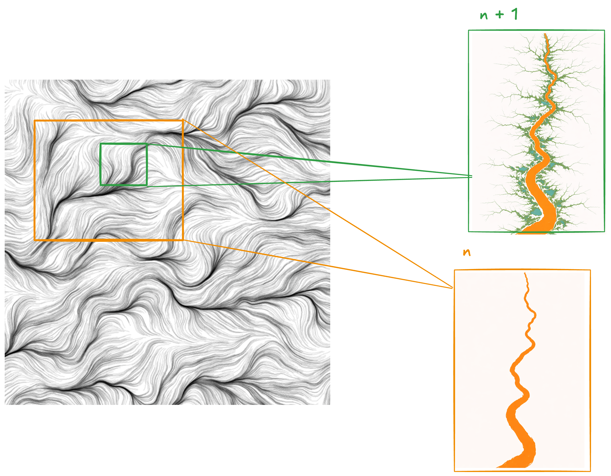

# RFC-105: Procedural Terrain Generation

## Table of contents

- [1: Motivation](#1-motivation)
- [2: Prior Art](#2-prior-art)
    - [2.1: Theory](#21-theory)
        - [2.1.1: Gradient noise (Perlin and relatives)](#211-gradient-noise-perlin-and-relatives)
        - [2.1.2: Fractal sums and spectral control (fBm-style terrain)](#212-fractal-sums-and-spectral-control-fbm-style-terrain)
        - [2.1.3: Hydraulic and thermal erosion](#213-hydraulic-and-thermal-erosion)
        - [2.1.4: River networks and stream order](#214-river-networks-and-stream-order)
        - [2.1.5: Scatter placement (Poisson disk, Worley noise)](#215-scatter-placement-poisson-disk-worley-noise)
    - [2.2: Practice](#22-practice)
        - [2.2.1: Large-scale terrain LOD (geometry clipmaps)](#221-large-scale-terrain-lod-geometry-clipmaps)
        - [2.2.2: Texture resolution at scale (virtual texturing)](#222-texture-resolution-at-scale-virtual-texturing)
        - [2.2.3: Engine terrain stacks (Unreal, Unity, and analogs)](#223-engine-terrain-stacks-unreal-unity-and-analogs)
        - [2.2.4: GPU-oriented synthesis (noise, erosion-style passes on GPU)](#224-gpu-oriented-synthesis-noise-erosion-style-passes-on-gpu)
    - [2.3: In Maybraid Already](#23-in-maybraid-already)
- [3: Design](#3-design)
    - [3.1: Core Concepts](#31-core-concepts)
    - [3.2: Noise Base](#32-noise-base)
    - [3.3: Cellular Stamping](#33-cellular-stamping)
    - [3.4: Fractal Stamping](#34-fractal-stamping)
    - [3.5: Stamp Generation](#35-stamp-generation)
    - [3.6: Stamp Semantics](#36-stamp-semantics)
    - [3.7: Stamp Graphs](#37-stamp-graphs)
        - [3.7.1: Higher-order Boundary Agreements](#371-higher-order-boundary-agreements)
        - [3.7.2: Directional Bias](#372-directional-bias)
            - [3.7.2.1: Scalar Projective Fields](#3721-scalar-projective-fields)
            - [3.7.2.2: Vector Fields](#3722-vector-fields)
            - [3.7.2.3: Hysteresis](#3723-hysteresis)
    - [3.8: Jersey Stamps](#38-jersey-stamps)
        - [3.8.1: Jersey Valley Basins (Unchained)](#381-jersey-valley-basins-unchained)
        - [3.8.2: Jersey Plateau Caps (Unchained)](#382-jersey-plateau-caps-unchained)
        - [3.8.3: Jersey Rugged Massifs (Unchained)](#383-jersey-rugged-massifs-unchained)
        - [3.8.4: Jersey Pocket Waters (Small Hydrology Chains)](#384-jersey-pocket-waters-small-hydrology-chains)
        - [3.8.5: Jersey Basin Waters (Large Hydrology Chains)](#385-jersey-basin-waters-large-hydrology-chains)
        - [3.8.6: Jersey Valley Trains (Chained Valleys)](#386-jersey-valley-trains-chained-valleys)
        - [3.8.7: Jersey Canyons (Confined Incision)](#387-jersey-canyons-confined-incision)
        - [3.8.8: Jersey Hydrology Complexes (Multi-Part Landforms)](#388-jersey-hydrology-complexes-multi-part-landforms)
        - [3.8.9: Jersey Karst Pockets (Small Caves, Unchained)](#389-jersey-karst-pockets-small-caves-unchained)
        - [3.8.10: Jersey Cave Networks (Chained Caves)](#3810-jersey-cave-networks-chained-caves)
        - [3.8.11: Jersey Rolling Ground (Unchained)](#3811-jersey-rolling-ground-unchained)
- [4: Milestones](#4-milestones)
    - [4.1: Alpha noise and stamping abstraction spec](#41-alpha-noise-and-stamping-abstraction-spec)
    - [4.2: Alpha noise and stamping API](#42-alpha-noise-and-stamping-api)
    - [4.3: Alpha BVH spec](#43-alpha-bvh-spec)
    - [4.4: Alpha BVH API](#44-alpha-bvh-api)
    - [4.5: Jersey stamp milestones](#45-jersey-stamp-milestones)
        - [4.5.1: Milestone — Jersey Valley Basins (Unchained)](#451-milestone--jersey-valley-basins-unchained)
        - [4.5.2: Milestone — Jersey Plateau Caps (Unchained)](#452-milestone--jersey-plateau-caps-unchained)
        - [4.5.3: Milestone — Jersey Rugged Massifs (Unchained)](#453-milestone--jersey-rugged-massifs-unchained)
        - [4.5.4: Milestone — Jersey Pocket Waters (Small Hydrology Chains)](#454-milestone--jersey-pocket-waters-small-hydrology-chains)
        - [4.5.5: Milestone — Jersey Basin Waters (Large Hydrology Chains)](#455-milestone--jersey-basin-waters-large-hydrology-chains)
        - [4.5.6: Milestone — Jersey Valley Trains (Chained Valleys)](#456-milestone--jersey-valley-trains-chained-valleys)
        - [4.5.7: Milestone — Jersey Canyons (Confined Incision)](#457-milestone--jersey-canyons-confined-incision)
        - [4.5.8: Milestone — Jersey Hydrology Complexes (Multi-Part Landforms)](#458-milestone--jersey-hydrology-complexes-multi-part-landforms)
        - [4.5.9: Milestone — Jersey Karst Pockets (Small Caves, Unchained)](#459-milestone--jersey-karst-pockets-small-caves-unchained)
        - [4.5.10: Milestone — Jersey Cave Networks (Chained Caves)](#4510-milestone--jersey-cave-networks-chained-caves)
        - [4.5.11: Milestone — Jersey Rolling Ground (Unchained)](#4511-milestone--jersey-rolling-ground-unchained)
    - [4.6: Revised BVH and streaming spec](#46-revised-bvh-and-streaming-spec)
    - [4.7: Revised noise and stamping abstraction spec](#47-revised-noise-and-stamping-abstraction-spec)
    - [4.8: Revised BVH API](#48-revised-bvh-api)
    - [4.9: Revised noise and stamping API](#49-revised-noise-and-stamping-api)

## 1: Motivation

Maybraid aims for large, lightly authored worlds. Terrain must stay globally consistent under streaming and level-of-detail (LOD): the same horizontal coordinates should yield the same elevation (and compatible macro shape) whenever a chunk loads or a coarser ring replaces a finer one.

We treat terrain as a noise base accessed through one height oracle, then deformed by stamps--(1) fractal stamping where landforms must correlate across many samples (valleys, ranges, hydrology) and (2) cellular stamping where per-cell independence is enough (scatter, small relief). Stamp semantics expose non-geometric facts to gameplay and simulation; stamp graphs relate stamps along a shared spine or hydrology graph (again with rivers and reaches as the lead example). [Section 2](#2-prior-art) surveys theory and engine practice against that vocabulary; [Section 3](#3-design) says how Maybraid should implement the stack. Open context: [maybraid#55 — Procedural terrain generation proposal](https://github.com/ramate-io/maybraid/issues/55).

## 2: Prior Art

What follows maps textbook methods and commercial patterns onto the same terms as [Section 1](#1-motivation): noise base, height oracle, stamps (fractal vs cellular), stamp semantics, stamp graphs, deterministic evaluation, streaming, and LOD. Paragraphs that describe how Maybraid fits each topic are written in ordinary prose below; they are judgments about the target stack, not claims that the engine already implements it end to end.

### 2.1: Theory

Elsewhere in games and tooling it is normal to start from cheap continuous noise (gradient noise in the Perlin tradition, or fBm) for a broad base, then stack streamable, deterministic passes for specific needs: river carves, road or trail grades, biome masks, hero landmarks, or Houdini-style exports keyed to tiles. Those passes behave like our stamps: local footprints, parameters tied to world or chunk coordinates, and a need to compose cleanly when neighbors stream in. Not every pipeline uses the word “stamp,” but the noise-then-targeted-features pattern is common.

Spatial indexing, lazy structures, and BVH-shaped cells. Large outdoor worlds pair procedural tiles with spatial acceleration—bounding-volume hierarchies, uniform grids, quad trees, or clipmap rings—so culling and generation scale with what is visible rather than with the entire world. Macro regions (chunk bounds, stamp influence volumes, hydrology skeletons) are often stored or derived as hierarchical cells; that is the same family of ideas as the BVH milestones in [Section 4.3](#43-alpha-bvh-spec) (alpha spec) and [Section 4.6](#46-revised-bvh-and-streaming-spec) (revised spec), even when the exact tree format is engine-specific.

Industry and research pipelines also use those hierarchies to gate expensive procedural structure: nothing pays for a full hydrology solve or hero landmark until a query or volume intersects the node that owns it. For example, coarse world cells can be chosen (deterministically from seed) to contain or omit a “river complex”; only when the player’s bounds or a streamed chunk intersects such a cell does the pipeline instantiate a denser graph—tributaries, pour points, reach IDs—over smaller sub-cells. Unreal-style world partition, planet-scale quad trees, and many open-world streaming designs follow the same pattern: coarse bounds first, then deferred refinement. In Maybraid, macro-stamps and stamp graphs ([Section 3.7](#37-stamp-graphs)) target that lazy, intersection-driven workflow, not evaluating every structure everywhere every frame.

#### 2.1.1: Gradient noise (Perlin and relatives)

[Perlin noise](https://en.wikipedia.org/wiki/Perlin_noise) and successor gradient-domain functions (see Ken Perlin’s [noise reference page](https://cs.nyu.edu/~perlin/noise/); Improving Noise, ACM TOG 2002, is not linked here—common PDF mirrors and DOI checks often time out or return errors in automated link validation) are the default continuous random field for height: cheap to sample, smooth between neighbors, and easy to tile into infinite worlds (Minecraft-style overlays, space games, survival sandboxes).

In procedurally generated games, gradient noise typically drives base elevation, wind patterns, or blend weights between materials; designers stack a few octaves and tune frequency, so play spaces read as hills and flats rather than white noise.

In Maybraid, we want a strong fit for the noise base and for stamp parameters ([Section 3](#3-design)): deterministic, streaming-safe height without authoring every hill. Low-poly art direction does not reduce the need for coherent macro shape; it reduces reliance on high-frequency detail in the base field.

#### 2.1.2: Fractal sums and spectral control (fBm-style terrain)

Summing noise at multiple scales produces fractional Brownian motion (fBm)-like relief; see [fractional Brownian motion](https://en.wikipedia.org/wiki/Fractional_Brownian_motion) and the intuition of fractal terrain in Mandelbrot’s [The Fractal Geometry of Nature](https://en.wikipedia.org/wiki/The_Fractal_Geometry_of_Nature).

In other games, multi-octave sums are the standard way to get foothills, ridges, and micro-roughness from a single seed; many titles add ridging, warp, or curve remapping on top of the same stack.

In Maybraid, we align directly with a stampable pipeline: the global base can stay fBm-like while stamps inject valleys, roads, and hero features. Spectral choices (how many octaves, how much high frequency) should stay compatible with chunk LOD so distant terrain does not shimmer or diverge from near terrain.

#### 2.1.3: Hydraulic and thermal erosion

Iterated sediment transport and slope-collapse models reshape noise into drainage-like networks; classic references appear in Musgrave’s line of work and in *Texturing and Modeling* (Ebert et al.); see also surveys of interactive terrain erosion (e.g. [terrain deformation / erosion](https://en.wikipedia.org/wiki/Terrain_deformation)).

In other games, erosion appears both as offline bake (acceptable load times) and as GPU or chunk passes for live worlds; it sells valleys, talus, and river attachment better than raw noise alone.

In Maybraid, this is only a partial fit. Hydrology-flavored look supports discovery and watershed-adjacent gameplay, but heavy iterative simulation on every chunk may fight demo deadlines and deterministic streaming. The likely pattern is lightweight erosion-like stamps or a few global passes, plus semantic water networks where we need correctness more than full physics.

#### 2.1.4: River networks and stream order

[Stream order](https://en.wikipedia.org/wiki/Stream_order) (Strahler, Horton) formalizes tree-shaped drainage: tributaries merge into larger channels. Procedural tools often build a graph or tree on the plane, then carve or stamp terrain to match.

In other games, explicit river graphs power navigable water, quests along rivers, and consistent flow direction; without a graph, rivers from noise alone often fail to close or flow uphill locally.

In Maybraid, [Fractal Stamping](#34-fractal-stamping) and [Stamp Graphs](#37-stamp-graphs) are a strong fit: we want large features that stay coherent across streamed cells. The open question is how much graph solving we do up front versus lazy refinement when chunks load—both are compatible with the RFC if semantics and height stay coupled.

#### 2.1.5: Scatter placement (Poisson disk, Worley noise)

[Poisson disk sampling](https://en.wikipedia.org/wiki/Supersampling) yields even, non-grid spacing for props; [Worley noise](https://en.wikipedia.org/wiki/Worley_noise) builds Voronoi-like regions useful for biome patches, stone fields, or cellular variation that still looks organic.

In other games, these drive trees, rocks, grass clumps, and loot placement on top of terrain; they are orthogonal to how height is formed but essential for readable open worlds.

In Maybraid, vegetation and detail layers already sit beside macro terrain in our demos, so the fit is strong. Worley-style fields can also back cellular stamping ([Section 3.3](#33-cellular-stamping)) when we want patchy stamp types without a rigid grid. The main constraint is the same as everywhere: reproducible seeds per chunk and agreement with LOD (do not spawn detail only at one LOD).

### 2.2: Practice

#### 2.2.1: Large-scale terrain LOD (geometry clipmaps)

[Geometry clipmaps](https://en.wikipedia.org/wiki/Clipmap) (Losasso & Hoppe, [author project page](https://hhoppe.com/proj/geomclipmap/) and [paper PDF](https://hhoppe.com/geomclipmap.pdf)) use nested regular grids centered on the camera, so high resolution sits near the player and coarser rings fill the horizon, with streaming and stitching rules that avoid cracks.

In production, those tiles or rings are almost always scheduled through a spatial index—commonly a BVH or quad tree over chunk axis-aligned bounding boxes—so culling and terrain jobs scale with visibility rather than world diameter (same family of ideas as in [Section 2.1](#21-theory) and [Section 4.6](#46-revised-bvh-and-streaming-spec)).

In procedurally generated games, clipmaps and close cousins (chunked heightfields, CDLOD, planet quad trees) are how open-world and flight titles keep frame cost bounded while the world is infinite or huge. Generation runs per chunk or per ring, keyed by world coordinates and LOD level.

In Maybraid, discovery-scale outdoor spaces are a strong fit: we need deterministic height per chunk and stable transitions between LODs, so procedural stamps do not pop or shift when rings update. Exploratory scheduling already uses a 3-power concentric-shell cascade ([Section 2.3](#23-in-maybraid-already)); mesh stitching, height-oracle LOD keys, and BVH integration remain open design surface. The RFC assumes some hierarchical LOD story shared with culling.

#### 2.2.2: Texture resolution at scale (virtual texturing)

[Virtual texturing](https://en.wikipedia.org/wiki/MegaTexture#Virtual_texturing) (see also MegaTexture/clipmap-style streaming on the same page) and sparse or paged albedo-normal workflows (often discussed under virtual texture or megatexture-class rendering) break the terrain material into tiles loaded by visibility and mip need, instead of one giant bitmap.

In other games, this matters when ground detail must hold up at player scale across kilometers--common in AAA open worlds and some stylized titles with rich surface breakup.

In Maybraid, this is only a partial fit. Low-poly shading reduces pressure for 8K-class splats, but biomes, paths, and stamp semantics may still want sparse overlays (decals, splat IDs, or virtual texturing) as worlds grow. Cost is pipeline complexity (streaming, compression, tooling); we may stay lightweight (few layers, baked low-res) until a demo explicitly needs near-field texture density.

#### 2.2.3: Engine terrain stacks (Unreal, Unity, and analogs)

[Unreal Landscape](https://dev.epicgames.com/documentation/en-us/unreal-engine/landscape-technical-guide) and [Unity Terrain](https://docs.unity3d.com/Manual/terrain-UsingTerrains.html) embody the mainstream heightfield, paint layers, splat masks workflow: artists sculpt and blend materials; code can feed heights and masks procedurally.

In other games, these stacks are the authoring hub even when height comes from noise or Houdini: teams export or drive landscapes from tools, then layer foliage, physics, and streaming on the same grid.

In Maybraid, we treat these stacks as workflow reference, not a mandate. We are on Bevy, not Unreal or Unity terrain, but the separation of concerns carries over: height oracle, material classification, decals, and detail spawning. Procedural stamps ([Section 3](#3-design)) play the role of brushes and layers, with deterministic parameters instead of hand painting.

#### 2.2.4: GPU-oriented synthesis (noise, erosion-style passes on GPU)

[GPU Gems 3 — “Generating Complex Procedural Terrains Using the GPU”](https://developer.nvidia.com/gpugems/gpugems3/part-i-geometry/chapter-1-generating-complex-procedural-terrains-using-gpu) exemplifies real-time composition: noise layers, blends, and erosion-like iterations on height textures or vertex buffers under a millisecond budget.

In other games, GPU height passes appear in planet generators, editor previews, and runtime deformation (craters, trails); CPU generation remains common when determinism and simple tooling matter more than peak throughput.

In Maybraid, the GPU path is an optional accelerator. Our stamp and oracle model can run on the CPU first (easier to debug and to match across LOD). GPU stages become attractive when we need wide batches (whole rings) or interactive edits, as long as bit-identical or well-defined fallbacks exist for streaming and replay. It is not required for low-poly credibility; it is useful when iteration speed or scale dominates.

### 2.3: In Maybraid Already

There is exploratory terrain work in Maybraid ([`procedures/terrain`](../../procedures/terrain/), demo wiring in [`demos/naturescapes/src/terrain.rs`](../../demos/naturescapes/src/terrain.rs)). It uses a 2.5D height oracle with stacked region-shaped modulations and embeds the resulting surface in a 3D signed distance field, allowing volumetric composition.

LOD/chunk scheduling is [`util/chunk/src/cascade.rs`](../../util/chunk/src/cascade.rs) defines a viewer-centered cascade of `CascadeChunk` volumes. A fine center cell is surrounded by concentric rings; each ring is the 26 outer cells of a 3×3×3 neighborhood (interior omitted), and edge length scales as min_size · 3^ring. `ResolutionMap` assigns a power-of-two sample resolution per ring (constant or decreasing toward the horizon). Optionally, a coarse background grid of larger chunks (span derived from the cascade) is built around the same camera position; those chunks store an omit region described by an axis-aligned box equal to the full cascade’s axis-aligned bounding box, so macro tiles cover the distant volume without overlapping the high-detail band. Conceptually this sits beside geometry clipmaps and CDLOD: nested regular decomposition keyed to the viewer and streaming deltas (`new_chunks`), but the topology is 3D cubic shells rather than 2D nested quad rings.

> [!NOTE]
> In practice, the current usage of the LOD system with marching-cubes does not handle stitching at resolution boundaries. Thus, only a single resolution can be used over the cascade. 
>
> In the future, we may resolve this [with](https://github.com/ramate-io/maybraid/pull/39) [transvoxel](https://transvoxel.org/) or skirting approaches.  

> [!WARNING]
> The code described above is not the specification for this RFC: it may be replaced, re-scoped, or discarded as the design in [Section 3](#3-design) stabilizes. When this document and the implementation diverge, this document wins until explicitly revised.

## 3: Design

This section specifies how Maybraid should assemble procedural terrain going forward: contracts between a noise base, stamps, stamp semantics, and stamp graphs. Nothing here asserts that a given subsystem already exists or matches exploratory code in [Section 2.3](#23-in-maybraid-already); implementers should treat this as the target architecture and migrate toward it. It does not mandate crate layout.

### 3.1: Core Concepts

- **Height oracle:** Maybraid should expose one elevation API for horizontal coordinates `(x, z)` (and optionally slopes or normals) keyed by world seed and LOD or chunk context. Gameplay, physics, foliage, and procedural stamps that need ground height should call this oracle or a documented cache derived from it, instead of sampling noise ad hoc, so every system agrees after streaming and LOD changes.
- **Stamp:** A stamp is a local operator: a footprint in the plane (hard mask, smooth falloff, or signed-distance blend) plus parameters (strength, orientation, path anchors, noise seeds). Pipelines should pick and document a composition policy (ordered stack, DAG with priorities, or buckets), so evaluation order is not ambiguous when several stamps overlap.
- **Fractal stamping:** Use continuous noise (or derived fields) to drive whether a stamp applies, which stamp type runs, or numeric parameters, so landforms stay spatially correlated across many samples. Prefer this for drainage valleys, mountain fronts, and ridge lines that would look tiled or broken under independent cell dice.
- **Cellular stamping:** Use a fixed cell grid and a PRNG keyed by cell coordinates when per-cell independence is acceptable (scatter rocks, small hollows). Do not rely on cellular dice alone for long reaches that must line up (see hydrology under [Section 3.7](#37-stamp-graphs)).
- **Stamp semantics:** Stamps that affect gameplay or simulation should emit structured, non-geometric data alongside height (tags, masks, graph hooks). Hydrology is the reference example throughout this RFC: a channel stamp should be able to expose reach identity, flow direction, bank masks, and adjacency to the next stamp downstream without forcing callers to infer water from height alone ([Section 3.6](#36-stamp-semantics)).

### 3.2: Noise Base

- **Build order:** evaluate a global base first, then apply stamps. The base should normally be a multi-octave smooth-noise stack (fBm-style), optionally followed by spectral shaping (ridged noise, domain warp) or lightweight erosion-like passes as described in [Section 2.1](#21-theory). 
- **Determinism:** the base must be a pure function of world coordinates, seed, and LOD parameters, so the same query after a chunk reload or at a coarser ring returns the same elevation and downstream hydrology stamps do not fight a shifting substrate.

### 3.3: Cellular Stamping

- **Procedure:** fix a cell size; for each cell, hash `(cell_i, cell_j, world_seed)` into a PRNG; decide boolean presence and stamp type from that stream. 
- **When to use:** props, potholes, and other features that do not need to align across cell borders. 
- **When to avoid:** main-stem rivers, continuous ridges, or any feature whose centerline or banks must meet across streamed boundaries; those require fractal fields and/or planned graphs. In these cases, independent cellular stamping will not achieve the needed spatial correlation. 

### 3.4: Fractal Stamping

Use fractal noise to make stamping decisions, thus spatially correlating stamps across cells or other procedural boundaries. 

Below are example noise algorithms and stamp families they suit:

| Stamp family | Suggested noise role | Notes |
|--------------|----------------------|--------|
| Large landform (basin, plateau) | Low-frequency fBm / gradient noise | Establishes watershed-scale bowls and barriers before channel stamps run. |
| Ridge / cliff line | Ridged or absolute-value variants of smooth noise | Often needs directional bias or domain warp, so divides stay coherent. |
| Valley / channel | Curve- or graph-guided field plus detail noise | Hydrology: pair with path-consistent grade, so pools and runs read as downhill. |
| Scatter (boulders, small dips) | Mid-frequency noise plus thresholds | Mix with cellular rules where independence is fine. |
| Wobbly footprint | Noise modulating a 2D distance field | Irregular bank lines without hand-authored splines. |

Allowing a stamp to spawn child stamps, e.g. main channel spawns bars, cutbanks, and confluence pockets, introduces recursive structure mimicking the nature of fractal itself. Taken further, by reusing the same noise family at offset seeds or scales, we can accomplish a sampling of the original fractal noise that interprets finer sample decisions as finer game world structures. 

### 3.5: Stamp Generation

As referenced above, stamps should often be written to construct from a seed themselves. 

### 3.6: Stamp Semantics

Stamps that influence later world construction and interaction layers beyond terrain specification should be marked in their extents. For example, stamps that carve channels, lakeshores, or engineered grades should both move height and publish facts downstream systems need. Hydrology-first examples:

- A riverbed stamp should be able to emit wet mask, thalweg polyline or raster spine, flow direction, and optional graph edges (“this reach continues to stamp instance *k*” or “confluence with reach *m*”).
- A waterfall or grade break stamp should record drop height, overflow lip geometry, and upstream/downstream reach IDs, so audio, particles, and fish spawning do not re-derive topology from triangles.
- Consumers (spawning, buoyancy, quest triggers, future flow solvers) should read these fields from a query API, not by thresholding final height (“blue below *z*”) unless you explicitly document that as a fallback.

Keep geometry deltas and semantic records in the same evaluation pass but separate in data (height change vs. tag set, masks, edges), so changing how height is blended does not silently erase which cells belong to which reach.

### 3.7: Stamp Graphs

A common object is to relate adjacent stamps. For example, we might want to create a hydrology complex with a reliable downhill gradient from sources to sinks. 

[Fractal Stamping](#34-fractal-stamping) gets most of the way there. We can sample noise to tell us there should be a hydrology complex over a large region running from a given elevation to another. We can apply this recursively to break the hydrology elevation requirements over piece-wise cells. Then, we can break these cells into complete graphs and finally generate the elevation requirements for various features along the graphs. 

At a high-level, the [Fractal Stamping](#34-fractal-stamping) framework gives us the tools to build these complexes. However, often, we will need to use cleverer patterns--as described in this section--to accomplish the intended chain. 

#### 3.7.1: Higher-order Boundary Agreements

Coherent Stamp Graphs rely on boundary agreements. A known hydrology graph in Cell A can only reasonably connect to Cell B if they can agree on the connection points and values at those connection points. 

In a stream-ready setting without higher-order structure, this task is undecidable: w.l.o.g, there arises a circular dependency between Cell A knowing the values of Cell B knowing the values of A. 

We could resolve this with a direct ordering requirement between Cell A and Cell B, but this makes efficient streaming very difficult. 

Instead, it's often better to impose boundary conditions at a higher-order cell. For example, Cell A and Cell B can reside within Cell $\Gamma$. Cell $\Gamma$ can efficiently know that Cell A and Cell B share a boundary at $y=1.0$. It can further efficiently decide that Cell A and B should connect a hydrology complex at $(x=0.5,y=1.0,z=0.5)$, taking the z-value for height from its encoding of a larger hydrology model w.l.o.g. 

#### 3.7.2: Directional Bias

We often want our Stamp Graphs to have a certain directional bias. For example, we might want a river--once seeded--to flow mostly west. Below are a series of methods for accomplishing this at various levels of abstraction.

##### 3.7.2.1: Scalar Projective Fields

> [!NOTE]
> While scalar projections are a common mathematical tool, this particular usage of them is not something I've found repeated explicitly elsewhere. This may be because it is a trivial outcome. 

Scalar Projective Fields are fields described by a set of rays, which give a (normalized) value representing adherence to a directional bias described by the ray. In other words, when sampling any point in a scalar projective field, you obtain a value representing how far something is relative to a bias ray. 

Scalar Projective Fields are useful when you want to describe complex objects within a cell that you will sample up to some definition of completeness. Each normalized value can be interpreted as a likelihood or magnitude which you can use to determine an effect at the sampled point and/or surrounding region. 

##### 3.7.2.2: Vector Fields

Vector fields are good for both pathfinding and complex geometry, though for the latter they are less directly interpretable than [Scalar Projective Fields](#3721-scalar-projective-fields). 

When pathfinding, given a starting point in a vector field, one can simply trace the vectors through to an end point.

When building complex geometry, one can either build cells that take sampled vectors as inputs or take some norm of the vectors and use an approach similar to [Scalar Projective Fields](#3721-scalar-projective-fields).

##### 3.7.2.3: Hysteresis 

Hysteresis is particularly good for pathfinding and graph-growth procedures when the underlying field is noisy or when evidence arrives piecemeal as chunks stream in. Instead of flipping a decision the moment a scalar crosses one cut, you separate an *enter* threshold from an *exit* threshold (or an equivalent lag): the trace “commits” to a corridor, branch, or flow direction until the field pushes far enough past the second boundary to justify a change. That behavior matches hydrology-shaped Stamp Graphs—a reach or thalweg should not renegotiate its identity every time a neighbor cell loads or a new sample nudges a cost slightly.

It pairs naturally with [vector fields](#3722-vector-fields): once integration has progressed far enough along a biased direction, you can tighten or loosen the cone of acceptable tangents so small perpendicular components do not tear the path apart. It also sits beside [Higher-order Boundary Agreements](#371-higher-order-boundary-agreements): at a shared face between cells, you can require a sustained mismatch before reopening junction heights or graph edges, rather than reacting to the first disagreeing sample—reducing oscillation without giving up the ability to correct real errors when the macro model updates.

The tradeoff is explicit state: you must record the current committed phase (which edge set, which branch, which “locked” boundary values) and document deterministic rules for when new data may override it, consistent with [Section 3.5](#35-stamp-generation). Without clear release conditions, hysteresis can mask bugs—paths that never unlock--so treat those conditions as part of the terrain contract, not a hidden implementation detail.

### 3.8: Jersey Stamps

Jersey is the working name for the first curated bundle of terrain stamp families aimed at demos and vertical slices. Names below are product-facing groupings; one family may compile to several internal stamp types. Together they stress-test [fractal stamping](#34-fractal-stamping)—noise-driven correlation across procedural boundaries, recursive parent-to-child stamps, and multiscale reuse of the same noise family—and [stamp graphs](#37-stamp-graphs), where hydrology and tunnels are built as related stamps with shared graph identity, higher-order boundary agreements across streamed cells, and directional-bias machinery when a reach needs a preferred bearing. Volume-local work follows the same 3D signed-distance embedding described in [Section 2.3](#23-in-maybraid-already).

Hydrology-heavy lines (Jersey Pocket Waters, Jersey Basin Waters, Jersey Valley Trains, Jersey Hydrology Complexes) are the primary graph-shaped SKUs; Jersey Canyons and the karst or cave families are separate product lines—morphology-first incision or tunnel parameter space—even when the underlying math touches water or graphs. Where gameplay or simulation consumes terrain, Jersey stamps should publish the structured fields called for in [Section 3.6](#36-stamp-semantics) and stay deterministic under streaming and LOD as in [Section 3.5](#35-stamp-generation).

Look and layering: every Jersey family is meant to run on top of the noise base ([Section 3.2](#32-noise-base)), not on a flat synthetic plane. Stamps should lean on noise for placement, strength, footprint warp, and micro-breakup ([Section 3.4](#34-fractal-stamping), [Section 3.5](#35-stamp-generation)), so the result stays rough and natural-looking—strong landforms read clearly, but they still inherit the fractal grain of the base instead of looking like smooth CAD inserts.

#### 3.8.1: Jersey Valley Basins (Unchained)

**Purpose:** single-region valley depressions with parameterized cross-section (V-shaped, U-shaped, or asymmetric), width, axis curvature, and bank falloff. Placement and strength should be fractal-driven ([Section 3.4](#34-fractal-stamping)), so long valleys do not tile like independent cellular tiles.

**Semantics:** bank mask for foliage and splats; optional tags distinguishing dry arroyo profiles from spillway-ready floors that a later hydrology stamp can occupy.

LOD: fix macro axis and depth early; treat micro bank breakup as a high-frequency layer that can weaken at distance without moving the thalweg.

#### 3.8.2: Jersey Plateau Caps (Unchained)

**Purpose:** tablelands and mesa-style caps: raised interior with gentle tilt, escarpment strength at the rim, and controlled corner behavior. Footprints can be convex polygons, smooth blobs, or noise-warped boundaries using the “wobbly footprint” idea from [Section 3.4](#34-fractal-stamping).

**Semantics:** surface class (e.g. exposed cap rock vs soil mantle) for materials and props.

#### 3.8.3: Jersey Rugged Massifs (Unchained)

**Purpose:** ridged, serrated, or cliff-banded high terrain—peaks, arêtes, and broken crests—using the same spectral toolkit as the ridge row in [Section 3.4](#34-fractal-stamping). Often stacked after coarse envelope stamps, so crests inherit watershed-scale context.

**Semantics:** exposure or rockiness masks for scree and cliff props.

#### 3.8.4: Jersey Pocket Waters (Small Hydrology Chains)

**Purpose:** stamp chains for small closed systems: a pond or tarn body, optional outlet lip, a short run or riffle, and a documented termination (another sink, marsh hint, or hand-off tag). All instances along the chain share one drainage ID ([Section 3.7](#37-stamp-graphs), [Section 3.6](#36-stamp-semantics)).

**Semantics:** water-surface target where applicable; reach graph (typically a handful of edges); flow direction on the run; bank or littoral masks.

#### 3.8.5: Jersey Basin Waters (Large Hydrology Chains)

**Purpose:** macro hydrology bundles: lake or reservoir-scale water bodies, branched outlet systems, and tributary stubs or confluence nodes, parameterized from a coarse drainage graph. Designed so macro reaches stay stable as chunks stream.

**Semantics:** reach IDs, junction records, pour-point or outlet targets for downstream systems; optional seasonal or regulated level hints.

#### 3.8.6: Jersey Valley Trains (Chained Valleys)

**Purpose:** ordered valley stamps along a shared horizontal spine (headwater to base level): for example upper gorge, middle glide, lower widened floor. Segment heights obey endpoint constraints from a macro planner or oracle.

**Semantics:** per-segment tags indicating active channel vs floodplain-only, so hydrology overlays know where to bind running water.

#### 3.8.7: Jersey Canyons (Confined Incision)

**Purpose:** morphology-first stamps for confined terrain: slots, narrows, gorge walls, and vertical relief along a spine (dry or wet). This is hydrology-adjacent—many canyons host ephemeral or perennial channels—but Jersey treats canyons as their own product line so tooling emphasizes wall height, confinement ratio, bench shelves, and overhang risk rather than only water-surface targets.

**Variants:** unchained (single enclosed reach of incision) or chained segments (upper slot, wider box canyon, exit ramp) along one centerline.

**Semantics:** wall or cliff masks; floor vs ledge classification; optional thalweg or dry-channel spine for downstream Pocket or Basin water stamps to bind without re-deriving confinement from height alone.

#### 3.8.8: Jersey Hydrology Complexes (Multi-Part Landforms)

**Purpose:** packaged stamp groups that describe a single named geomorphic system made of several interacting pieces—still grounded in drainage logic, but not sold as the same SKU as Pocket Waters or Basin Waters (those focus on graph-like lake–stream–pour-point networks). Examples: alluvial fan head + incised distributaries + toe; sink–polje–resurgence-style stepped flats; plunge–pool + rapid ladder + glide pool along one macro reach; terrace stair with paired cutbanks.

**Authoring:** either a macro footprint or a graph seed drives child stamps arranged as a chain (sequential) or DAG (parallel), with a shared complex ID, so consumers see one logical feature.

**Semantics:** complex type tag; constituent roles (fan apex, main stem, overflow sill, etc.); reach or segment edges where water could attach; optional seasonal routing hints.

#### 3.8.9: Jersey Karst Pockets (Small Caves, Unchained)

**Purpose:** localized cavities: sinkhole mouths, short alcoves, or rubble-choked pockets. Implementation may be SDF-local (native 3D; context in [Section 2.3](#23-in-maybraid-already)) or a height-oracle dip plus volumetric tag when caves are represented lightly.

**Semantics:** cavity mask, entrance curve or portal disk, navigation class (passable, crawl-only, hazard).

#### 3.8.10: Jersey Cave Networks (Chained Caves)

**Purpose:** chains of passage stamps along a 3D spine (mouth, slot, chamber, sump or daylight exit), analogous to hydrology chains but in tunnel parameter space. Reuses chain discipline from [Section 3.7](#37-stamp-graphs): shared tunnel graph ID, deterministic sub-stamp keys ([Section 3.5](#35-stamp-generation)).

**Semantics:** branch nodes, air vs flooded segments, graph edges for audio, lighting, and spawn zoning.

#### 3.8.11: Jersey Rolling Ground (Unchained)

**Purpose:** gentle swell and swale on valley floors, plateau interiors, or piedmont surfaces without opening new primary drainages. Use mid-frequency fractal modulation so it does not fight larger valley or plateau stamps.

**Semantics:** pasture / agriculture suitability or generic detail mask for scatter rules.

## 4: Milestones

Milestones below are planning hooks, not dated commitments. This RFC separates spec milestones (what contracts and documents must say) from API milestones (what ships in code), for both the alpha cut and a later revised cut. Except for [Section 4.5](#45-jersey-stamp-milestones), wording is suggestive: engine layout, crate boundaries, and exact APIs remain adaptable.

### 4.1: Alpha noise and stamping abstraction spec

Document the target contracts from [Sections 3.1](#31-core-concepts)–[3.6](#36-stamp-semantics), so implementers can build against a single source of truth:

- Height oracle contract: callable elevation (and optional derivatives) from `(x, z)` plus seed / LOD or chunk context, with tests that the same query is stable across reloads ([Section 3.1](#31-core-concepts), [Section 3.2](#32-noise-base)).
- Noise base pipeline: documented build order (global base before stamps), fBm-style stack plus optional spectral shaping hooks, and a path to swap noise implementations without changing callers.
- Stamp core: footprint types (hard mask, falloff, SDF blend), parameter bundle, and a documented composition policy (stack, DAG, or buckets) with deterministic overlap resolution ([Section 3.1](#31-core-concepts)).
- Fractal vs cellular: at least one fractal-driven placement path and one cell PRNG path, both feeding the same stamp evaluator ([Section 3.3](#33-cellular-stamping), [Section 3.4](#34-fractal-stamping)).
- Reproducibility: randomness keyed by an agreed tuple (e.g. seed, region, stamp ID, sub-stamp index) verified in streaming and replay scenarios ([Section 3.5](#35-stamp-generation)).
- Semantics v0: stamps can attach queryable payloads (tags, masks, sparse graph edges); at least one hydrology-shaped example end-to-end ([Section 3.6](#36-stamp-semantics)).

### 4.2: Alpha noise and stamping API

Done when: a concrete API surface (traits, types, or equivalent) implements [Section 4.1](#41-alpha-noise-and-stamping-abstraction-spec): callers can obtain oracle samples with documented LOD/chunk keys, run fractal and cellular placement into one evaluator, and read semantics payloads from at least one hydrology-shaped stamp. Automated tests cover reload stability and one streaming-style scenario; composition and tuple-keying rules from [Section 3.5](#35-stamp-generation) are enforced in code or asserted in tests.

### 4.3: Alpha BVH spec

Document the first spatial-index story for terrain and stamp macro work:

- Spatial index v0: a bounding-volume hierarchy (or equivalent) over terrain chunks, stamp macro regions, or both, sufficient for frustum / distance rejection in a demo scene.
- Single-writer rule: how generation and culling agree on node bounds and versioning when terrain updates (even if updates are rare in the MVP).
- Coarse LOD linkage: MVP may use one or two discrete LODs; the spec records which oracle parameters change per level, so Jersey stamps can be tested against pop and shift behavior.
- Debug visibility: optional overlay or logging format for BVH nodes to validate hierarchy depth and overlap against stamp footprints.

### 4.4: Alpha BVH API

Done when: the engine path used by a demo performs frustum/distance queries against the structure described in [Section 4.3](#43-alpha-bvh-spec), with the single-writer/versioning story exercised (even minimally). Optional debug draw or logging matches the spec. Integration points with chunk scheduling or terrain jobs are documented so [Section 4.2](#42-alpha-noise-and-stamping-api) and Jersey work can depend on them.

### 4.5: Jersey stamp milestones

Each milestone below maps to one Jersey family in [Section 3.8](#38-jersey-stamps). “Done when” means: behavior matches that family’s Purpose and Semantics bullets, respects Look and layering (noise-on-base), and stays deterministic under the alpha contracts ([Section 4.1](#41-alpha-noise-and-stamping-abstraction-spec), [Section 4.2](#42-alpha-noise-and-stamping-api)).

Suggested sequencing: 4.5.1–4.5.3 and 4.5.11 can land early. 4.5.4–4.5.8 need stamp-graph and semantics maturity ([Section 3.7](#37-stamp-graphs)). 4.5.9–4.5.10 need the chosen SDF / volume path.

#### 4.5.1: Milestone — Jersey Valley Basins (Unchained)

Spec: [Section 3.8.1](#381-jersey-valley-basins-unchained).

Done when: fractal-driven valley depression with parameterized cross-section, width, axis, and bank falloff; bank (and optional arroyo vs spillway-ready) semantics; thalweg stable across LOD reloads.

#### 4.5.2: Milestone — Jersey Plateau Caps (Unchained)

Spec: [Section 3.8.2](#382-jersey-plateau-caps-unchained).

Done when: tableland interior with rim escarpment and controlled corners; noise-warped, blob, or polygon footprints; surface class semantic for materials or props.

#### 4.5.3: Milestone — Jersey Rugged Massifs (Unchained)

Spec: [Section 3.8.3](#383-jersey-rugged-massifs-unchained).

Done when: ridged / cliff-banded high terrain consistent with [Section 3.4](#34-fractal-stamping) ridge-style noise; stacks sensibly after coarse envelopes; optional exposure or rockiness mask.

#### 4.5.4: Milestone — Jersey Pocket Waters (Small Hydrology Chains)

Spec: [Section 3.8.4](#384-jersey-pocket-waters-small-hydrology-chains).

Done when: chain of small hydrology stamps (pond or tarn, outlet, short run, termination) sharing one drainage ID; water-surface targets where needed; reach graph, flow direction, bank or littoral masks per [Section 3.8.4](#384-jersey-pocket-waters-small-hydrology-chains).

#### 4.5.5: Milestone — Jersey Basin Waters (Large Hydrology Chains)

Spec: [Section 3.8.5](#385-jersey-basin-waters-large-hydrology-chains).

Done when: macro lake or reservoir body with branched outlets and tributary or confluence nodes driven from a coarse drainage graph; reach IDs, junction records, and pour-point targets stable as chunks stream.

#### 4.5.6: Milestone — Jersey Valley Trains (Chained Valleys)

Spec: [Section 3.8.6](#386-jersey-valley-trains-chained-valleys).

Done when: ordered valley stamps on one horizontal spine with endpoint heights from macro planner or oracle; per-segment active channel vs floodplain-only tags for hydrology overlays.

#### 4.5.7: Milestone — Jersey Canyons (Confined Incision)

Spec: [Section 3.8.7](#387-jersey-canyons-confined-incision).

Done when: confined incision (unchained or chained gorge segments) with wall height and confinement tooling; wall / cliff, floor / ledge semantics; optional thalweg or dry-channel spine for binding Pocket or Basin water later.

#### 4.5.8: Milestone — Jersey Hydrology Complexes (Multi-Part Landforms)

Spec: [Section 3.8.8](#388-jersey-hydrology-complexes-multi-part-landforms).

Done when: multipart stamp group under one complex ID; chain or DAG child arrangement; complex type, constituent roles, and reach or segment edges; optional seasonal routing hints per [Section 3.8.8](#388-jersey-hydrology-complexes-multi-part-landforms).

#### 4.5.9: Milestone — Jersey Karst Pockets (Small Caves, Unchained)

Spec: [Section 3.8.9](#389-jersey-karst-pockets-small-caves-unchained).

Done when: localized cavity or sink entrance via SDF-local carve and/or height-oracle dip plus volumetric tag; cavity mask, entrance geometry, navigation class semantic.

#### 4.5.10: Milestone — Jersey Cave Networks (Chained Caves)

Spec: [Section 3.8.10](#3810-jersey-cave-networks-chained-caves).

Done when: chained passage stamps on a 3D spine with shared tunnel graph ID; branch, air vs flooded, and graph edge semantics for downstream systems ([Section 3.5](#35-stamp-generation) sub-stamp keys).

#### 4.5.11: Milestone — Jersey Rolling Ground (Unchained)

Spec: [Section 3.8.11](#3811-jersey-rolling-ground-unchained).

Done when: mid-frequency swell and swale that does not overpower valley or plateau stamps; optional pasture / agriculture suitability or generic detail mask.

### 4.6: Revised BVH and streaming spec

Update the BVH/streaming document to match production-scale goals and coarse-to-fine stamp graph discipline ([Section 3.7](#37-stamp-graphs), especially higher-order boundary agreements):

- Shared hierarchy: culling and terrain generation consume the same BVH (or strictly synchronized mirrors), so invisible regions do not schedule expensive stamp work.
- Streaming correctness: chunk load / unload does not change deterministic height or semantic IDs for regions that remain loaded; document handshake between macro-stamps and fine local passes when new neighbors appear.
- Multi-resolution BVH: coarse-to-fine nodes aligned with LOD rings or clipmap-style bands; semantic IDs stable from coarse to fine.
- Scale stress: targets for node count, refit cost, and worst-case depth on discovery-scale worlds (numbers left to engine RFCs).
- Failure modes: defined behavior when planner data arrives late (fallback height, degraded semantics, or explicit “not ready” query), without silent graph corruption.

### 4.7: Revised noise and stamping abstraction spec

Revise the noise/stamp specification using field experience from alpha and alignment with [Section 4.6](#46-revised-bvh-and-streaming-spec):

- Oracle and stamp evaluation are keyed consistently with BVH LOD bands and chunk cascade parameters; document which queries are valid before macro graph data is resident.
- Stamp graphs ([Section 3.7](#37-stamp-graphs)): boundary agreements, directional bias, and hysteresis rules appear in the spec where they affect determinism or query contracts—not only in narrative sections.
- Intersection-gated refinement: macro regions and hydrology skeletons define when fine graphs may be instantiated; lazy evaluation semantics match [Section 2.1](#21-theory) prior-art discussion.
- Migration notes from [Section 4.1](#41-alpha-noise-and-stamping-abstraction-spec): deprecated assumptions, new required semantics fields, and compatibility guarantees for saved seeds or replays.

### 4.8: Revised BVH API

Done when: the implementation matches [Section 4.6](#46-revised-bvh-and-streaming-spec): multi-resolution tree (or equivalent) refits within agreed budgets, culling and terrain generation share one hierarchy or a provably synchronized pair, and stress targets are measurable. Release notes describe behavioral changes relative to [Section 4.4](#44-alpha-bvh-api).

### 4.9: Revised noise and stamping API

Done when: public surfaces match [Section 4.7](#47-revised-noise-and-stamping-abstraction-spec), including graph and semantics hooks needed for revised BVH scheduling. Migration guidance ships for consumers of the alpha API ([Section 4.2](#42-alpha-noise-and-stamping-api)); batching or job interfaces align with how the revised BVH drives work, without breaking deterministic replay unless explicitly versioned.