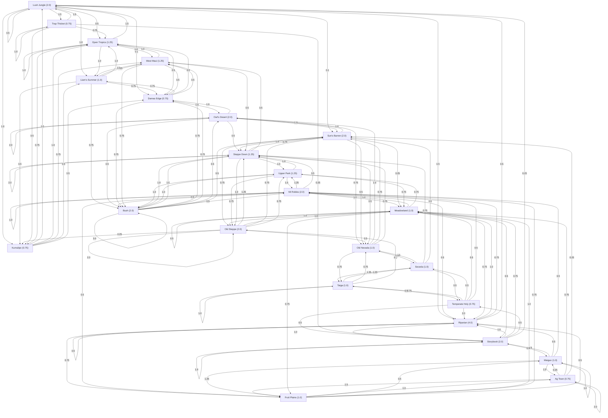

# 3.5.5: Chico Vegetation

This page is subsection **3.5.5** of [RFC-183: Chico Vegetation](../../README.md)

Initial Hopscotch distribution sketch for Chico vegetation:

```rust
pub enum ChicoVegetationHopscotch {
    LushJungle(Bucket {
        weight: 2.0,
        adjacencies: [
            (TrapThicket, 1.5),
            (LiamsSummer, 1.0)
            (Kumulipo, 1.0),
            (OpenTropics, 0.5),
            (Riparian, 0.5),
            (DamasEdge, 0.1),
            (SunsBarren, 0.1)
            // Loop back somewhat common
            (LushJungle, 0.5)
        ],
        item: LushJungle
    }),
    Riparian(Bucket {
        weight: 4.0,
        adjacencies: [
            (Riparian, 0.5),
            (Storybook, 1.0),
            (Meadowland, 1.0),
            (MiRobles, 0.75),
            (FruitPlains, 0.75),
            (LushJungle, 0.5),
        ],
        item: Riparian
    }),
    Taiga(Bucket {
        weight: 1.0,
        adjacencies: [
            (Seceda, 1.25),
            (OldNevada, 0.75),
            (TemperateHoly, 0.5),
            (OldSteppe, 0.5),
            // Loopback fairly common
            (Taiga, 1.0)
        ],
        item: Taiga
    }),
    LiamsSummer(Bucket {
        weight: 1.0,
        adjacencies: [
            (WestMaui, 1.25),
            (OpenTropics, 1.0),
            (DamasEdge, 0.75),
            (Bush, 0.75),
            (Kumulipo, 0.5),
        ],
        item: LiamsSummer
    }),
    OwlsDesert(Bucket {
        weight: 2.0,
        adjacencies: [
            (SunsBarren, 1.0),
            (DamasEdge, 1.0),
            (OldNevada, 0.75),
            (Bush, 0.5),
            (SteppeDown, 0.5),
            // Loop back common
            (OwlsDesert, 2.0)
        ],
        item: OwlsDesert
    }),
    MiRobles(Bucket {
        weight: 2.0,
        adjacencies: [
            (UpperPark, 1.25),
            (Meadowland, 1.0),
            (Riparian, 0.5),
            (FruitPlains, 0.5),
            (SteppeDown, 0.5),
            (Bush, 0.5),
            // Loop back somewhat common
            (MiRobles, 1.0)
        ],
        item: MiRobles
    }),
    Seceda(Bucket {
        weight: 1.0,
        adjacencies: [
            (Taiga, 1.25),
            (OldNevada, 1.0),
            (SteppeDown, 0.75),
            (TemperateHoly, 0.5),
            (SunsBarren, 0.5)
        ],
        item: Seceda
    }),
    Kumulipo(Bucket {
        weight: 0.75,
        adjacencies: [
            (LushJungle, 1.0),
            (OpenTropics, 1.0),
            (WestMaui, 0.75),
            (LiamsSummer, 0.5),
            (DamasEdge, 0.5),
        ],
        item: Kumulipo
    }),
    Waiguo(Bucket {
        weight: 1.0,
        adjacencies: [
            (AgTown, 1.5),
            (FruitPlains, 1.25),
            (Storybook, 0.5),
            (Riparian, 0.5),
            (MiRobles, 0.5),
            // Loop back common
            (Waiguo, 1.0)
        ],
        item: Waiguo
    }),
    AgTown(Bucket {
        weight: 0.75,
        adjacencies: [
            (Waiguo, 0.25),
            (FruitPlains, 1.0),
            (Meadowland, 0.75),
            (SunsBarren, 0.25),
            // Loop back common
            (AgTown, 2.0)
        ],
        item: AgTown
    }),
    SunsBarren(Bucket {
        weight: 2.0,
        adjacencies: [
            (OwlsDesert, 1.0),
            (SteppeDown, 1.0),
            (OldSteppe, 0.75),
            (OldNevada, 0.5),
            (Meadowland, 0.25),
        ],
        item: SunsBarren
    }),
    TemperateHoly(Bucket {
        weight: 0.75,
        adjacencies: [
            (Riperian, 2.0)
            (Taiga, 0.75),
            (Seceda, 0.5),
            (Storybook, 0.5),
            (Meadowland, 0.5),
            (MiRobles, 0.5),
        ],
        item: TemperateHoly
    }),
    OldSteppe(Bucket {
        weight: 2.0,
        adjacencies: [
            (SteppeDown, 1.25),
            (Meadowland, 1.0),
            (SunsBarren, 0.75),
            (UpperPark, 0.75),
            (OldNevada, 0.5),
            (Kumulipo, 0.25).
            // Loop back common
            (OldSteppe, 2.0)
        ],
        item: OldSteppe
    }),
    TrapThicket(Bucket {
        weight: 0.75,
        adjacencies: [
            (LushJungle, 1.5),
            (OpenTropics, 0.75),
            (Kumulipo, 0.5),
            (Storybook, 0.25),
            // Loop back common
            (TrapThicket, 1.0)
        ],
        item: TrapThicket
    }),
    Bush(Bucket {
        weight: 2.0,
        adjacencies: [
            (UpperPark, 1.0),
            (SteppeDown, 1.0),
            (WestMaui, 0.75),
            (DamasEdge, 0.75),
            (MiRobles, 0.5),
            (OwlsDesert, 0.5),
            (SunsBarren, 0.5),
            // Looop back very common
            (Bush, 3.0)
        ],
        item: Bush
    }),
    OldNevada(Bucket {
        weight: 1.0,
        adjacencies: [
            (OwlsDesert, 1.0),
            (Seceda, 1.0),
            (Taiga, 0.75),
            (SunsBarren, 0.75),
            (SteppeDown, 0.75),
        ],
        item: OldNevada
    }),
    Storybook(Bucket {
        weight: 2.0,
        adjacencies: [
            (Riparian, 1.0),
            (Meadowland, 0.75),
            (TemperateHoly, 0.5),
            (Waiguo, 0.5),
            (LushJungle, 0.25),
            // Loop back common
            (Storybook, 1.0)
        ],
        item: Storybook
    }),
    Meadowland(Bucket {
        weight: 1.0,
        adjacencies: [
            (Meadowland, 0.5),
            (OldSteppe, 1.0),
            (MiRobles, 1.0),
            (Riparian, 0.75),
            (FruitPlains, 0.75),
            (UpperPark, 0.75),
            (Storybook, 0.5),
        ],
        item: Meadowland
    }),
    FruitPlains(Bucket {
        weight: 1.0,
        adjacencies: [
            (Waiguo, 0.5),
            (AgTown, 1.0),
            (Meadowland, 1.0),
            (MiRobles, 0.75),
            (Riparian, 0.5),
        ],
        item: FruitPlains
    }),
    DamasEdge(Bucket {
        weight: 0.75,
        adjacencies: [
            (OwlsDesert, 1.0),
            (Bush, 0.75),
            (LiamsSummer, 0.75),
            (OpenTropics, 0.5),
            (WestMaui, 0.5),
        ],
        item: DamasEdge
    }),
    OpenTropics(Bucket {
        weight: 1.25,
        adjacencies: [
            (WestMaui, 1.0),
            (LiamsSummer, 1.0),
            (Kumulipo, 0.75),
            (LushJungle, 1.5),
            (DamasEdge, 0.5),
            // Loop back common
            (OpenTropics, 1.0)
        ],
        item: OpenTropics
    }),
    WestMaui(Bucket {
        weight: 1.25,
        adjacencies: [
            (OpenTropics, 1.0),
            (LiamsSummer, 1.0),
            (Bush, 0.75),
            (DamasEdge, 0.5),
            (SteppeDown, 0.5),
        ],
        item: WestMaui
    }),
    UpperPark(Bucket {
        weight: 1.25,
        adjacencies: [
            (MiRobles, 1.0),
            (Bush, 1.0),
            (SteppeDown, 1.0),
            (OldSteppe, 0.75),
            (Meadowland, 0.75),
        ],
        item: UpperPark
    }),
    SteppeDown(Bucket {
        weight: 1.25,
        adjacencies: [
            (UpperPark, 1.0),
            (OldSteppe, 1.0),
            (Bush, 1.0),
            (SunsBarren, 0.75),
            (OldNevada, 0.5),
            (WestMaui, 0.5),
            // loop back common
            (SteppeDown, 2.0)
        ],
        item: SteppeDown
    }),
}
```

## Summary

This distribution is organized around a few coherent neighborhoods:

* **Wet tropical** layerings cluster around Lush Jungle, Trap Thicket, Kumulipo, Open Tropics, West Maui, and Liam's Summer.
* **Dry and open** layerings cluster around Owl's Desert, Sun's Barren, Steppe Down, Bush, Old Nevada, and Old Steppe.
* **Temperate and meadow** layerings cluster around Mi Robles, Upper Park, Meadowland, Storybook, Riparian, and Temperate Holy.
* **Cultivated** layerings cluster around Ag Town, Waiguo, and Fruit Plains, with bridges back into Meadowland, Riparian, and Mi Robles.
* Loop-backs are used on stable identities that should resist noisy drift: jungle, desert, oak, bush, steppe, storybook, cultivated, and open tropics.

## Connectivity

Node labels include bucket weights in parentheses. Edge labels show adjacency weights. The pseudocode above remains the source of truth.


