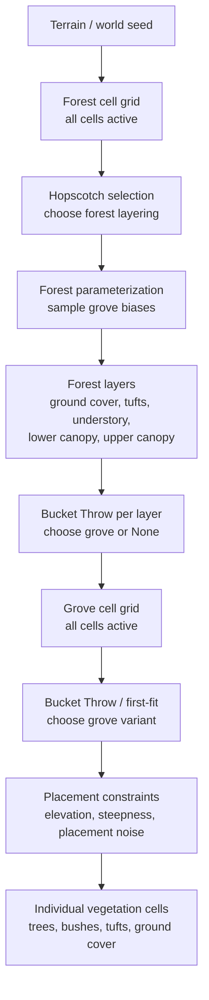

# RFC-183: Chico Vegetation

## Table of Contents

- [1: Summary](#1-summary)
- [2: Prior Art](#2-prior-art)
- [3: Design](#3-design)
  - [3.1: Stalk and Ball-stick Trees](#31-stalk-and-ball-stick-trees)
  - [3.2: L-system Trees](#32-l-system-trees)
  - [3.3: Ground Cover](#33-ground-cover)
  - [3.4: Cellular Groves](#34-cellular-groves)
  - [3.5: Cellular Forests](#35-cellular-forests)
  - [3.6: Elder Trees](#36-elder-trees)
- [4: Milestone](#4-milestone)

## 1: Summary

We propose the Chico vegetation system in response to [#61](https://github.com/ramate-io/maybraid/issues/61). Chico defines a layered, deterministic vegetation pipeline that evaluates from large forest cells down to individual plant constructions while keeping placement coherent with terrain, biome identity, and level-of-detail constraints.

The system is built around a few reusable pieces: ball-stick tree constructions for individual plants, world-space stick and leaf shaders for stable within-species variation, ground-cover primitives for low vegetation, cellular groves for local planting recipes, cellular forests for large-scale layering, and elder trees for rare urban landmarks. Forests select layerings with Hopscotch, layers select groves with Bucket Throw, and groves select individual variants with first-fit placement constraints.

The goal is not botanical simulation for its own sake. The goal is an authorable procedural vegetation system that can produce recognizable forest, scrub, grassland, orchard, jungle, and landmark-tree identities while remaining chunk-stable, scalable, and practical for runtime generation.

## 2: Prior Art

Industry vegetation systems tend to combine authored species assets with procedural distribution, terrain masks, and aggressive LOD. [SpeedTree](https://docs8.speedtree.com/modeler/doku.php?id=modeling_approach) is the most visible middleware example: it uses procedural generators for branches, fronds, leaves, and variation, while still giving artists direct control over the final plant models. [GPU Gems 3: Next-Generation SpeedTree Rendering](https://developer.nvidia.com/gpugems/GPUGems3/gpugems3_ch04.html) also illustrates the rendering side of this problem, especially leaf lighting, silhouettes, billboards, and distant tree representation.

Open-world games show the importance of procedural placement at terrain scale. Ubisoft's [Far Cry 5 procedural world generation](https://www.youtube.com/watch?v=JBp8zvLVsgg) pipeline used biome recipes and deterministic content generation to keep vegetation coherent as terrain changed during production. Ubisoft's [Ghost Recon Wildlands vegetation generation](https://80.lv/articles/vegetation-generation-in-ghost-recon-wildlands) similarly combined terrain materials, slope, density, spacing, exclusion masks, cascading tree-to-bush placement, and location-sensitive LOD to populate a very large world.

Academically, [*The Algorithmic Beauty of Plants*](http://www.springer.com/la/book/9780387946764) and related [Algorithmic Botany](http://www.algorithmicbotany.org/papers/) work establish L-systems as a foundation for procedural plant structure. [Realistic Modeling and Rendering of Plant Ecosystems](http://www.graphics.stanford.edu/papers/ecosys/) extends the problem to ecosystem-scale placement, combining terrain editing, procedural plant models, plant distribution, and geometric simplification for large natural scenes. Chico borrows the broad lesson from these systems, but favors spatially grounded, chunk-friendly constructions over a full L-system-first design.

## 3: Design

At runtime, Chico vegetation evaluates from coarse forest cells down to individual vegetation constructions:

### 3.1: Stalk and Ball-stick Trees

Stalk and ball-stick trees form the core geometric system for Chico vegetation. The design refines the current system which uses [an ad hoc stalk with radial projection](https://github.com/ramate-io/maybraid/blob/cebdaf75f0ce2d837ddc818a9a2658abb3d738dd/procedures/vegetation/src/tree.rs#L171), a [`BallStick`](https://github.com/ramate-io/maybraid/blob/cebdaf75f0ce2d837ddc818a9a2658abb3d738dd/procedures/comproc/src/complex/chain/ball_stick/builder.rs) complex for the canopy, a [noisy cylinder](https://github.com/ramate-io/maybraid/blob/cebdaf75f0ce2d837ddc818a9a2658abb3d738dd/procedures/vegetation/src/tree/meshes/trunk/segment.rs) for trunk and branch segments, and a [planar canopy](https://github.com/ramate-io/maybraid/blob/9c38f45cfd697a392e6114bbc6e67b50005b7f65/procedures/vegetation/src/tree/meshes/canopy/ball.rs).

The goal is to formalize this into a composable, parameterized system:

* **Stalks** define primary vertical structure
* **Sticks** define trunk and branch segments
* **Balls and planes** define canopy and foliage
* **Ball-stick chains** unify tree construction
* **World-space stick and leaf shaders** provide stable color variation within a species

Tree types are then expressed as parameterized constructions over these primitives rather than bespoke implementations, with shader-side palettes providing individual variation without changing the underlying geometry.

---

Subsections:

- [3.1.1: Stick and Stalk Components](./03-01-stalk-and-ball-stick-trees/01-stick-and-stalk-components/README.md)
- [3.1.2: Ball Components](./03-01-stalk-and-ball-stick-trees/02-ball-components/README.md)
- [3.1.3: Ball-stick Anchors](./03-01-stalk-and-ball-stick-trees/03-ball-stick-anchors/README.md)
- [3.1.4: Ball-stick Chains](./03-01-stalk-and-ball-stick-trees/04-ball-stick-chains/README.md)
- [3.1.5: Ball Selection](./03-01-stalk-and-ball-stick-trees/05-ball-selection/README.md)
- [3.1.6: Well-known Component Constructions](./03-01-stalk-and-ball-stick-trees/06-well-known-component-constructions/README.md)
- [3.1.7: Well-known Tree Constructions](./03-01-stalk-and-ball-stick-trees/07-well-known-tree-constructions/README.md)
- [3.1.8: Tree LOD Tricks](./03-01-stalk-and-ball-stick-trees/08-tree-lod-tricks/README.md)
- [3.1.9: Stick Shading](./03-01-stalk-and-ball-stick-trees/09-stick-shading/README.md)
- [3.1.10: Leaf Shading](./03-01-stalk-and-ball-stick-trees/10-leaf-shading/README.md)

---

### 3.2: L-system Trees

L-systems are a well-established method for generating botanical structures and offer a natural way to express recursive growth, branching grammars, and species variation. They are a strong candidate for future expansion of the vegetation system.

Details:

- [3.2: L-system Trees](./03-02-l-system-trees/README.md)

---

### 3.3: Ground Cover

Ground cover is the lowest layer of vegetation detail: it fills terrain with grasses, moss, scrub, and low plant matter. It should stay **dense but inexpensive**, **spatially stable**, **driven by terrain** (elevation, slope, biome), and **composable** with higher-level vegetation. The design pairs **bump outs** (continuous SDF height variation, aligned with [RFC-170 bump outs](https://github.com/ramate-io/maybraid/tree/main/rfc/rfc-000-000-170-terrain-detail#34-bump-outs)) with **tufts** (sparse discrete clumps for breakup and silhouette).

Subsections:

- [3.3.1: Bump Outs](./03-03-ground-cover/01-bump-outs/README.md)
- [3.3.2: Tufts](./03-03-ground-cover/02-tufts/README.md)

---

### 3.4: Cellular Groves

Cellular Groves are the primary allocation unit for vegetation types. A grove defines a **locally coherent planting context**: it determines *what* can be planted, *how often*, and *under what constraints*. Groves unify a set of compatible vegetation types and expose parameter ranges that are instantiated by the parent [Forest](./03-05-cellular-forests/README.md#35-cellular-forests).

At a high level:

* **Parameterization** defines the statistical and environmental character of the grove
* **Selection and Placement** determines where and what is actually planted

---

Subsections:

- [3.4.1: Parameterization](./03-04-cellular-groves/01-parameterization/README.md)
- [3.4.2: Selection and Placement](./03-04-cellular-groves/02-selection-and-placement/README.md)
- [3.4.3: Well-known Ground Cover Groves](./03-04-cellular-groves/03-well-known-ground-cover-groves/README.md)
- [3.4.4: Well-known Tufts Groves](./03-04-cellular-groves/04-well-known-tufts-groves/README.md)
- [3.4.5: Well-known Understory Groves](./03-04-cellular-groves/05-well-known-understory-groves/README.md)
- [3.4.6: Well-known Lower Canopy Groves](./03-04-cellular-groves/06-well-known-lower-canopy-groves/README.md)
- [3.4.7: Well-known Upper Canopy Groves](./03-04-cellular-groves/07-well-known-upper-canopy-groves/README.md)
- [3.4.8: Grove LOD Tricks](./03-04-cellular-groves/08-grove-lod-tricks/README.md)

---

### 3.5: Cellular Forests

Cellular Forests are the top-level allocation system for Chico vegetation. They select coherent forest layerings over large forest cells, pass forest-scale parameter biases down to groves, and instantiate compatible grove layers inside each selected cell. A reasonable starting scale is `1600m x 1600m` forest cells with a(n) `8 x 8` grid of `200m x 200m` grove cells inside each forest cell.

Subsections:

- [3.5.1: Parameterization](./03-05-cellular-forests/01-parameterization/README.md)
- [3.5.2: Selection and Construction](./03-05-cellular-forests/02-selection/README.md)
- [3.5.3: Forest Layers](./03-05-cellular-forests/03-forest-layers/README.md)
- [3.5.4: Well-known Layerings](./03-05-cellular-forests/04-well-known-layerings/README.md)
- [3.5.5: Chico Vegetation](./03-05-cellular-forests/05-chico-vegetation/README.md)
- [3.5.6: Forest LOD Tricks](./03-05-cellular-forests/06-lod-tricks/README.md)

---

### 3.6: Elder Trees

Elder Trees are massive ball-stick tree constructions intended to pair tightly with urbanization. They use a separate allocation grid from forests and act as living landmarks for platforms, paths, shrines, homes, bridges, and other built features.

Details:

- [3.6: Elder Trees](./03-06-elder-trees/README.md)

## 4: Milestone

