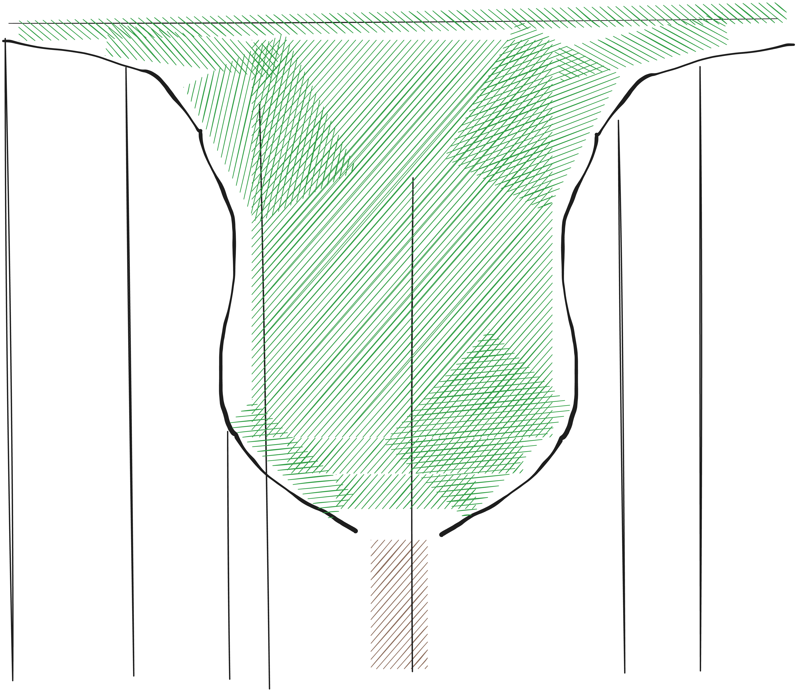

# RFC-N: Chico Vegetation

## Table of Contents

## 1: Summary

We propose the Chico vegetation system in response to [#61](https://github.com/ramate-io/maybraid/issues/61).

## 2: Prior Art

## 3: Design

### 3.1: Stalk and Ball-stick Trees

Stalk and ball-stick trees form the core geometric system for Chico vegetation. The design refines the current system which uses [an ad hoc stalk with radial projection](https://github.com/ramate-io/maybraid/blob/cebdaf75f0ce2d837ddc818a9a2658abb3d738dd/procedures/vegetation/src/tree.rs#L171), a [`BallStick`](https://github.com/ramate-io/maybraid/blob/cebdaf75f0ce2d837ddc818a9a2658abb3d738dd/procedures/comproc/src/complex/chain/ball_stick/builder.rs) complex for the canopy, a [noisy cylinder](https://github.com/ramate-io/maybraid/blob/cebdaf75f0ce2d837ddc818a9a2658abb3d738dd/procedures/vegetation/src/tree/meshes/trunk/segment.rs) for trunk and branch segments, and a [planar canopy](https://github.com/ramate-io/maybraid/blob/9c38f45cfd697a392e6114bbc6e67b50005b7f65/procedures/vegetation/src/tree/meshes/canopy/ball.rs).

The goal is to formalize this into a composable, parameterized system:

* **Stalks** define primary vertical structure
* **Sticks** define trunk and branch segments
* **Balls and planes** define canopy and foliage
* **Ball-stick chains** unify tree construction

Tree types are then expressed as parameterized constructions over these primitives rather than bespoke implementations.

---

### 3.1.1: Stick and Stalk Components

Stick and stalk components define the structural backbone of trees. They should remain:

* deterministic from seed
* SDF-compatible for mesh and physics reuse
* composable into chains and radial projections

---

### 3.1.1.1: Noisy Cylinder

The noisy cylinder is the default segment primitive and corresponds directly to the existing [noisy cylinder implementation](https://github.com/ramate-io/maybraid/blob/cebdaf75f0ce2d837ddc818a9a2658abb3d738dd/procedures/vegetation/src/tree/meshes/trunk/segment.rs).

It defines a tapered cylinder along the $y$ axis with noise applied to its surface.

```rust
pub struct SegmentConfig {
    pub seed: u32,
    pub base_radius: f32,
    pub top_radius: f32,
    pub noise_amplitude: f32,
    pub noise_frequency: f32,
}
```

SDF sketch:

```rust
fn distance(&self, p: Vec3) -> f32 {
    let y = p.y;
    let t = y.clamp(0.0, 1.0);

    let radius = mix(
        self.base_radius,
        self.top_radius,
        t,
    );

    let radial = Vec2::new(p.x, p.z).length();
    let mut d = radial - radius;

    let n = perlin(
        p * self.noise_frequency,
        self.seed,
    );

    d += n * self.noise_amplitude;

    if y < 0.0 {
        d = d.max(-y);
    } else if y > 1.0 {
        d = d.max(y - 1.0);
    }

    d
}
```

This component is suitable for:

* trunks
* straight or mildly irregular branches
* most general-purpose segment usage

---

### 3.1.1.2: Crook Cylinder

The crook cylinder extends the noisy cylinder by introducing continuous curvature along the segment while preserving an SDF formulation.

Instead of a straight axis, the cylinder is defined around a smooth centerline:

$$
\gamma(t) =
\begin{bmatrix}
a_x \sin(\pi t + \phi_x) \
t \
a_z \sin(\pi t + \phi_z)
\end{bmatrix}
$$

...where $t \in [0,1]$ and $a_x, a_z$ control bend magnitude.

```rust
pub struct CrookConfig {
    pub segment: SegmentConfig,
    pub bend_x: f32,
    pub bend_z: f32,
    pub phase_x: f32,
    pub phase_z: f32,
}
```

SDF sketch:

```rust
fn centerline(&self, t: f32) -> Vec3 {
    Vec3::new(
        self.bend_x * (PI * t + self.phase_x).sin(),
        t,
        self.bend_z * (PI * t + self.phase_z).sin(),
    )
}

fn distance(&self, p: Vec3) -> f32 {
    let t = p.y.clamp(0.0, 1.0);

    let c = self.centerline(t);
    let q = p - c;

    let radius = mix(
        self.segment.base_radius,
        self.segment.top_radius,
        t,
    );

    let radial = Vec2::new(q.x, q.z).length();

    let n = perlin(
        p * self.segment.noise_frequency,
        self.segment.seed,
    );

    let d = radial - radius + n * self.segment.noise_amplitude;

    if p.y < 0.0 {
        d.max(-p.y)
    } else if p.y > 1.0 {
        d.max(p.y - 1.0)
    } else {
        d
    }
}
```

This produces smoothly bent trunks and branches without introducing discontinuities.

**Usage**

* stylized or expressive trunks
* bent or wind-shaped branches
* palms, banyans, and irregular growth patterns

Crook cylinders should be used deliberately, as they strongly influence silhouette and perceived species.

### 3.1.2: Ball Components

Ball components are primarily used for canopy and foliage massing. Unlike stick components, they do not generally need to be collision-supporting, though some may retain SDF backings where useful for reuse or consistency.

These components provide the visual mass of vegetation, while stick components define structure. Together, they enable a wide range of tree and plant forms through simple composition.

---

### 3.1.2.1: Icosahedron

A low-poly convex canopy primitive used primarily at far range.

**Construction**

* Static indexed mesh: 12 vertices, 20 faces
* Can be precomputed or reused via asset handle

In Bevy:

```rust
let mesh = Mesh::from(shape::Icosahedron {
    radius,
    subdivisions: 0,
});
```

**Usage**

* far LOD canopy fill
* silhouette preservation
* cheap instancing across large forests

**Notes**

* One-sided opaque shading is sufficient at distance
* Icospheres (`subdivisions > 0`) may be used for moderate LOD
* Can replace [Noisy Balls](#3122-noisy-ball) in [Plane Splays](#3125-plane-splay)

---

### 3.1.2.2: Noisy Ball

An SDF-backed spherical canopy element with surface perturbation.

**Construction**

$$
d(\mathbf{p}) = |\mathbf{p}| - r + \text{noise}(\mathbf{p})
$$

```rust
fn distance(p: Vec3) -> f32 {
    let n = perlin(p * freq + seed) * amp;
    p.length() - radius + n
}
```

Mesh generation proceeds via marching cubes or dual contouring.

**Usage**

* mid-range canopy fill
* base layer for higher-detail canopy, e.g. [Plane Splay](#3125-plane-splay)

**Notes**

* One-sided shading at range
* Two-sided shading up close
* Can be replaced by icosahedra at low LOD

---

### 3.1.2.3: Octagonal Plane

A low triangle-count planar element used within splays.

**Construction**

* 8-sided polygon in local plane
* UVs centered for radial leaf textures

```rust
let positions = regular_ngon(8, radius);
```

**Usage**

* canopy layering in [Plane Splay](#3125-plane-splay)
* mid-detail foliage clusters

**Notes**

* Billboarded or slightly tilted
* Double-sided material recommended

---

### 3.1.2.4: Triangular Plane

Minimal planar primitive used for fine foliage and fronds.

**Construction**

```rust
let positions = [
    Vec3::new(0.0, 0.0, 0.0),
    Vec3::new(w, 0.0, 0.0),
    Vec3::new(0.0, h, 0.0),
];
```

**Usage**

* fronds
* fine canopy breakup
* edge detailing in splays

**Notes**

* Very low cost
* Best used in groups, chains, or splayed clusters
* Usually double-sided

---

### 3.1.2.5: Plane Splay

A high-detail canopy construction derived from the original [`NoisyBall`](https://github.com/ramate-io/maybraid/blob/9c38f45cfd697a392e6114bbc6e67b50005b7f65/procedures/vegetation/src/tree/meshes/canopy/ball.rs#L102-L231).

Plane Splay combines:

* a central noisy ball or implicit volume
* multiple outward-facing planes
* octagonal or triangular planar elements
* radial or hemispherical distribution

**Construction**

```rust
for i in 0..N {
    let dir = sample_sphere(seed, i);
    let pos = center + dir * radius;

    spawn_plane(
        position = pos,
        normal = dir,
        scale = plane_scale(seed, i),
    );
}
```

Planes may be emitted as independent meshes for instancing or merged into a single mesh for fewer draw calls.

**Usage**

* high LOD canopy
* outer canopy layers
* silhouette refinement
* leaf clusters around ball-stick nodes

**Notes**

* Prefer placing planes near canopy surface
* Avoid dense interior placement
* Combine with noisy ball or icosphere for volume

---

### 3.1.2.6: Tufts

A jagged, outward-projecting canopy component with an SDF backing, based on the existing [tuft implementation](https://github.com/ramate-io/maybraid/blob/9c38f45cfd697a392e6114bbc6e67b50005b7f65/procedures/terrain/src/detail/meshes/tuft.rs#L27).

**Construction**

Tufts are composed as a cluster of projecting elements from a shared origin. They are SDF-generated rather than purely planar.

```rust
fn distance(p: Vec3) -> f32 {
    let d = base_shape(p);
    let spikes = directional_noise(p, seed) * amplitude;

    d - spikes
}
```

Mesh generation proceeds via standard SDF meshing.

**Usage**

* sprouting trees
* jungle growths on branches
* canopy detail layers
* ground cover

**Notes**

* Can be used at all LOD when visible
* Cull when occluded by larger canopy elements
* Useful as both vegetation detail and terrain detail

---

### 3.1.2.7: Fronds

Fronds are mesh-based arching chains of triangular or narrow quad planes. They are used for palms, bushes, and jungle growth. They should not be SDF-backed unless collision is later required.

**Construction**

A frond is defined by a curved spine and a sequence of planar leaflets attached along it.

```rust
pub struct FrondConfig {
    pub segments: usize,
    pub length: f32,
    pub width: f32,
    pub droop: f32,
    pub twist: f32,
    pub leaflet_count: usize,
}
```

A simple spine:

```rust
fn spine(t: f32, config: &FrondConfig) -> Vec3 {
    let x = t * config.length;
    let y = -config.droop * t * t;

    Vec3::new(x, y, 0.0)
}
```

Leaflets are placed along the spine:

```rust
for i in 0..config.leaflet_count {
    let t = i as f32 / (config.leaflet_count - 1) as f32;

    let p = spine(t, config);
    let tangent = normalize(
        spine(t + EPS, config) - spine(t - EPS, config)
    );

    let side = if i % 2 == 0 { 1.0 } else { -1.0 };
    let width = config.width * (1.0 - t);
    let lateral = side * width;

    emit_triangle_or_quad(
        root = p,
        tangent = tangent,
        lateral = lateral,
        twist = config.twist * t,
    );
}
```

**Mesh strategy**

Fronds should usually be emitted as one combined mesh per frond. For palm crowns, multiple fronds may be merged into one mesh per crown ring or one mesh per tree.

**Usage**

* palm crowns
* fern-like bushes
* jungle branch growth
* sparse tropical canopy detail

**Notes**

* Use double-sided foliage materials
* Taper leaflet size toward the tip
* Add mild noise to spine droop and leaflet angle
* Prefer mesh construction over SDF unless collision is needed

---

### 3.1.2.8: Jessen's Icosahedron

[Jessen's icosahedron](https://en.wikipedia.org/wiki/Jessen%27s_icosahedron) is a non-convex variation of the icosahedron used for additional visual variety.

**Usage**

* replace standard icosahedra at far LOD
* introduce irregular silhouettes
* mix with icospheres for variation
* reduce repetition in distant forests

**Notes**

* Especially useful when many distant trees would otherwise share the same silhouette
* Selection can be randomized per instance
* Covered more completely in [Tree LOD Tricks](#318-tree-lod-tricks)

Here’s a refined replacement for **3.1.3–3.1.5** incorporating those points.

---

### 3.1.3: Ball-stick Anchors

Ball-stick anchors define where a branch, canopy chain, or foliage complex begins. The current system does this implicitly through [radial projection from an ad hoc stalk](https://github.com/ramate-io/maybraid/blob/cebdaf75f0ce2d837ddc818a9a2658abb3d738dd/procedures/vegetation/src/tree.rs#L171), then passes the resulting start point and ray into a [`BallStick`](https://github.com/ramate-io/maybraid/blob/cebdaf75f0ce2d837ddc818a9a2658abb3d738dd/procedures/comproc/src/complex/chain/ball_stick/builder.rs) construction.

The refinement is to treat anchoring as a named step. An anchor records the start position, initial growth direction, bias direction, and local scale for a branch or canopy chain.

```rust
pub struct BallStickAnchor {
    pub position: Vec3,
    pub initial_ray: Vec3,
    pub bias_ray: Vec3,
    pub radius: f32,
}
```

Anchors are usually placed at or near the **stalk radial centroid** rather than directly on the visible stalk surface. This reduces the chance that branches appear detached or improperly projected. The branch mesh can still emerge visually from the stalk surface because the first stick segment projects outward from the centroid.

Common anchor routines include:

* stalk-height sampling for ordinary branches
* radial rings around the stalk for canopies
* crown-only rings for palms
* node-derived anchors for secondary growth
* downward-biased anchors for banyan descenders
* ground anchors for bushes, shoots, and trunkless palms

Tree recipes should compose these routines rather than hard-code anchor placement. For example:

```rust
let anchors = stalk_rings(...)
    .with_height_bias(...)
    .with_radial_count(...)
    .with_direction_rule(...);
```

This makes constructions such as conifers, palms, banyans, and vase trees variations over anchor selection rather than separate systems.

---

### 3.1.4: Ball-stick Chains

Ball-stick chains describe the branching skeleton grown from an anchor. The existing [`BallStickBuilder`](https://github.com/ramate-io/maybraid/blob/cebdaf75f0ce2d837ddc818a9a2658abb3d738dd/procedures/comproc/src/complex/chain/ball_stick/builder.rs) already captures the core idea: extend from parent nodes, choose child count, sample direction, assign radii, and emit connected nodes.

At a high level, a chain is a directed graph:

```rust
pub struct BallStickChain {
    pub nodes: Vec<BallStickNode>,
    pub segments: Vec<BallStickSegment>,
}
```

Each segment becomes a stick component, usually a [noisy cylinder](#3111-noisy-cylinder) or [crook cylinder](#3112-crook-cylinder). Each node becomes a possible site for foliage, descenders, joint-concealing balls, or additional child chains.

The key behavior to preserve is **directional hysteresis**. A segment should blend prior direction, bias direction, and bounded noise rather than sampling a fresh direction independently.

```rust
let mean = blend(previous_ray, bias_ray, bias_strength);
let ray = perturb(mean, angle_tolerance, seed);
let child = parent.position + ray * segment_length;
```

However, several intended tree constructions require the hysteresis behavior to vary across the graph. Banyan descenders need every nth segment to bias downward. Vase and torch trees need the bias to change with height. Conifers need radial projections to shorten and shift angle with vertical position.

Accordingly, the refined chain model should allow a rule mapping node context to a hysteresis configuration:

```rust
pub struct ChainContext {
    pub depth: usize,
    pub branch_order: usize,
    pub height_fraction: f32,
    pub segment_index: usize,
    pub parent_ray: Vec3,
    pub anchor: BallStickAnchor,
}

pub struct HysteresisConfig {
    pub bias_ray: Vec3,
    pub bias_strength: f32,
    pub angle_tolerance: f32,
    pub length_range: Range<f32>,
    pub radius_range: Range<f32>,
    pub child_count: Range<usize>,
}
```

Conceptually:

```rust
fn hysteresis_for(ctx: ChainContext) -> HysteresisConfig {
    if ctx.segment_index % 4 == 0 {
        downward_descender_config()
    } else {
        ordinary_canopy_config(ctx.height_fraction)
    }
}
```

This can be implemented as either:

- (1) a vector of hysteresis configs indexed by depth or segment index, or
- (2) a rule object that maps `ChainContext` to `HysteresisConfig`.

The rule form is more expressive and better matches the proposed named trees. It allows the construction to say “bias upward near the top,” “bias downward every fourth segment,” or “reduce radial length logarithmically with height” without creating a new chain builder.

When a chain is processed as a branch, nodes should optionally receive small noisy balls using the same material as the stick or stalk. These joint balls conceal intersections between cylinders and make the branch graph read as continuous organic growth rather than assembled tubes.

```rust
if render_joint_balls {
    spawn_noisy_ball(
        position = node.position,
        radius = node.radius,
        material = stick_material,
    );
}
```

---

### 3.1.5: Ball Selection

Ball selection means deciding **which nodes in the ball-stick graph receive foliage or canopy mass**, not choosing the concrete ball mesh type. The current system effectively allocates canopy at branch nodes through the existing tree spawning flow and [planar canopy construction](https://github.com/ramate-io/maybraid/blob/9c38f45cfd697a392e6114bbc6e67b50005b7f65/procedures/vegetation/src/tree/meshes/canopy/ball.rs). The refinement is to make node selection an explicit policy of each tree construction.

This policy is mostly recipe-specific. A tree recipe traverses the graph and marks nodes for canopy allocation according to its intended silhouette.

Typical rules include:

* allocate only at terminal nodes
* allocate on outer canopy layers
* skip hidden interior nodes
* allocate more densely near the crown
* allocate along every node for dense jungle growth
* allocate sparse tufts on selected branch joints
* allocate fronds only on crown-ring anchors

A selector should use graph and anchor context:

```rust
pub struct BallSelectionContext {
    pub depth: usize,
    pub branch_order: usize,
    pub height_fraction: f32,
    pub distance_from_anchor: f32,
    pub is_terminal: bool,
    pub child_count: usize,
}
```

Conceptually:

```rust
fn should_allocate_ball(ctx: BallSelectionContext) -> bool {
    ctx.is_terminal || ctx.height_fraction > 0.65
}
```

This supports the named constructions later in the proposal:

* storybook trees favor outer and terminal canopy nodes
* conifers favor small allocations along many short radial projections
* banyans allocate broadly across upper canopy and descender nodes
* palms allocate primarily from crown-ring anchors
* jungle growths add secondary allocations at selected canopy nodes

The concrete component used at a selected node, such as noisy ball, plane splay, tuft, or frond, is a separate decision handled by the tree recipe and eventual LOD strategy.


### 3.1.6: Well-known Component Constructions

This section lists reusable component-level constructions. These are not complete tree recipes; they are smaller routines that named tree constructions can compose.

---

### 3.1.6.1: Palm Crown

A palm crown is built from several radially projecting frond rings placed in quick vertical succession.

Each ring places frond anchors around a central crown point:

```rust
for ring in 0..ring_count {
    let h = ring as f32 * ring_spacing;
    let vertical_bias = base_bias + ring as f32 * bias_step;

    for i in 0..fronds_per_ring {
        let theta = TAU * i as f32 / fronds_per_ring as f32;
        let radial = Vec3::new(theta.cos(), 0.0, theta.sin());

        spawn_frond(
            anchor = crown + Vec3::Y * h,
            direction = normalize(radial + Vec3::Y * vertical_bias),
        );
    }
}
```

Higher rings should start with greater upward bias. Lower rings may droop or project closer to horizontal. This produces the layered crown silhouette common to palms.

---

### 3.1.6.2: Palm Trunk

A palm trunk should be built without allocating a separate stalk. Instead, use a tight ball-stick chain grown upward from a ground anchor.

The chain should have:

* strong vertical bias
* low angular variance
* consistent slight directional bias for arching palms
* tight hysteresis to preserve a smooth curve

```rust
let config = HysteresisConfig {
    bias_ray: normalize(Vec3::Y + arch_bias),
    bias_strength: high,
    angle_tolerance: low,
    child_count: 1..=1,
    length_range: short..medium,
    radius_range: trunk_radius..trunk_radius,
};
```

Invert the usual tapering rule, so the bottom of each segment is slightly narrower than the top:

```rust
segment.base_radius = r * 0.92;
segment.top_radius = r;
```

Repeated over many segments, this gives the impression of stacked palm trunk bands.

---

### 3.1.6.3: High-bushes and Shoots

High-bushes and shoots are trunkless radial constructions.

Use a ground or near-ground anchor and emit a single ring of upward-biased radial projections:

```rust
for i in 0..shoot_count {
    let theta = TAU * i as f32 / shoot_count as f32;
    let radial = Vec3::new(theta.cos(), 0.0, theta.sin());

    let dir = normalize(radial * radial_strength + Vec3::Y * vertical_bias);

    grow_chain(anchor, dir);
}
```

This construction is useful for bushes, young trees, tall grass-like woody growth, and vine-like shrubs. Leaf allocation is usually dense near terminal nodes.

---

### 3.1.6.4: Jungle Growths

Jungle growths are secondary foliage allocations placed at selected ball points.

At a selected canopy node:

```rust
spawn_canopy_ball(node);

spawn_noisy_ball(
    position = node.position,
    radius = node.radius * jungle_growth_scale,
    material = darker_leaf_material,
);

spawn_tuft(
    position = node.position,
    direction = outward_or_upward_bias(node),
);
```

The larger, darker ball gives depth and density. The tuft adds protruding detail and a wet, overgrown silhouette.

This construction is useful for tropical trees, banyans, branch epiphytes, and dense understory vegetation.

---

### 3.1.6.5: Banyan Trunk

A banyan trunk is a thick, noisy stalk.

Use a large radius and high surface noise:

```rust
let trunk = NoisyCylinder {
    base_radius: large,
    top_radius: large * taper,
    noise_amplitude: high,
    noise_frequency: medium,
};
```

Banyan trunks should appear irregular and rooted rather than smooth. Crook cylinders may be used for secondary trunk forms, but the primary impression should come from radius, noise, and mass.

Joint-concealing balls using bark material may be allocated near major trunk or branch intersections.

---

### 3.1.6.6: Banyan Descenders

Banyan descenders are downward-growing branch chains emitted from the upper canopy.

Use high radial projection segment count and a chain rule that periodically switches to a strong downward bias:

```rust
fn hysteresis_for(ctx: ChainContext) -> HysteresisConfig {
    if ctx.segment_index % descender_period == 0 {
        HysteresisConfig {
            bias_ray: -Vec3::Y,
            bias_strength: very_high,
            angle_tolerance: low,
            child_count: 1..=1,
            length_range: long..very_long,
            radius_range: thin..medium,
        }
    } else {
        ordinary_canopy_config(ctx)
    }
}
```

Descenders should often extend below the canopy height and may approach or intersect the ground. When they reach the ground, they can be thickened or treated as secondary stalks.

Use sparse foliage on descenders themselves; most foliage should remain attached to the upper canopy.

### 3.1.6.7: Fruiting Bodies

Fruiting bodies are optional canopy details: small, brightly colored ellipsoidal volumes placed on or near the radius of canopy components. They are useful for fruit trees, jungle growths, magical trees, and seasonal variation.

A fruiting body should usually be attached to a selected canopy node or canopy ball, not to the trunk. The placement rule samples points near the canopy surface:

```rust
let dir = sample_sphere(seed, i);
let p = canopy_center + dir * canopy_radius;
```

Then apply a small inward or outward offset, so fruit appears embedded in the foliage rather than floating:

```rust
let p = p - dir * embed_depth;
```

The fruit itself can be a scaled sphere or ellipsoid:

```rust
pub struct FruitingBodyConfig {
    pub count: usize,
    pub radius: Vec3,
    pub color: Color,
    pub embed_depth: f32,
    pub surface_bias: f32,
}
```

For SDF construction:

```rust
fn ellipsoid_sdf(p: Vec3, r: Vec3) -> f32 {
    (p / r).length() - 1.0
}
```

For mesh construction, use a low-subdivision UV sphere or icosphere and apply non-uniform scale:

```rust
spawn_ellipsoid(
    position = p,
    scale = config.radius,
    material = fruit_material,
);
```

Fruit allocation should be sparse and deterministic:

```rust
for i in 0..config.count {
    if noise(seed, i) < fruit_probability {
        continue;
    }

    let dir = sample_canopy_surface(seed, i);
    let p = canopy_center + dir * canopy_radius;
    spawn_fruit(p);
}
```

A more advanced form may include seasonality. A time or season parameter can modulate both visibility and size:

```rust
let maturity = seasonal_curve(time, fruit_phase, fruit_duration);

let scale = base_scale * maturity;
let visible = maturity > visibility_threshold;
```

This allows fruit to emerge, grow, ripen, and disappear over time without changing the underlying tree construction. Color may also vary with maturity, for example green to yellow to red.

### 3.1.7: Well-known Tree Constructions

We provided the intended tree shapes for Chico vegetation. Note that many of these shapes can be used with a variety of textures and scales to produce the impressions of different species. 

### 3.1.7.1: Storybook Tree

The Storybook Tree is the default broadleaf silhouette: a narrow central stalk with a rounded canopy assembled from moderately dense radial ball-stick projections. It is useful for deciduous forests, orchards, parks, and general-purpose background trees.

**Shape**

* Tall, fairly narrow stalk
* Rounded canopy beginning low on the upper trunk
* Lower branches longer than upper branches
* Moderate branching and soft radial spread

**Stalk**

Let $H$ be total tree height including canopy.

```rust
let stalk_height = 0.80 * H;
let stalk_radius = 0.035 * H;
```

Use a [Noisy Cylinder](#3111-noisy-cylinder) for the stalk. Noise should be visible but not dominant.

```rust
NoisyCylinder {
    base_radius: stalk_radius,
    top_radius: stalk_radius * 0.55,
    noise_amplitude: 0.08 * stalk_radius,
    noise_frequency: medium,
}
```

**Anchor Rings**

Radial projections begin at roughly $15%$ of total height and continue toward the top of the stalk.

```rust
let z_min = 0.15 * H;
let z_max = stalk_height;
let ring_spacing = 0.08 * H;
let anchors_per_ring = 6;
```

Each ring places anchors roughly every $60^\circ$:

```rust
for z in steps(z_min, z_max, ring_spacing) {
    for i in 0..anchors_per_ring {
        let theta = TAU * i as f32 / anchors_per_ring as f32;
        let radial = Vec3::new(theta.cos(), 0.0, theta.sin());

        anchor(position = stalk_centroid(z), initial_ray = radial);
    }
}
```

Anchors should originate near the stalk radial centroid to avoid detached-looking branches.

**Projection Length**

Lower branches should be longer than upper branches. Let:

$$
u = \frac{z - z_{\min}}{z_{\max} - z_{\min}}
$$

Use a logarithmic or similar falloff:

$$
\ell(u) = \ell_{\max}(1 - \log(1 + \alpha u) / \log(1 + \alpha))
$$

with:

```rust
let max_projection_length = 0.60 * H;
let alpha = 4.0;
```

This produces a round canopy that gently approaches the vertical axis near the top.

**Chain Growth**

Each radial projection grows as a short ball-stick chain:

```rust
BallStickChain {
    segments: 3..=5,
    child_count: 1..=3, // mean near 2
    angle_tolerance: radians(15.0),
    bias_ray: radial,
    bias_strength: moderate,
}
```

The bias should be mostly horizontal, with slight upward variance for higher branches and slight downward variance for lower branches if a fuller canopy is desired.

**Ball Selection**

At high detail, allocate [Plane Splay](#3125-plane-splay) primarily on the outer canopy:

```rust
fn should_allocate_ball(ctx: BallSelectionContext) -> bool {
    ctx.is_terminal || ctx.distance_from_anchor > 0.65 * ctx.max_projection_length
}
```

Use a splay radius of roughly:

```rust
let leaf_radius = 0.09 * H;
```

Interior nodes should usually avoid foliage allocation unless a dense canopy is desired.

**Materials**

* Stick shader: bark or stylized trunk material
* Leaf shader: broadleaf, deciduous, orchard, or fantasy foliage
* Optional [Fruiting Bodies](#3167-fruiting-bodies) for orchard or magical variants

**Variants**

* Denser rings and larger leaf splays produce orchard trees.
* Smaller projection length and darker materials produce compact forest trees.
* Higher angular variance and [Crook Cylinder](#3112-crook-cylinder) segments produce older or more whimsical silhouettes.

### 3.1.7.2: Liam's Conifer

Liam's Conifer is a sparse, dry conifer silhouette: a narrow vertical stalk with many short, lightly downward-biased radial projections. It is useful for drier conifer stands, semi-arid forests, and lighter woodland edges.

**Shape**

* Tall, narrow central stalk
* Short radial projections
* Sparse branching
* Tuft-based canopy at most ball-stick joints
* Slight downward branch bias

**Stalk**

Let $H$ be total tree height.

```rust
let stalk_height = H;
let stalk_radius = 0.025 * H;
```

Use a [Noisy Cylinder](#3111-noisy-cylinder) with modest taper and low to medium noise.

```rust
NoisyCylinder {
    base_radius: stalk_radius,
    top_radius: stalk_radius * 0.35,
    noise_amplitude: 0.06 * stalk_radius,
    noise_frequency: medium,
}
```

**Anchor Rings**

Radial projections begin at roughly $10%$ of height and continue nearly to the top.

```rust
let z_min = 0.10 * H;
let z_max = 0.98 * H;
let ring_spacing = 0.04 * H;
let anchors_per_ring = 4;
```

Each ring places anchors roughly every $90^\circ$:

```rust
for z in steps(z_min, z_max, ring_spacing) {
    for i in 0..anchors_per_ring {
        let theta = TAU * i as f32 / anchors_per_ring as f32;
        let radial = Vec3::new(theta.cos(), 0.0, theta.sin());

        anchor(position = stalk_centroid(z), initial_ray = radial);
    }
}
```

**Projection Length**

Upper projections shrink linearly relative to lower projections.

Let:

$$
u = \frac{z - z_{\min}}{z_{\max} - z_{\min}}
$$

Then:

$$
\ell(u) = \ell_{\max}(1 - u)
$$

with:

```rust
let max_projection_length = 0.05 * H;
```

Optionally clamp to preserve a small top silhouette:

```rust
let length = max(0.20 * max_projection_length, max_projection_length * (1.0 - u));
```

**Chain Growth**

Each projection uses a long first segment followed by two short segments.

```rust
BallStickChain {
    segments: 3,
    segment_lengths: [
        0.70 * projection_length,
        0.15 * projection_length,
        0.15 * projection_length,
    ],
    child_count: 1..=2, // mean close to 1
    angle_tolerance: radians(8.0),
}
```

Bias the projection slightly downward:

```rust
let downward_bias = rotate_down(radial, radians(2.0));
```

Use tight hysteresis, so branches remain sparse and readable.

```rust
HysteresisConfig {
    bias_ray: downward_bias,
    bias_strength: high,
    angle_tolerance: radians(8.0),
    child_count: 1..=2,
}
```

**Ball Selection**

Allocate [Tufts](#3126-tufts) at all ball-stick joints.

```rust
fn should_allocate_ball(_ctx: BallSelectionContext) -> bool {
    true
}
```

Use two to three tufts per joint:

```rust
let tuft_count = 2..=3;
let tuft_scale = 0.02 * H;
```

Tufts should follow the branch direction with mild upward spread to avoid a purely flat silhouette.

**Materials**

* Stick shader: lighter bark or dry trunk tones
* Leaf shader: pale green, dusty green, or dry conifer tones

**Variants**

* Increasing ring density produces fuller conifers.
* Replacing tufts with [Plane Splay](#3125-plane-splay) produces a northern conifer variant.
* Increasing downward bias gives a drooping alpine silhouette.

### 3.1.7.3: Vase Tree

The Vase Tree is a broad, upward-opening tree form. It starts from the [Storybook Tree](#3171-storybook-tree) construction but inverts the canopy profile, so radial projections grow wider toward the top. This gives a head-trained, vase-like silhouette useful for ornamental trees, mystical forests, bushes, and urban plantings.

**Shape**

* Narrow to moderate stalk
* Canopy opens upward and outward
* Upper branches are longer than lower branches
* Lower branches are strongly upward-biased
* Bias relaxes closer to horizontal near the top

**Stalk**

Use the same stalk construction as [Storybook Tree](#3171-storybook-tree), optionally shortened slightly for bush or ornamental variants.

```rust
let stalk_height = 0.75 * H;
let stalk_radius = 0.035 * H;
```

Use a [Noisy Cylinder](#3111-noisy-cylinder) or [Crook Cylinder](#3112-crook-cylinder) depending on desired stylization.

**Anchor Rings**

Use Storybook-style radial rings, but favor upper canopy density.

```rust
let z_min = 0.20 * H;
let z_max = stalk_height;
let ring_spacing = 0.08 * H;
let anchors_per_ring = 6;
```

Anchors should originate near the stalk radial centroid.

Yes — you’re right. A normal sigmoid gives more of a **chalice** profile.

For the vase, you want something closer to an **inverse sigmoid radius profile**: fast widening near the bottom, slower widening through the middle, then renewed flare near the rim.

A clean construction is to use the **logit-like inverse sigmoid shape**, but keep it bounded:

```rust
fn vase_profile(u: f32, eps: f32) -> f32 {
    let u = u.clamp(eps, 1.0 - eps);

    let x = (u / (1.0 - u)).ln();

    // remap from [-a, a] into [0, 1]
    let a = ((1.0 - eps) / eps).ln();
    (x + a) / (2.0 * a)
}
```

Then:

```rust
let cup = vase_profile(u, 0.08);

let projection_length = mix(
    min_projection_length,
    max_projection_length,
    cup,
);
```

Proposal wording:

---

**Projection Length**

Use a bounded inverse-sigmoid profile over height. This gives the vase or calyx shape: rapid widening near the base of the crown, slower widening through the middle, and renewed flare near the rim.

Let:

$$
u = \frac{z - z_{\min}}{z_{\max} - z_{\min}}
$$

Use a clamped inverse sigmoid:

$$
v(u) =
\frac{
\log\left(\frac{u}{1-u}\right) + a
}{
2a
}
$$

where:

$$
a = \log\left(\frac{1-\epsilon}{\epsilon}\right)
$$

...and $u$ is clamped to $[\epsilon, 1-\epsilon]$.

Then:

$$
\ell(u) = \ell_{\min} + (\ell_{\max} - \ell_{\min})v(u)
$$

```rust
fn vase_profile(u: f32, eps: f32) -> f32 {
    let u = u.clamp(eps, 1.0 - eps);
    let a = ((1.0 - eps) / eps).ln();

    ((u / (1.0 - u)).ln() + a) / (2.0 * a)
}

let projection_length = mix(
    min_projection_length,
    max_projection_length,
    vase_profile(u, 0.08),
);
```

This produces the desired “flower cup” profile rather than the squared-off chalice profile of a direct sigmoid.

> [!NOTE]
> You can play with this inverse sigmoid shape at the Desmos plot [here](https://www.desmos.com/calculator/vvytytkb8u).

**Chain Growth**

Use a Storybook-like chain with moderate branching.

```rust
BallStickChain {
    segments: 3..=5,
    child_count: 1..=3,
    angle_tolerance: radians(15.0),
}
```

Bias should start strongly upward and approach horizontal as height increases.

```rust
let vertical_angle = mix(
    radians(45.0),
    radians(5.0),
    u,
);

let bias_ray = rotate_up(radial, vertical_angle);
```

This opens the canopy like a vase: lower branches climb sharply, while upper branches spread outward.

**Ball Selection**

Allocate foliage mostly on upper and outer nodes.

```rust
fn should_allocate_ball(ctx: BallSelectionContext) -> bool {
    ctx.is_terminal
        || ctx.height_fraction > 0.60
        || ctx.distance_from_anchor > 0.60 * ctx.max_projection_length
}
```

Use [Plane Splay](#3125-plane-splay) at high detail and [Noisy Ball](#3122-noisy-ball) or icospheres at lower detail.

```rust
let leaf_radius = 0.08 * H;
```

**Materials**

* Stick shader: deciduous bark, ornamental bark, or stylized dark bark
* Leaf shader: broadleaf, flowering, magical, or urban ornamental foliage
* Optional [Fruiting Bodies](#3167-fruiting-bodies) for orchard-like variants

**Variants**

* Shorter stalk and denser upper branches produce a bush form.
* Higher upward bias produces a flame-like ornamental tree.
* Crook cylinders add a trained or sculpted garden appearance.

### 3.1.7.4: Penmarch Torch

The Penmarch Torch is an upward-projecting variant of the [Vase Tree](#3173-vase-tree). Instead of relaxing toward horizontal near the top, its branches become increasingly vertical, producing a flame-like or torch-like silhouette.

**Shape**

* Narrow to moderate stalk
* Canopy projects upward
* Lower branches open outward
* Upper branches tighten toward vertical
* Overall silhouette resembles a torch or flame

**Stalk**

Use the [Vase Tree](#3173-vase-tree) stalk, usually slightly shorter and more compact.

```rust
let stalk_height = 0.70 * H;
let stalk_radius = 0.03 * H;
```

A [Crook Cylinder](#3112-crook-cylinder) may be used for stylized urban or chaparral variants.

**Anchor Rings**

Use Vase-style radial rings:

```rust
let z_min = 0.20 * H;
let z_max = stalk_height;
let ring_spacing = 0.08 * H;
let anchors_per_ring = 6;
```

Anchors should originate near the stalk radial centroid.

**Projection Length**

Use the same upper-widening profile as the [Vase Tree](#3173-vase-tree), but generally with a smaller maximum spread:

```rust
let min_projection_length = 0.10 * H;
let max_projection_length = 0.45 * H;
```

This preserves the torch shape without becoming too broad.

**Chain Growth**

Use moderate branching, similar to Vase Tree:

```rust
BallStickChain {
    segments: 3..=5,
    child_count: 1..=3,
    angle_tolerance: radians(12.0),
}
```

The key difference is the vertical bias. Let:

$$
u = \frac{z - z_{\min}}{z_{\max} - z_{\min}}
$$

Instead of decreasing vertical bias with height, increase it:

```rust
let vertical_angle = mix(
    radians(25.0),
    radians(70.0),
    u,
);

let bias_ray = rotate_up(radial, vertical_angle);
```

Lower branches still flare outward, while upper branches climb sharply.

**Ball Selection**

Allocate foliage mainly along upper and terminal nodes to preserve the torch silhouette.

```rust
fn should_allocate_ball(ctx: BallSelectionContext) -> bool {
    ctx.is_terminal
        || ctx.height_fraction > 0.55
        || ctx.distance_from_anchor > 0.70 * ctx.max_projection_length
}
```

Use compact [Plane Splay](#3125-plane-splay), [Tufts](#3126-tufts), or [Noisy Ball](#3122-noisy-ball) depending on desired density.

```rust
let leaf_radius = 0.06 * H;
```

**Materials**

* Stick shader: dry bark, pale bark, or ornamental trunk material
* Leaf shader: chaparral green, dusty green, conifer-like, or urban ornamental foliage

**Variants**

* Reduce height and increase density for chaparral shrubs.
* Use tufts instead of broadleaf splays for short dry conifers.
* Increase vertical bias and use saturated leaves for stylized urban trees.

### 3.1.7.5: Honu Banyan

The Honu Banyan is a wide, spreading banyan-like tree with a heavy trunk, broad upper canopy, and occasional downward-descending branches. It is useful for jungle, riparian, and mystical forest regions.

**Shape**

* Thick, irregular central trunk
* Canopy begins high on the tree
* Broad, near-horizontal radial spread
* Periodic descenders fall from canopy branches
* Leaf mass is distributed throughout the upper canopy

**Stalk**

Use the [Banyan Trunk](#3165-banyan-trunk) construction.

```rust
let stalk_height = 0.80 * H;
let stalk_radius = 0.08 * H;
```

Use a high-noise [Noisy Cylinder](#3111-noisy-cylinder), optionally with [Crook Cylinder](#3112-crook-cylinder) variants for secondary trunks.

```rust
NoisyCylinder {
    base_radius: stalk_radius,
    top_radius: stalk_radius * 0.75,
    noise_amplitude: 0.18 * stalk_radius,
    noise_frequency: medium,
}
```

**Anchor Rings**

Radial projections begin high, around $80%$ of total height.

```rust
let z_min = 0.80 * H;
let z_max = 0.95 * H;
let ring_spacing = 0.06 * H;
let anchors_per_ring = 6..=8;
```

Use only two to three rings.

```rust
let ring_count = 2..=3;
```

Anchors should originate near the stalk radial centroid to keep major limbs visually embedded in the trunk mass.

**Projection Length**

The canopy should spread far and wide.

```rust
let max_projection_length = 0.75 * H;
let min_projection_length = 0.35 * H;
```

Projection length can remain mostly stable across the few upper rings, with slight shortening near the highest ring.

```rust
let length = mix(max_projection_length, min_projection_length, u * 0.35);
```

**Chain Growth**

Use long, mostly horizontal ball-stick chains.

```rust
BallStickChain {
    segments: 5..=8,
    child_count: 1..=3,
    angle_tolerance: radians(12.0),
}
```

The ordinary canopy bias should be nearly horizontal:

```rust
let canopy_bias = normalize(radial + Vec3::Y * 0.05);
```

Then apply [Banyan Descenders](#3166-banyan-descenders) every third to fourth segment.

```rust
fn hysteresis_for(ctx: ChainContext) -> HysteresisConfig {
    if ctx.segment_index % 4 == 0 {
        descender_config()
    } else {
        HysteresisConfig {
            bias_ray: canopy_bias,
            bias_strength: high,
            angle_tolerance: radians(12.0),
            child_count: 1..=3,
            length_range: medium..long,
            radius_range: medium..thin,
        }
    }
}
```

Descenders should bias strongly downward and may extend below the canopy height.

```rust
fn descender_config() -> HysteresisConfig {
    HysteresisConfig {
        bias_ray: -Vec3::Y,
        bias_strength: very_high,
        angle_tolerance: radians(6.0),
        child_count: 1..=1,
        length_range: long..very_long,
        radius_range: thin..medium,
    }
}
```

**Ball Selection**

Allocate leaf balls broadly throughout the canopy, not only at terminal nodes.

```rust
fn should_allocate_ball(ctx: BallSelectionContext) -> bool {
    ctx.height_fraction > 0.70
        || ctx.is_terminal
        || ctx.branch_order > 1
}
```

Use [Noisy Ball](#3122-noisy-ball) or [Plane Splay](#3125-plane-splay) depending on detail level. For jungle variants, combine with [Jungle Growths](#3164-jungle-growths).

```rust
let leaf_radius = 0.10 * H;
```

Descenders should usually receive sparse foliage or none, unless the goal is a very dense jungle silhouette.

**Materials**

* Stick shader: dark, high-variation bark
* Leaf shader: dense tropical green, riparian green, or darker jungle foliage
* Optional jungle growth layer for wet or overgrown variants

**Variants**

* Increase descender frequency for older banyans.
* Allow descenders to become secondary trunks when they reach the ground.
* Add darker interior balls and tufts for dense jungle banyans.

### 3.1.7.6: Sope's Banyan



Sope's Banyan is a banyan variant with a tall, vase-like crown. It begins from the [Honu Banyan](#3175-honu-banyan) construction, but moves the canopy lower and biases branch growth upward, closer to the [Penmarch Torch](#3174-penmarch-torch). The result is a mystical, vertically rising banyan form suited to jungle, riparian, and elder-tree contexts.

**Shape**

* Thick banyan trunk
* Canopy begins around mid-height
* Wide but upward-projecting branch structure
* Periodic downward descenders
* Tall, vase-like silhouette

**Stalk**

Use the [Banyan Trunk](#3165-banyan-trunk) construction.

```rust
let stalk_height = 0.75 * H;
let stalk_radius = 0.075 * H;
```

Use high-noise bark and strong trunk mass, as in [Honu Banyan](#3175-honu-banyan).

**Anchor Rings**

Radial projections begin much lower than Honu Banyan, around $40%$ of total height.

```rust
let z_min = 0.40 * H;
let z_max = 0.90 * H;
let ring_spacing = 0.08 * H;
let anchors_per_ring = 6..=8;
```

Use several rings to build the rising crown:

```rust
let ring_count = 5..=7;
```

Anchors should originate near the stalk radial centroid, so the large upward limbs read as emerging from the trunk mass.

**Projection Length**

Use a vase-like widening profile. Let:

$$
u = \frac{z - z_{\min}}{z_{\max} - z_{\min}}
$$

Projection length increases with height:

```rust
let min_projection_length = 0.25 * H;
let max_projection_length = 0.70 * H;
let length = mix(min_projection_length, max_projection_length, sqrt(u));
```

This keeps the lower crown compact while allowing the upper canopy to spread dramatically.

**Chain Growth**

Use long banyan-like chains with upward torch bias.

```rust
BallStickChain {
    segments: 5..=8,
    child_count: 1..=3,
    angle_tolerance: radians(12.0),
}
```

Bias rises with height, as in [Penmarch Torch](#3174-penmarch-torch):

```rust
let vertical_angle = mix(
    radians(25.0),
    radians(70.0),
    u,
);

let canopy_bias = rotate_up(radial, vertical_angle);
```

Descenders still occur every third to fourth segment:

```rust
fn hysteresis_for(ctx: ChainContext) -> HysteresisConfig {
    if ctx.segment_index % 4 == 0 {
        descender_config()
    } else {
        HysteresisConfig {
            bias_ray: canopy_bias,
            bias_strength: high,
            angle_tolerance: radians(12.0),
            child_count: 1..=3,
            length_range: medium..long,
            radius_range: medium..thin,
        }
    }
}
```

Descenders should remain strongly downward-biased, but may be slightly less frequent than in Honu Banyan if the crown should read more vertical than tangled.

**Ball Selection**

Allocate foliage broadly throughout the rising crown.

```rust
fn should_allocate_ball(ctx: BallSelectionContext) -> bool {
    ctx.height_fraction > 0.45
        || ctx.is_terminal
        || ctx.branch_order > 1
}
```

Use [Noisy Ball](#3122-noisy-ball), [Plane Splay](#3125-plane-splay), and optional [Jungle Growths](#3164-jungle-growths) for dense variants.

```rust
let leaf_radius = 0.09 * H;
```

Descenders should receive sparse foliage, except where a denser mystical canopy is desired.

**Materials**

* Stick shader: dark banyan bark, wet bark, or high-contrast fantasy bark
* Leaf shader: dense jungle green, deep riparian green, or saturated mystical foliage
* Optional darker inner canopy balls for depth

**Variants**

* Increase total height and reduce descender frequency for an elder-tree silhouette.
* Add [Fruiting Bodies](#3167-fruiting-bodies) for mystical or ancient variants.
* Use [Crook Cylinder](#3112-crook-cylinder) on major limbs for a more twisted appearance.


### 3.1.7.7: Rory's Head-trained

Rory's Head-trained is a top-heavy, trained tree form: a simple stalk with a thin, mostly horizontal canopy near the top. It is useful for arid trees, grape-vine-like bushes, ornamental plantings, and non-coniferous groves.

**Shape**

* Standard vertical stalk
* Single high canopy ring
* Thin horizontal spread
* Moderate branching
* Minimal lower foliage

**Stalk**

Use a standard [Noisy Cylinder](#3111-noisy-cylinder).

```rust
let stalk_height = 0.90 * H;
let stalk_radius = 0.025 * H;
```

Keep the trunk relatively clean and readable.

```rust
NoisyCylinder {
    base_radius: stalk_radius,
    top_radius: stalk_radius * 0.55,
    noise_amplitude: 0.06 * stalk_radius,
    noise_frequency: medium,
}
```

**Anchor Ring**

Begin radial projections at $90%$ or more of total height. Use one ring layer.

```rust
let z = 0.90 * H;
let anchors_per_ring = 6..=8;
```

Anchors should originate near the stalk radial centroid.

```rust
for i in 0..anchors_per_ring {
    let theta = TAU * i as f32 / anchors_per_ring as f32;
    let radial = Vec3::new(theta.cos(), 0.0, theta.sin());

    anchor(
        position = stalk_centroid(z),
        initial_ray = radial,
        bias_ray = radial,
    );
}
```

**Projection Length**

Use moderate projection lengths similar to [Storybook Tree](#3171-storybook-tree), but keep the canopy flatter.

```rust
let projection_length = 0.35 * H..0.55 * H;
```

For bush or grape-vine variants, reduce height and keep spread relatively wide:

```rust
let projection_length = 0.60 * H;
```

**Chain Growth**

Use moderate branching and segment length values.

```rust
BallStickChain {
    segments: 3..=5,
    child_count: 1..=3,
    angle_tolerance: radians(10.0),
}
```

Bias projections nearly horizontal:

```rust
let bias_ray = normalize(radial + Vec3::Y * 0.02);
```

Keep vertical variance small to maintain the trained canopy plane.

```rust
HysteresisConfig {
    bias_ray,
    bias_strength: high,
    angle_tolerance: radians(10.0),
    child_count: 1..=3,
}
```

**Ball Selection**

Allocate canopy primarily on terminal and outer nodes, preserving the thin horizontal profile.

```rust
fn should_allocate_ball(ctx: BallSelectionContext) -> bool {
    ctx.is_terminal
        || ctx.distance_from_anchor > 0.65 * ctx.max_projection_length
}
```

Use compact [Plane Splay](#3125-plane-splay), [Noisy Ball](#3122-noisy-ball), or [Tufts](#3126-tufts) depending on species.

```rust
let leaf_radius = 0.06 * H;
```

Avoid dense interior allocation, since this tree should read as a trained crown rather than a full rounded canopy.

**Materials**

* Stick shader: dry bark, vineyard wood, or ornamental bark
* Leaf shader: broadleaf, vine, arid green, or cultivated foliage
* Optional [Fruiting Bodies](#3167-fruiting-bodies) for orchard or grape-like variants

**Variants**

* Shorten stalk and increase spread for bush or grape-vine forms.
* Add fruiting bodies for cultivated groves.
* Use sparse tufts for arid scrub variants.

### 3.1.7.8: Waialea Palm

Waialea Palm is a gently arched palm with a light, layered crown. It is useful for tropical coastlines, riparian edges, resorts, gardens, and sparse warm-region groves.

**Shape**

* Slender arched trunk
* Crown concentrated at the top
* Two to three frond rings
* Lower fronds droop or project outward
* Upper fronds rise more vertically

**Trunk**

Use the [Palm Trunk](#3162-palm-trunk) construction with a gentle arch.

```rust
let trunk_height = 0.85 * H;
let trunk_radius = 0.025 * H;
```

Use a tight upward chain with slight persistent lateral bias:

```rust
let arch_bias = Vec3::new(0.12, 1.0, 0.0).normalize();

HysteresisConfig {
    bias_ray: arch_bias,
    bias_strength: high,
    angle_tolerance: radians(4.0),
    child_count: 1..=1,
    length_range: 0.05 * H..0.08 * H,
    radius_range: trunk_radius..trunk_radius,
}
```

Invert the usual tapering per segment, so each segment’s top is slightly wider than its base:

```rust
segment.base_radius = r * 0.92;
segment.top_radius = r;
```

This gives a stacked palm-trunk impression.

**Crown Anchors**

Place the crown at the trunk tip.

```rust
let crown = trunk_tip;
let ring_count = 2..=3;
let fronds_per_ring = 8..=12;
let ring_spacing = 0.015 * H;
```

Use the [Palm Crown](#3161-palm-crown) construction.

```rust
for ring in 0..ring_count {
    let vertical_bias = base_bias + ring as f32 * bias_step;

    for i in 0..fronds_per_ring {
        let theta = TAU * i as f32 / fronds_per_ring as f32;
        let radial = Vec3::new(theta.cos(), 0.0, theta.sin());

        spawn_frond(
            anchor = crown + Vec3::Y * ring as f32 * ring_spacing,
            direction = normalize(radial + Vec3::Y * vertical_bias),
        );
    }
}
```

**Fronds**

Use [Fronds](#3127-fronds) as mesh-based arching chains.

```rust
FrondConfig {
    segments: 8..=14,
    length: 0.28 * H..0.42 * H,
    width: 0.045 * H,
    droop: medium,
    twist: mild,
    leaflet_count: 10..=18,
}
```

Lower rings should have less vertical bias and more droop. Higher rings should start more upright.

```rust
let base_bias = 0.10;
let bias_step = 0.18;
```

**Ball Selection**

Waialea Palm does not use ordinary ball selection over a branch graph. The crown directly allocates fronds from crown anchors. Optional small [Tufts](#3126-tufts) may be placed at the crown center to conceal the frond origins.

```rust
spawn_tuft(
    position = crown,
    direction = Vec3::Y,
    scale = 0.04 * H,
);
```

**Materials**

* Stick shader: palm bark, dry fibrous bark, or banded trunk material
* Leaf shader: tropical palm green, coastal green, or dry palm tones

**Variants**

* Increase arch bias for windswept coastal palms.
* Reduce ring count for sparse decorative palms.
* Add [Fruiting Bodies](#3167-fruiting-bodies) near the crown for coconut-like variants.

### 3.1.7.9: Date Palm

The Date Palm is a tall, vertical palm with a dense, layered crown. Compared to [Waialea Palm](#3178-waialea-palm), it is less arched, more columnar, and has a fuller, more structured canopy.

**Shape**

* Tall, straight trunk
* Dense crown with many frond layers
* Lower fronds droop outward and downward
* Upper fronds project upward
* Strong vertical silhouette

**Trunk**

Use the [Palm Trunk](#3162-palm-trunk) construction without arching.

```rust
let trunk_height = 0.90 * H;
let trunk_radius = 0.025 * H;
```

Use a tight, vertical chain:

```rust
HysteresisConfig {
    bias_ray: Vec3::Y,
    bias_strength: very_high,
    angle_tolerance: radians(2.0),
    child_count: 1..=1,
    length_range: 0.05 * H..0.08 * H,
    radius_range: trunk_radius..trunk_radius,
}
```

Maintain the inverted taper per segment for banded trunk appearance:

```rust
segment.base_radius = r * 0.92;
segment.top_radius = r;
```

This produces the characteristic stacked palm trunk.

**Crown Anchors**

Place the crown at the trunk tip.

```rust
let crown = trunk_tip;
let ring_count = 6..=10;
let fronds_per_ring = 10..=16;
let ring_spacing = 0.01 * H;
```

Use the [Palm Crown](#3161-palm-crown) construction with many tightly stacked layers.

```rust
for ring in 0..ring_count {
    let u = ring as f32 / (ring_count - 1) as f32;

    let vertical_bias = mix(
        -0.10,  // lower rings droop
        0.60,   // upper rings rise
        u,
    );

    for i in 0..fronds_per_ring {
        let theta = TAU * i as f32 / fronds_per_ring as f32;
        let radial = Vec3::new(theta.cos(), 0.0, theta.sin());

        spawn_frond(
            anchor = crown + Vec3::Y * ring as f32 * ring_spacing,
            direction = normalize(radial + Vec3::Y * vertical_bias),
        );
    }
}
```

**Fronds**

Use [Fronds](#3127-fronds) with longer and more structured leaves than Waialea Palm.

```rust
FrondConfig {
    segments: 10..=16,
    length: 0.35 * H..0.50 * H,
    width: 0.05 * H,
    droop: medium_to_high,
    twist: mild,
    leaflet_count: 14..=24,
}
```

Lower fronds should droop noticeably; upper fronds should rise or remain near horizontal.

**Ball Selection**

Date Palm uses direct frond allocation from crown anchors rather than ball-stick node selection. Optionally, place a dense central mass to conceal the frond base:

```rust
spawn_tuft(
    position = crown,
    direction = Vec3::Y,
    scale = 0.05 * H,
);
```

**Materials**

* Stick shader: fibrous palm bark, layered or banded trunk
* Leaf shader: bright or dusty green palm leaves

**Variants**

* Increase droop for desert palms.
* Reduce ring count for younger palms.
* Add [Fruiting Bodies](#3167-fruiting-bodies) beneath the crown for date clusters.

### 3.1.7.10: Palm Bush

The Palm Bush is a trunkless palm form: a dense, ground-anchored cluster of fronds radiating outward. It is useful for understory tropical vegetation, coastal growth, decorative landscaping, and dense jungle edges.

**Shape**

* No visible trunk
* Dense radial frond cluster from ground
* Multi-layered crown
* Lower fronds droop outward
* Upper fronds rise slightly

**Anchor**

Place the crown directly at or slightly above ground level.

```rust
let crown = ground_position + Vec3::Y * (0.02 * H);
```

**Crown Construction**

Use the [Palm Crown](#3161-palm-crown) construction with more layers to achieve density.

```rust
let ring_count = 6..=10;
let fronds_per_ring = 10..=16;
let ring_spacing = 0.01 * H;
```

```rust
for ring in 0..ring_count {
    let u = ring as f32 / (ring_count - 1) as f32;

    let vertical_bias = mix(
        -0.20, // lower rings droop strongly
        0.35,  // upper rings slightly upward
        u,
    );

    for i in 0..fronds_per_ring {
        let theta = TAU * i as f32 / fronds_per_ring as f32;
        let radial = Vec3::new(theta.cos(), 0.0, theta.sin());

        spawn_frond(
            anchor = crown + Vec3::Y * ring as f32 * ring_spacing,
            direction = normalize(radial + Vec3::Y * vertical_bias),
        );
    }
}
```

**Fronds**

Use [Fronds](#3127-fronds) with moderate length and strong droop for lower layers.

```rust
FrondConfig {
    segments: 8..=14,
    length: 0.25 * H..0.40 * H,
    width: 0.05 * H,
    droop: medium_to_high,
    twist: mild,
    leaflet_count: 12..=20,
}
```

Lower fronds should sweep outward and downward, forming a skirt. Upper fronds should provide some upward lift to avoid a flattened silhouette.

**Ball Selection**

Not applicable. Fronds are directly allocated from the crown anchor. Optionally, use a small central [Tuft](#3126-tufts) to conceal the origin point.

```rust
spawn_tuft(
    position = crown,
    direction = Vec3::Y,
    scale = 0.04 * H,
);
```

**Materials**

* Leaf shader: tropical greens, dusty greens, or dry palm tones
* Optional variation in leaf color across rings for natural variation

**Variants**

* Reduce height and increase frond count for dense ground cover.
* Increase droop for desert or coastal scrub variants.
* Add [Fruiting Bodies](#3167-fruiting-bodies) near the base for decorative or exotic forms.

### 3.1.7.11: Northern Conifer

The Northern Conifer is a fuller, colder-climate variant of [Liam's Conifer](#3172-liams-conifer). It preserves the narrow stalk, dense vertical ringing, and short radial projections, but replaces tuft foliage with [Plane Splays](#3125-plane-splay) for broader, denser needle mass.

**Shape**

* Tall, narrow central stalk
* Short radial projections
* Dense layered conifer profile
* Fuller canopy than Liam's Conifer
* Needle-like or clustered planar foliage

**Stalk**

Use the [Liam's Conifer](#3172-liams-conifer) stalk.

```rust
let stalk_height = H;
let stalk_radius = 0.025 * H;
```

**Anchor Rings**

Use the same ring structure as Liam's Conifer.

```rust
let z_min = 0.10 * H;
let z_max = 0.98 * H;
let ring_spacing = 0.04 * H;
let anchors_per_ring = 4;
```

**Projection Length**

Use the same linear upper shortening profile.

```rust
let max_projection_length = 0.05 * H;
let length = max(
    0.20 * max_projection_length,
    max_projection_length * (1.0 - u),
);
```

**Chain Growth**

Use the same sparse radial chain shape, but allow slightly more foliage density at each node.

```rust
BallStickChain {
    segments: 3,
    segment_lengths: [
        0.70 * projection_length,
        0.15 * projection_length,
        0.15 * projection_length,
    ],
    child_count: 1..=2,
    angle_tolerance: radians(8.0),
}
```

Bias projections slightly downward:

```rust
let bias_ray = rotate_down(radial, radians(2.0));
```

**Ball Selection**

Allocate foliage at all ball-stick joints, as in Liam's Conifer, but use [Plane Splay](#3125-plane-splay) instead of [Tufts](#3126-tufts).

```rust
fn should_allocate_ball(_ctx: BallSelectionContext) -> bool {
    true
}
```

Use small, narrow splays to imply needle clusters.

```rust
let splay_radius = 0.018 * H;
let splay_count = 2..=4;
```

Plane splays should align broadly with the branch direction and slightly downward or outward.

**Materials**

* Stick shader: darker or colder conifer bark
* Leaf shader: dark green, blue-green, or snow-tinted needle material

**Variants**

* Increase splay density for spruce-like forms.
* Use paler shaders for dry or alpine forms.
* Add snow bump-out integration for winter biomes.

### 3.1.7.12: Common High Bush

The Common High Bush is a trunkless or near-trunkless shrub form built from upward-biased radial shoots. It is useful as a bush, small tree, understory plant, hedge element, or filler vegetation in most biomes.

**Shape**

* No dominant central trunk
* Seven to ten upward radial shoots
* Rounded or vase-like shrub silhouette
* Dense foliage near outer and terminal nodes
* Works with many bark and leaf shaders

**Anchors**

Use the [High-bushes and Shoots](#3163-high-bushes-and-shoots) construction from a ground or near-ground anchor.

```rust
let shoot_count = 7..=10;
let anchor = ground_position + Vec3::Y * (0.02 * H);
```

Distribute shoots radially:

```rust
for i in 0..shoot_count {
    let theta = TAU * i as f32 / shoot_count as f32;
    let radial = Vec3::new(theta.cos(), 0.0, theta.sin());

    let dir = normalize(radial * 0.45 + Vec3::Y * 0.75);

    grow_chain(anchor, dir);
}
```

**Chain Growth**

Use short to moderate ball-stick chains with upward bias.

```rust
BallStickChain {
    segments: 3..=5,
    child_count: 1..=2,
    angle_tolerance: radians(12.0),
}
```

Keep branches readable but not too sparse:

```rust
HysteresisConfig {
    bias_ray: dir,
    bias_strength: high,
    angle_tolerance: radians(12.0),
    child_count: 1..=2,
    length_range: 0.08 * H..0.16 * H,
    radius_range: 0.012 * H..0.025 * H,
}
```

**Ball Selection**

Allocate foliage on terminal and upper nodes, with moderate interior fill for bush density.

```rust
fn should_allocate_ball(ctx: BallSelectionContext) -> bool {
    ctx.is_terminal
        || ctx.height_fraction > 0.45
        || ctx.branch_order > 1
}
```

Use [Plane Splay](#3125-plane-splay), [Noisy Ball](#3122-noisy-ball), or [Tufts](#3126-tufts) depending on style.

```rust
let leaf_radius = 0.05 * H;
```

**Materials**

* Stick shader: shrub bark, green woody stems, dry brush, or stylized bark
* Leaf shader: broadleaf, dry chaparral, jungle green, flowering, or ornamental foliage

**Variants**

* Use tufts for scrub or dry brush.
* Use plane splays for leafy bushes.
* Add [Fruiting Bodies](#3167-fruiting-bodies) for berry bushes.
* Reduce height and increase shoot count for hedge-like forms.

### 3.1.7.13: Jungle Storybook Tree

The Jungle Storybook Tree is a dense, overgrown variant of the [Storybook Tree](#3171-storybook-tree). Rather than simply adding [Jungle Growths](#3164-jungle-growths), this construction increases canopy density, introduces layered foliage, and adds secondary growth behaviors to achieve a humid, entangled jungle appearance.

**Shape**

* Retains general Storybook silhouette
* Denser, more layered canopy
* Reduced interior visibility
* Secondary growth protruding from branches
* Slight downward weight in canopy mass

---

**Base Construction**

Start from the [Storybook Tree](#3171-storybook-tree), but adjust:

* increase anchor density slightly
* reduce angular symmetry
* increase branching slightly

```rust
let anchors_per_ring = 6..=8;
let child_count = 2..=3;
```

---

**Projection Length**

Slightly compress the canopy vertically and expand it laterally.

```rust
let max_projection_length = 0.65 * H;
let min_projection_length = 0.15 * H;
```

Optionally bias the profile toward a flatter crown:

```rust
let projection_length = mix(min_projection_length, max_projection_length, sigmoid(u, 10.0, 0.4));
```

---

**Chain Growth**

Increase branching and introduce mild downward drift to give weight to the canopy.

```rust
HysteresisConfig {
    bias_ray: normalize(radial + Vec3::Y * 0.15),
    bias_strength: medium,
    angle_tolerance: radians(18.0),
    child_count: 2..=3,
}
```

Occasionally introduce slight downward perturbations:

```rust
if noise(seed, segment_index) < 0.2 {
    bias_ray += -Vec3::Y * 0.25;
}
```

---

**Ball Selection**

Unlike the base Storybook Tree, allocate foliage throughout the canopy, not just outer layers.

```rust
fn should_allocate_ball(ctx: BallSelectionContext) -> bool {
    ctx.height_fraction > 0.40
        || ctx.is_terminal
        || ctx.branch_order > 1
}
```

Use a mix of components:

* [Plane Splay](#3125-plane-splay) for outer canopy
* [Noisy Ball](#3122-noisy-ball) for inner mass
* occasional [Tufts](#3126-tufts) for irregular protrusions

```rust
let leaf_radius = 0.09 * H;
```

---

**Jungle Growths**

Apply [Jungle Growths](#3164-jungle-growths) at selected canopy nodes:

```rust
if noise(seed, node_id) < 0.4 {
    spawn_jungle_growth(node);
}
```

This adds:

* darker secondary balls
* tufts
* localized density and visual noise

---

**Secondary Effects**

Introduce layered variation:

* slightly darker interior foliage
* higher saturation in outer canopy
* irregular clustering

Optional additions:

* sparse [Fruiting Bodies](#3167-fruiting-bodies)
* occasional short descender-like branches

---

**Materials**

* Stick shader: darker, higher-contrast bark
* Leaf shader: saturated greens, wet foliage tones
* Inner canopy: slightly darker or desaturated

---

**Variants**

* Increase jungle growth density for rainforest canopy
* Add short descenders for proto-banyan hybrid
* Increase downward bias for heavier, humid appearance
* Mix in [Plane Splay](#3125-plane-splay) and [Tufts](#3126-tufts) for layered foliage complexity

### 3.1.7.13: Braid Oak

The Braid Oak is a gnarled, expressive broadleaf tree with interweaving branch structure. It builds on the [Storybook Tree](#3171-storybook-tree) but introduces strong directional variation and curvature, producing a braided, organic canopy with rich silhouette complexity.

**Shape**

* Moderate-height, sturdy stalk
* Lower branches droop and spread outward
* Mid-branches level out
* Upper branches rise and interweave
* Overall canopy feels braided or layered rather than radial

---

**Stalk**

Use a slightly thicker and more expressive stalk than Storybook.

```rust
let stalk_height = 0.75 * H;
let stalk_radius = 0.045 * H;
```

Prefer [Crook Cylinder](#3112-crook-cylinder) for the stalk to introduce subtle curvature and age.

---

**Anchor Rings**

Use Storybook-style rings.

```rust
let z_min = 0.15 * H;
let z_max = stalk_height;
let ring_spacing = 0.08 * H;
let anchors_per_ring = 6;
```

Anchors should originate near the stalk centroid.

---

**Projection Length**

Use a standard Storybook profile or slightly increased spread.

```rust
let min_projection_length = 0.15 * H;
let max_projection_length = 0.60 * H;
```

---

**Chain Growth**

Use moderate branching, but apply **height-dependent bias**:

Let:

```rust
let u = height_fraction;
```

Bias transitions from downward to upward:

```rust
let vertical_bias = mix(-0.35, 0.45, u);
let bias_ray = normalize(radial + Vec3::Y * vertical_bias);
```

* Lower branches droop and spread
* Mid0branches become more horizontal
* Upper branches rise and interweave

Use [Crook Cylinder](#3112-crook-cylinder) for all segments:

```rust
CrookCylinder {
    bend_x: small_to_medium,
    bend_z: small_to_medium,
    noise_amplitude: medium,
}
```

Increase angular variance slightly to encourage overlap and braiding:

```rust
angle_tolerance: radians(18.0),
child_count: 2..=3,
segments: 3..=6,
```

---

**Ball Selection**

Allocate foliage across mid-to-outer canopy, not strictly terminal.

```rust
fn should_allocate_ball(ctx: BallSelectionContext) -> bool {
    ctx.is_terminal
        || ctx.branch_order > 1
        || ctx.height_fraction > 0.35
}
```

Use a mix of:

* [Plane Splay](#3125-plane-splay) for outer canopy
* [Noisy Ball](#3122-noisy-ball) for interior mass

```rust
let leaf_radius = 0.085 * H;
```

---

**Materials**

* Stick shader: dark, aged bark with high variation
* Leaf shader: broadleaf greens, autumn tones, or stylized variants

---

**Variants**

* Increase crook amplitude for older, more twisted oaks
* Add [Jungle Growths](#3164-jungle-growths) for overgrown variants
* Add [Fruiting Bodies](#3167-fruiting-bodies) for acorns or stylized fruit
* Reduce upward bias at top for flatter oak canopies

### 3.1.7.14: Friend's Conifer

Friend's Conifer is a fuller, more naturally rounded variant of the [Northern Conifer](#31711-northern-conifer). It keeps the dense conifer ring structure and plane-splay foliage, but changes the projection-length profile so branch length remains nearly consistent through most of the tree before rounding inward near the top.

**Shape**

* Tall, narrow central stalk
* Dense radial branch rings
* Nearly consistent branch length through the lower and middle canopy
* Softly rounded top
* Fuller silhouette than [Liam's Conifer](#3172-liams-conifer)

---

**Stalk**

Use the [Northern Conifer](#31711-northern-conifer) stalk.

```rust
let stalk_height = H;
let stalk_radius = 0.025 * H;
```

---

**Anchor Rings**

Use the same dense conifer ring structure.

```rust
let z_min = 0.10 * H;
let z_max = 0.98 * H;
let ring_spacing = 0.04 * H;
let anchors_per_ring = 4;
```

---

**Projection Length**

Use a logarithmic rounding profile. The projection length should stay close to its maximum for most of the canopy, then fall off near the top.

Let:

```rust
let u = (z - z_min) / (z_max - z_min);
```

A useful profile is:

$$
\ell(u) = \ell_{\max}\left(1 - \frac{\log(1 + \alpha u^\beta)}{\log(1 + \alpha)}\right)
$$

...with $\beta > 1$ to delay the falloff.

```rust
let max_projection_length = 0.06 * H;
let min_projection_length = 0.015 * H;

let alpha = 8.0;
let beta = 3.0;

let falloff = (1.0 + alpha * u.powf(beta)).ln()
    / (1.0 + alpha).ln();

let projection_length = mix(
    max_projection_length,
    min_projection_length,
    falloff,
);
```

This keeps most branches similar in length, then rounds the upper canopy inward.

---

**Chain Growth**

Use the [Northern Conifer](#31711-northern-conifer) branch structure, with short, slightly downward-biased projections.

```rust
BallStickChain {
    segments: 3,
    segment_lengths: [
        0.70 * projection_length,
        0.15 * projection_length,
        0.15 * projection_length,
    ],
    child_count: 1..=2,
    angle_tolerance: radians(8.0),
}
```

```rust
let bias_ray = rotate_down(radial, radians(2.0));
```

---

**Ball Selection**

Use [Plane Splay](#3125-plane-splay) at all ball-stick joints, as in [Northern Conifer](#31711-northern-conifer).

```rust
fn should_allocate_ball(_ctx: BallSelectionContext) -> bool {
    true
}
```

```rust
let splay_radius = 0.018 * H;
let splay_count = 2..=4;
```

---

**Materials**

* Stick shader: dark conifer bark or cold-region bark
* Leaf shader: dark green, blue-green, snowy green, or alpine needle material

---

**Variants**

* Increase `beta` for a more cylindrical body and sharper top rounding.
* Lower `beta` for a more triangular conifer profile.
* Increase plane-splay density for spruce-like trees.

### 3.1.7.15: Temperate Conifer

The Temperate Conifer is a sparse, fronded variant of [Friend's Conifer](#31714-friends-conifer). It keeps the rounded conifer profile but replaces plane-splay foliage with [Fronds](#3127-fronds), giving the canopy a lighter, more articulated texture.

**Shape**

* Tall, narrow central stalk
* Rounded conifer silhouette
* Sparse frond-based foliage
* Open branch visibility
* Works well when scaled down into strange bushes

---

**Stalk**

Use the [Friend's Conifer](#31714-friends-conifer) stalk.

```rust
let stalk_height = H;
let stalk_radius = 0.025 * H;
```

---

**Anchor Rings**

Use the same conifer ring structure.

```rust
let z_min = 0.10 * H;
let z_max = 0.98 * H;
let ring_spacing = 0.04 * H;
let anchors_per_ring = 4;
```

---

**Projection Length**

Use the same logarithmic rounding profile from [Friend's Conifer](#31714-friends-conifer), preserving the almost cylindrical body and rounded top.

```rust
let max_projection_length = 0.06 * H;
let min_projection_length = 0.015 * H;
let alpha = 8.0;
let beta = 3.0;
```

---

**Chain Growth**

Use the same short, slightly downward-biased conifer branch structure.

```rust
BallStickChain {
    segments: 3,
    segment_lengths: [
        0.70 * projection_length,
        0.15 * projection_length,
        0.15 * projection_length,
    ],
    child_count: 1..=2,
    angle_tolerance: radians(8.0),
}
```

```rust
let bias_ray = rotate_down(radial, radians(2.0));
```

---

**Ball Selection**

Allocate foliage at all ball-stick joints, but use [Fronds](#3127-fronds) instead of [Plane Splay](#3125-plane-splay).

```rust
fn should_allocate_ball(_ctx: BallSelectionContext) -> bool {
    true
}
```

Fronds should be short and narrow, oriented along or slightly below the branch direction.

```rust
FrondConfig {
    segments: 5..=8,
    length: 0.035 * H..0.07 * H,
    width: 0.012 * H,
    droop: low_to_medium,
    twist: mild,
    leaflet_count: 6..=10,
}
```

Use fewer fronds per joint than a palm crown:

```rust
let fronds_per_joint = 1..=2;
```

---

**Materials**

* Stick shader: dry conifer bark or semi-arid bark
* Leaf shader: muted green, dusty green, or tropical dry foliage

---

**Variants**

* Scale down for strange bushes or ornamental shrubs.
* Increase frond length for tropical or semi-arid variants.
* Reduce frond count for sparse dryland silhouettes.


### 3.1.7.16: Simpleman's Hedge

Simpleman's Hedge is a minimal hedge construction that does not require ball-stick chains. It is built by placing [Plane Splay](#3125-plane-splay) components directly along the ground or along a hedge guide path.

**Shape**

* Low, dense foliage band
* No explicit stalk or branch graph
* Ground-aligned or path-aligned
* Cheap to generate and suitable for urban or garden settings

**Construction**

```rust
for p in hedge_samples(path_or_cell, spacing) {
    spawn_plane_splay(
        position = p,
        radius = hedge_radius,
        vertical_bias = Vec3::Y,
    );
}
```

Use overlapping splays to create a continuous hedge mass.

```rust
let spacing = 0.5 * hedge_radius;
let hedge_radius = 0.08 * H;
```

**Materials**

* Leaf shader: hedge green, ornamental foliage, flowering shrub variants

**Variants**

* Follow a line or polygon boundary for garden hedges.
* Scatter in cell interiors for rough shrub masses.
* Add sparse [Fruiting Bodies](#3167-fruiting-bodies) for berry hedges.

---

### 3.1.7.17: Simpleman's Tuft

Simpleman's Tuft is the most basic ground vegetation construction. It consists of a single [Tuft](#3126-tufts) placed directly on terrain.

**Shape**

* Small jagged vegetation clump
* No stalk or branch graph
* SDF-backed tuft geometry
* Suitable for ground cover and small plants

**Construction**

```rust
spawn_tuft(
    position = terrain_position,
    direction = terrain_normal,
    scale = tuft_scale,
);
```

Use deterministic scale and rotation variation:

```rust
let scale = mix(min_scale, max_scale, noise(seed, SCALE_SALT));
let yaw = TAU * noise(seed, ROTATION_SALT);
```

**Materials**

* Leaf shader: grass, scrub, jungle undergrowth, dry brush, or flowering ground cover

**Variants**

* Increase scale for small bushes.
* Use dense placement for ground cover.
* Combine with [Simpleman's Hedge](#31716-simplemans-hedge) for layered shrubbery.

### 3.1.8: Tree LOD Tricks

This section outlines simple, high-impact techniques for reducing geometry and draw cost while preserving silhouette and visual variety across distance. The general principle is:

* preserve **silhouette first**
* preserve **mass second**
* drop **structure (branches) early**

Where possible, prefer **fewer meshes, fewer draw calls, and simpler topology** over geometric fidelity.

---

### 3.1.8.1: Performant Very Low-LOD Canopy

Use a single primitive to approximate canopy mass:

* upside-down square pyramid
* squashed tetrahedron

These shapes:

* approximate canopy taper
* are extremely cheap (4–5 faces)
* read well at distance when shaded correctly

```rust
spawn_mesh(upside_down_pyramid(scale));
```

Use slight vertical squash for broader canopies.

---

### 3.1.8.2: Performant Very Low-LOD Trunks

Use a stretched tetrahedron or square pyramid.

```rust
spawn_mesh(stretched_pyramid(height, radius));
```

These give:

* strong vertical read
* minimal geometry
* acceptable silhouette at long range

---

### 3.1.8.3: Performant Very Low-LOD Branches

Do not allocate any branches.

Branches do not contribute meaningfully at this distance and only add draw cost.

---

### 3.1.8.4: Performant Low-LOD Canopy

Use stretched icosahedra to approximate canopy shape:

* one vertical icosahedron for tall forms
* one horizontal (squashed) icosahedron for wide forms
* combine two for vase-like or complex shapes

```rust
spawn_mesh(icosahedron(scale));
```

This preserves:

* rounded silhouette
* better shading than pyramids
* low triangle count

---

### 3.1.8.5: Performant Low-LOD Trunks

Use a hexagonal prism.

```rust
spawn_mesh(hex_prism(height, radius));
```

This gives:

* cylindrical impression
* low polygon count
* good normal interpolation

---

### 3.1.8.6: Performant Low-LOD Branches

Do not allocate branch meshes.

Branch silhouettes are implied by canopy shape at this level.

---

### 3.1.8.7: Performant Moderate-LOD Canopy

Use:

* icosahedra
* icospheres (low subdivision)

Mixing both helps preserve organic variation while keeping geometry simple.

```rust
spawn_mesh(icosphere(subdivisions = 1..2));
```

---

### 3.1.8.8: Performant Moderate-LOD Trunks

Use lower sample-rate [Noisy Cylinder](#3111-noisy-cylinder).

```rust
NoisyCylinder {
    noise_frequency: lower,
    mesh_resolution: reduced,
}
```

This preserves trunk character while reducing vertex count.

---

### 3.1.8.9: Performant Moderate-LOD Branches

Use low-resolution noisy cylinders for major branches only:

* skip smaller branches
* merge segments where possible

```rust
segments: 1..=2
```

---

### 3.1.8.10: Varied Low-LOD Canopy

Use noise to select between primitive types:

* icosahedron
* tetrahedron

```rust
if noise(seed) < 0.5 {
    use_icosahedron();
} else {
    use_tetrahedron();
}
```

This reduces repetition across distant forests.

---

### 3.1.8.11: Varied Moderate-LOD Canopy

Use noise to vary between:

* standard icosahedron
* [Jessen's Icosahedron](https://en.wikipedia.org/wiki/Jessen%27s_icosahedron)

```rust
if noise(seed) < 0.5 {
    use_icosahedron();
} else {
    use_jessen();
}
```

This subtly breaks silhouette uniformity without increasing cost.

---

### 3.1.8.12: Silhouette-Preserving Scaling

At lower LODs, slightly exaggerate large-scale proportions to preserve readability:

* widen canopy by a small factor
* slightly shorten trunk
* reduce taper

```rust
let canopy_scale = 1.05..1.15;
let trunk_scale = 0.9..0.95;
```

This compensates for the loss of fine structure and prevents trees from appearing thin or brittle at distance.

---

### 3.1.8.13: Random Rotation and Skew

Introduce small deterministic variation in orientation and scale to break repetition across instances.

**Rotation**

Rotate around the vertical axis:

```rust
let yaw = TAU * noise(seed, ROT_SALT);
transform.rotate_y(yaw);
```

This prevents aligned silhouettes across large forests.

**Non-uniform scale (skew-like effect)**

Apply slight variation in horizontal axes:

```rust
let sx = 0.9 + 0.2 * noise(seed, SCALE_X);
let sz = 0.9 + 0.2 * noise(seed, SCALE_Z);

transform.scale *= Vec3::new(sx, 1.0, sz);
```

This produces:

* slight elongation or compression
* variation in canopy footprint
* reduced tiling artifacts

**Optional lean (very subtle)**

```rust
let lean = 0.05 * noise(seed, LEAN_SALT);
transform.rotate_axis(Vec3::Z, lean);
```

Use sparingly; excessive lean breaks vertical readability.

These small variations are critical for avoiding visual repetition when using low-LOD primitives.

---

### 3.1.8.14: Vertical Color Gradient

Apply a simple vertical gradient in the shader:

* darker near trunk base
* lighter near canopy top

This simulates:

* ambient occlusion
* light falloff
* canopy density

...without adding geometry.

---

### 3.1.8.15: Material Simplification

Reduce shader complexity at lower LODs:

* remove normal maps
* reduce texture lookups
* flatten roughness variation

This reduces GPU cost and improves batching while maintaining overall color and silhouette.

---

These techniques combine to produce large, varied forests at low cost while preserving convincing silhouettes and biome identity.

### 3.1.9: Stick Shading

Stick shading covers trunks, branches, descenders, and exposed woody structures. The goal is to avoid flat bark color while allowing each tree species to define its own palette.

This follows the same basic idea as [world-space ground color noise](https://github.com/ramate-io/maybraid/tree/main/rfc/rfc-000-000-170-terrain-detail#33-world-space-ground-color-noise): color variation is sampled in world space, so nearby points are visually related and variation remains stable across generated chunks.

#### 3.1.9.1: Species Palette

Each tree species provides a small ordered palette of stick colors.

```rust
pub struct StickPalette {
    pub colors: [Vec3; 4],
    pub regional_scale: f32,
    pub detail_scale: f32,
    pub value_strength: f32,
}
```

Example palette:

```rust
let bark_palette = [
    vec3(0.22, 0.15, 0.10), // dark brown
    vec3(0.36, 0.26, 0.18), // warm bark
    vec3(0.42, 0.36, 0.28), // gray bark
    vec3(0.16, 0.12, 0.09), // dark crevice
];
```

Species can bias toward gray, red, yellow, black, or pale bark tones.

#### 3.1.9.2: World-space Variation

Use low-frequency noise to choose a palette region and higher-frequency noise to modulate bark detail.

```wgsl
let regional = fbm(world_position.xz * stick.regional_scale, stick.seed);
let detail = fbm(world_position.xyz * stick.detail_scale, stick.seed + 101u);
```

The regional sample drives broad color variation. The detail sample adds local bark irregularity.

#### 3.1.9.3: WGSL Sketch

```wgsl
struct StickShaderParams {
    seed: u32,
    regional_scale: f32,
    detail_scale: f32,
    value_strength: f32,
    color0: vec3<f32>,
    _pad0: f32,
    color1: vec3<f32>,
    _pad1: f32,
    color2: vec3<f32>,
    _pad2: f32,
    color3: vec3<f32>,
    _pad3: f32,
};

@group(1) @binding(0)
var<uniform> stick: StickShaderParams;

fn fbm(p: vec3<f32>, seed: u32) -> f32 {
    // Placeholder: use standard value noise, Perlin, or existing project fbm.
    return fract(sin(dot(p, vec3<f32>(12.9898, 78.233, 37.719)) + f32(seed)) * 43758.5453);
}

fn palette_sample(t: f32) -> vec3<f32> {
    let t = clamp(t, 0.0, 1.0);
    let x = t * 3.0;
    let i = u32(floor(x));
    let f = fract(x);

    if (i == 0u) {
        return mix(stick.color0, stick.color1, f);
    }
    if (i == 1u) {
        return mix(stick.color1, stick.color2, f);
    }

    return mix(stick.color2, stick.color3, f);
}

fn stick_color(world_position: vec3<f32>, normal: vec3<f32>) -> vec3<f32> {
    let regional = fbm(world_position * stick.regional_scale, stick.seed);
    let detail = fbm(world_position * stick.detail_scale, stick.seed + 101u);

    let base = palette_sample(regional);

    let value = mix(
        1.0 - stick.value_strength,
        1.0 + stick.value_strength,
        detail,
    );

    // Optional: darken upward-facing creases less than side-facing bark.
    let side = 1.0 - abs(normal.y);
    let side_shade = mix(0.9, 1.05, side);

    return base * value * side_shade;
}
```

#### 3.1.9.4: Notes

* Use world-space coordinates, not UVs, so bark color stays stable across generated meshes.
* Use species palettes for broad identity and noise for local variation.
* Low-frequency noise should shift between bark tones; high-frequency noise should only modulate value.
* This can be shared by trunks, branches, descenders, and joint-concealing bark balls.

### 3.1.10: Leaf Shading

Leaf shading follows the same world-space palette approach as [Stick Shading](#319-stick-shading), but adds time, longitude, and altitude controls. The goal is to support stable foliage variation, seasonal color changes, snow accumulation, spring buds, and localized flecking without changing the underlying vegetation geometry.

#### 3.1.10.1: Base Leaf Palette

Each species provides a base palette for foliage color.

```rust
pub struct LeafPalette {
    pub colors: Vec<Vec3>,
    pub regional_scale: f32,
    pub detail_scale: f32,
    pub value_strength: f32,
}
```

World-space noise selects and modulates the base color:

```wgsl
let regional = fbm(world_position.xyz * leaf.regional_scale, leaf.seed);
let detail = fbm(world_position.xyz * leaf.detail_scale, leaf.seed + 101u);

let base = palette_sample(regional);
let value = mix(1.0 - leaf.value_strength, 1.0 + leaf.value_strength, detail);
```

#### 3.1.10.2: Flecks

A fleck is an additional color contribution applied over the base leaf color. Flecks are used for snow, buds, flowers, disease, dryness, or other localized seasonal effects.

```rust
pub struct LeafFleck {
    pub color: Vec3,
    pub strength: f32,

    pub season_center: f32,
    pub season_width: f32,
    pub season_cutoff: f32,

    pub longitude_divisor: f32,
    pub altitude_divisor: f32,

    pub season_weight: f32,
    pub longitude_weight: f32,
    pub altitude_weight: f32,

    pub noise_scale: f32,
    pub noise_cutoff: f32,
}
```

Each fleck computes a likelihood or strength from:

* season
* longitude
* altitude
* local world-space noise

The hard cutoff ensures the fleck can fully disappear rather than merely fade.

#### 3.1.10.3: Season, Longitude, and Altitude Terms

Season is cyclic over a normalized year:

```rust
let season: f32; // 0..1
```

A simple cyclic season response:

```wgsl
fn cyclic_window(t: f32, center: f32, width: f32) -> f32 {
    let d = abs(fract(t - center + 0.5) - 0.5);
    return smoothstep(width, 0.0, d);
}
```

Longitude and altitude can be normalized into coarse environmental masks:

```wgsl
let lon_term = fbm(vec3<f32>(world_position.x / fleck.longitude_divisor, 0.0, 0.0), seed);
let alt_term = smoothstep(alt_min, alt_max, world_position.y);
```

The combined fleck strength is:

```wgsl
let env =
    fleck.season_weight * season_term +
    fleck.longitude_weight * lon_term +
    fleck.altitude_weight * alt_term;

let env = env / max(
    0.0001,
    fleck.season_weight + fleck.longitude_weight + fleck.altitude_weight,
);
```

Then apply local fleck noise:

```wgsl
let local = fbm(world_position.xyz * fleck.noise_scale, seed);
let mask = env * local;
```

If `mask < fleck.noise_cutoff`, the fleck is absent.

#### 3.1.10.4: WGSL Sketch

```wgsl
const MAX_LEAF_COLORS: u32 = 4u;
const MAX_FLECKS: u32 = 4u;

struct LeafFleck {
    color: vec3<f32>,
    strength: f32,

    season_center: f32,
    season_width: f32,
    season_cutoff: f32,
    longitude_divisor: f32,

    altitude_start: f32,
    altitude_end: f32,
    altitude_divisor: f32,
    noise_scale: f32,

    season_weight: f32,
    longitude_weight: f32,
    altitude_weight: f32,
    noise_cutoff: f32,
};

struct LeafShaderParams {
    seed: u32,
    color_count: u32,
    fleck_count: u32,
    _pad0: u32,

    regional_scale: f32,
    detail_scale: f32,
    value_strength: f32,
    _pad1: f32,

    colors: array<vec4<f32>, 4>,
    flecks: array<LeafFleck, 4>,
};

@group(1) @binding(0)
var<uniform> leaf: LeafShaderParams;

@group(1) @binding(1)
var<uniform> season_time: f32;

fn fbm(p: vec3<f32>, seed: u32) -> f32 {
    // Placeholder: use standard value noise, Perlin, or project fbm.
    return fract(sin(dot(p, vec3<f32>(12.9898, 78.233, 37.719)) + f32(seed)) * 43758.5453);
}

fn cyclic_window(t: f32, center: f32, width: f32) -> f32 {
    let d = abs(fract(t - center + 0.5) - 0.5);
    return smoothstep(width, 0.0, d);
}

fn palette_sample(t: f32) -> vec3<f32> {
    let count = max(leaf.color_count, 1u);
    let max_i = count - 1u;

    let x = clamp(t, 0.0, 1.0) * f32(max_i);
    let i = min(u32(floor(x)), max_i);
    let j = min(i + 1u, max_i);
    let f = fract(x);

    return mix(
        leaf.colors[i].rgb,
        leaf.colors[j].rgb,
        f,
    );
}

fn fleck_mask(
    fleck: LeafFleck,
    world_position: vec3<f32>,
    seed: u32,
) -> f32 {
    let season_term = cyclic_window(
        season_time,
        fleck.season_center,
        fleck.season_width,
    );

    if (season_term < fleck.season_cutoff) {
        return 0.0;
    }

    let lon_term = fbm(
        vec3<f32>(
            world_position.x / max(fleck.longitude_divisor, 0.0001),
            0.0,
            0.0,
        ),
        seed + 17u,
    );

    let alt_base = smoothstep(
        fleck.altitude_start,
        fleck.altitude_end,
        world_position.y,
    );

    let alt_noise = fbm(
        vec3<f32>(
            0.0,
            world_position.y / max(fleck.altitude_divisor, 0.0001),
            0.0,
        ),
        seed + 31u,
    );

    let altitude_term = alt_base * alt_noise;

    let denom = max(
        0.0001,
        fleck.season_weight
            + fleck.longitude_weight
            + fleck.altitude_weight,
    );

    let env = (
        season_term * fleck.season_weight
        + lon_term * fleck.longitude_weight
        + altitude_term * fleck.altitude_weight
    ) / denom;

    let local = fbm(world_position * fleck.noise_scale, seed + 47u);
    let mask = env * local;

    if (mask < fleck.noise_cutoff) {
        return 0.0;
    }

    return mask;
}

fn leaf_color(world_position: vec3<f32>, normal: vec3<f32>) -> vec3<f32> {
    let regional = fbm(world_position * leaf.regional_scale, leaf.seed);
    let detail = fbm(world_position * leaf.detail_scale, leaf.seed + 101u);

    var color = palette_sample(regional);

    let value = mix(
        1.0 - leaf.value_strength,
        1.0 + leaf.value_strength,
        detail,
    );

    color = color * value;

    for (var i = 0u; i < MAX_FLECKS; i = i + 1u) {
        if (i >= leaf.fleck_count) {
            break;
        }

        let fleck = leaf.flecks[i];
        let mask = fleck_mask(fleck, world_position, leaf.seed + i * 131u);
        let amount = clamp(mask * fleck.strength, 0.0, 1.0);

        color = mix(color, fleck.color, amount);
    }

    return color;
}
```

#### 3.1.10.5: Usage

**Snow**

Use white flecks with strong season, latitude or longitude, and altitude weighting.

```rust
LeafFleck {
    color: Vec3::splat(0.95),
    strength: 0.8,
    season_center: winter,
    season_width: winter_width,
    season_cutoff: 0.2,
    longitude_weight: 0.4,
    altitude_weight: 0.6,
    season_weight: 1.0,
    noise_cutoff: 0.45,
}
```

Trees in the same region should generally share similar snow fleck parameters regardless of species, unless understory shielding or grove-specific effects apply.

**Spring buds**

Use bright green, yellow, pink, or white flecks early in the season. Bias primarily by season with slight longitude variation.

```rust
LeafFleck {
    color: bud_color,
    strength: 0.5,
    season_center: early_spring,
    season_width: short,
    season_weight: 1.0,
    longitude_weight: 0.2,
    altitude_weight: 0.1,
    noise_cutoff: 0.55,
}
```

**Overlapping flecks**

Multiple flecks may overlap. Their `strength` controls how aggressively each fleck blends over the current color. This lets snow, buds, flowers, and leaf-color variation coexist without requiring separate materials.

### 3.2: L-system Trees

L-systems are a well-established method for generating botanical structures and offer a natural way to express recursive growth, branching grammars, and species variation. They are a strong candidate for future expansion of the vegetation system.

However, we avoid adopting L-systems at this stage for a few practical reasons.

Primarily, L-systems do not provide direct spatial implications. While they are excellent for describing *connectivity* and *growth rules*, they do not inherently encode:

* world-space positioning
* spatial ownership or containment
* chunk alignment or LOD boundaries

As a result, additional interpretation layers are required to map symbolic structures into spatial ones. This introduces a tradeoff:

* **Composability**: combining multiple growth rules and structures cleanly
* **Connectivity**: maintaining coherent, continuous geometry in world space

Naive approaches tend to struggle to satisfy both simultaneously. Either the system becomes difficult to compose across species and features, or spatial coherence becomes fragile and expensive to maintain.

In contrast, the ball-stick and radial projection constructions used here:

* operate directly in world space
* align naturally with chunking and LOD systems
* provide predictable spatial ownership
* remain easy to compose and parameterize

While less expressive than full L-systems, they are significantly more practical for initial terrain-scale vegetation.

L-systems remain an important area of future work. In particular, hybrid approaches that:

* retain spatial grounding
* incorporate limited grammar-based growth
* or use L-systems as local refinements within existing structures

...may offer a path to richer vegetation without sacrificing system ergonomics or performance.

### 3.3: Ground Cover

Ground cover provides the lowest layer of vegetation detail and is responsible for visually filling terrain with grasses, moss, scrub, and low-lying plant matter. It should be:

* dense but inexpensive
* spatially stable
* driven primarily by terrain properties (elevation, slope, biome)
* composable with higher-level vegetation systems

The approach combines **continuous surface modification (bump outs)** with **discrete volumetric detail (tufts)**.

---

### 3.3.1: Bump Outs

Ground cover primarily relies on a similar [bump out](https://github.com/ramate-io/maybraid/tree/main/rfc/rfc-000-000-170-terrain-detail#34-bump-outs) method to RFC-170. These modify the underlying terrain SDF to introduce small-scale height variation representing grass beds, moss, soft soil, or low vegetation mats.

Construction follows:

* define a cell or region
* sample noise to determine coverage
* apply a bounded vertical displacement to the terrain SDF

```rust
let mask = noise(world_position * scale);

if mask > threshold {
    let height = amplitude * smooth(mask);
    sdf += height;
}
```

Key characteristics:

* **continuous**: no discrete meshes required
* **cheap**: operates in terrain generation phase
* **stable**: tied to world-space coordinates
* **biome-driven**: parameters vary with terrain conditions

Detail is primarily expressed through [Leaf Shaders](#3110-leaf-shading):

* color variation (greens, yellows, browns)
* seasonal effects (drying, snow cover)
* flecking (flowers, debris, moss variation)

Bump outs provide the **base visual mass** of ground vegetation.

---

### 3.3.2: Tufts

Extra volumetric detail is provided by [Tufts](#332-tufts). These add discrete geometry to break up the flatness of bump-out-only surfaces.

Tufts are:

* SDF-based or mesh-based clumps
* sparsely distributed over bump-out regions
* oriented by terrain normal
* scaled and rotated deterministically

```rust
if noise(seed) > placement_threshold {
    spawn_tuft(
        position = terrain_position,
        direction = terrain_normal,
        scale = tuft_scale,
    );
}
```

As detailed in [Tufts](#3522-tufts-layer), tufts should be handled as a **separate layer** from bump outs:

* bump outs define coverage and base density
* tufts provide localized vertical structure

This separation allows:

* independent LOD control
* independent density tuning
* better performance scaling

**Placement considerations**

* bias placement toward flatter regions or slight slopes
* avoid excessive clustering unless biome requires it
* reduce density near large vegetation or obstacles

**Usage**

* grasses and scrub
* jungle undergrowth
* dry brush
* moss clumps
* small flowering plants

Together, bump outs and tufts provide a scalable and performant ground cover system that integrates cleanly with terrain and vegetation layers.

Good call — that linkage matters for consistency across systems. Here is the corrected and tightened version with proper references to RFC-170 where concepts are reused.

---

### 3.4: Cellular Groves

Cellular Groves are the primary allocation unit for vegetation types. A grove defines a **locally coherent planting context**: it determines *what* can be planted, *how often*, and *under what constraints*. Groves unify a set of compatible vegetation types and expose parameter ranges that are instantiated by the parent [Forest](#35-cellular-forests).

At a high level:

* **Parameterization** defines the statistical and environmental character of the grove
* **Selection and Placement** determines where and what is actually planted

---

### 3.4.1: Parameterization

Each grove receives a set of parameters. The grove defines ranges; the [Forest](#35-cellular-forests) resolves them via spatially coherent noise.

### 3.4.1.1: Scale

Controls overall tree size.

* Grove defines `[min, max]`
* Forest samples via FBM

```rust
let scale = fbm(world_pos * scale_freq).remap(min_scale, max_scale);
```

Nearby groves will have similar scales.

---

### 3.4.1.2: Density

Controls planting frequency.

* Grove defines `[min, max]`
* Forest samples via FBM

```rust
let density = fbm(world_pos * density_freq).remap(min_density, max_density);
```

Used as the activation threshold for cells.

---

### 3.4.1.3: Distribution

Defines the relative likelihood of selecting variants within the grove.

* Grove defines base weights and ordering
* Forest perturbs weights via noise

Selection is performed via [Bucket Throw](#3421-bucket-throw), allowing smooth spatial shifts in composition.

---

### 3.4.1.4: Offsets

Controls intra-cell placement.

* Grove defines min and max offset ranges
* Forest selects values within that range

As discussed in [Cell Selection and Planting Constraints](#342-selection-and-placement), this follows the same approach as
[RFC-170: Terrain Detail – Position Selection and Validation](https://github.com/ramate-io/maybraid/tree/main/rfc/rfc-000-000-170-terrain-detail#313-position-selection-and-validation).

```rust
let offset = noise_vec2(seed).remap(offset_min, offset_max);
let position = cell_origin + offset;
```

Offsets may exceed sub-cell bounds, but ownership and stability are always derived from the parent cell.

---

### 3.4.1.5: Elevation Constraints

Defines allowable elevation ranges per variant.

* Base constraints live on tree variants
* Grove may narrow these
* Forest perturbs minimally

These are evaluated exactly as in terrain detail placement in
[RFC-170](https://github.com/ramate-io/maybraid/tree/main/rfc/rfc-000-000-170-terrain-detail#313-position-selection-and-validation).

Only extreme noise values should substantially affect these constraints.

---

### 3.4.1.6: Steepness Constraints

Similar to elevation, but based on terrain slope.

```rust
let steepness = laplacian(terrain, position);
```

* Grove defines acceptable range
* Forest perturbs slightly

As with elevation, this mirrors the validation step in RFC-170 terrain detail placement.

---

### 3.4.1.7: Noise Amplitude and Frequency

Controls spatial variation.

* Grove defines base amplitude and frequency
* Forest perturbs

```rust
let noise = fbm(world_pos * freq) * amplitude;
```

---

> [!NOTE]
> There is no palette parameterization or perturbation.
> This avoids excessive material variation and draw overhead.
> Visual diversity is instead achieved through world-space shading variation in species shaders.

---

### 3.4.2: Selection and Placement

This stage determines where trees are placed and which variant is selected. It closely mirrors the sampling and validation flow used in
[RFC-170: Terrain Detail](https://github.com/ramate-io/maybraid/tree/main/rfc/rfc-000-000-170-terrain-detail#313-position-selection-and-validation).

---

### 3.4.2.1: Bucket Throw

The bucket throw algorithm maps variants to contiguous weighted regions.

* Each variant has a **weight** and **position**
* Weights define region size
* Positions define ordering

Selection:

$$
variant = bucket(mean + s([-T, T]))
$$

where:

* $T$ is total ordering span
* $s$ is a centrally-biased noise sample

```rust
let shift = noise(seed).remap(-total_order, total_order);
let idx = wrap(mean + shift, total_order);
let variant = bucket_lookup(idx);
```

This produces:

* locally coherent variation
* gradual composition shifts
* non-uniform but stable distributions

---

### 3.4.2.2: Cell Activation

Cells are selected based on density and noise.

```rust
if fbm(cell_pos * density_freq) > density_threshold {
    continue;
}
```

---

### 3.4.2.3: Position Selection

Their exact point is determined by an offset on the grid, following
[RFC-170: Terrain Detail – Position Selection and Validation](https://github.com/ramate-io/maybraid/tree/main/rfc/rfc-000-000-170-terrain-detail#313-position-selection-and-validation).

```rust
let p = cell_origin + offset;
```

---

### 3.4.2.4: Constraint Evaluation

Evaluate terrain at the selected point.

```rust
let elevation = terrain_height(p);
let steepness = laplacian(terrain, p);
```

Reject placements that violate constraints.

```rust
if !within(elevation, elevation_range) { continue; }
if !within(steepness, steepness_range) { continue; }
```

This is directly analogous to the validation phase in RFC-170 terrain detail.

---

### 3.4.2.5: Variant Selection

Selection uses a next-fit approach over the ordered distribution:

```rust
selection(elevation, steepness, noise)
```

* start from a noise-derived index
* select nearest valid variant
* preserve distribution while respecting constraints

---

This structure intentionally mirrors terrain detail systems so that:

* placement behavior is predictable
* systems compose cleanly
* spatial artifacts (flicker, migration) are avoided

...while still allowing rich biome-level variation.

### 3.4.3: Well-known Ground Cover Groves

> [!NOTE]
> Assume an empty grove variant exists. 

> [!NOTE]
> For bump outs, the internal cells tend to be a bit larger than other layers.

#### 3.4.3.1: Huelgoat Pitch

- Low and smooth bump out that closely follows the underlying terrain. Think 5-10cm. 
- Typically, player should collide with this bump out, i.e., stand on top.
- Good when paired with sparse tufting patterns.
- Flecking should really only be snowfall. 
- Moderate to high density (60% to 80%). 
- Internal cell size typically around 50 to 100m. Fit, however, even subdivisions.  
- Cell size at low LOD can be entirety of the grove cell. 
- Minimal flecking.

Good for...

#### 3.4.3.2: Flecking Bed

- Moderate bump out with moderate noise that player sinks through, no collisions. 
- Moderate to high density.
- Good with strong seasonal flecking patterns for blooms. 
- Internal cell size typically around 50 to 100m. Fit, however, even subdivisions. 
- Cell size at low LOD can be entirety of the grove cell. 
- Good with any kind of tufting pattern.

Good for...

#### 3.4.2.3: Jim's Collage

- A union of [Huelgoat Pitch](#3431-huelgoat-pitch) and [Flecking Bed](#3432-flecking-bed). 
- Keep moderate to high density.

#### 3.4.3.4: Floor Scrub

- Low density variant of [Jim's Collage](#3423-jims-collage).
- Good for arid areas or stripped back understory. 
- Internal cell size typically around 15m. Fit, however, even subdivisions. 
- Cell size at low LOD can be entirety of the grove cell. 

#### 3.4.3.5: Mounds

- Use [Sparse Boulder](https://github.com/ramate-io/maybraid/tree/main/rfc/rfc-000-000-170-terrain-detail#31-sparse-boulders) pattern with ground cover shaders, embed a bit more deeply than typical sparse boulders. 
- Cell size typically around 5m
- Boulder size typically 60% of cell. 

### 3.4.4: Well-known Tufts Groves

> [!NOTE]
> Assume an empty grove variant exists. 

### 3.4.5: Well-known Understory Groves

> [!NOTE]
> Assume an empty grove variant exists. 

### 3.4.6: Well-known Lower Canopy Groves

> [!NOTE]
> Assume an empty grove variant exists. 

### 3.4.7: Well-known Upper Canopy Groves

> [!NOTE]
> Assume an empty grove variant exists. 


### 3.4.7: Grove LOD Tricks

### 3.5: Cellular Forests

General name for top-level grove allocation system. Split into several layers of groves. 

### 3.5.1: Parameterization

### 3.5.2: Forest Layers

### 3.5.2.1: Ground Cover Layer

### 3.5.2.2: Tufts Layer

### 3.5.2.3: Bush Layer

### 3.5.2.4: Tree Layer

### 3.5.3: Well-known Forests

```rust
pub enum ForestCell {
    Riparian,
    Chaparral,
    Alpine,
    TemperateConiferous,
    Orchard,
    Coniferous,
    Jungle,
    TropicalJungle,

}
```

### 3.5.3.1: Riparian 

### 3.5.3.2: Chaparral

### 3.5.3.3: Alpine

### 3.5.3.4: Temperate Coniferous

### 3.5.3.5: Orchard

### 3.5.3.6: Coniferous

### 

### 3.5.4: Forest LOD Tricks

### 3.6: Elder Trees

## 4: Milestone

