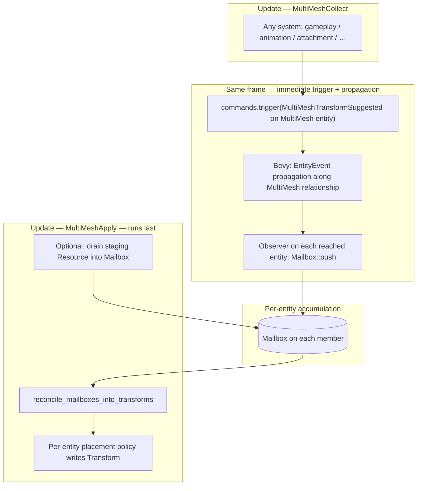
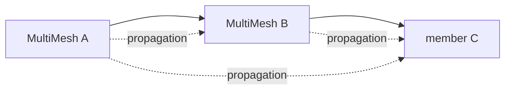

# RFC-N: Bevy Multi-mesh

- [Motivation](#motivation)
- [Prior art](#prior-art)
    - [In general](#in-general)
    - [Within `bevy`](#within-bevy)
- [Approaches considered](#approaches-considered)
- [Proposed design](#proposed-design)
    - [1. Core types (illustrative)](#1-core-types-illustrative)
    - [2. Why not write `Transform` directly?](#2-why-not-write-transform-directly)
    - [3. `EntityEvent`, observers, and aggregation](#3-entityevent-observers-and-aggregation)
    - [4. Schedule shape (system piping), traversal, and aggregation](#4-schedule-shape-system-piping-traversal-and-aggregation)
    - [5. From spawn to trigger (end-to-end sketch)](#5-from-spawn-to-trigger-end-to-end-sketch)
    - [6. Making the schedule easy for developers](#6-making-the-schedule-easy-for-developers)
    - [7. Generality](#7-generality)
    - [8. Physics (optional lane)](#8-physics-optional-lane)
- [References](#references)

## Motivation

> [!NOTE]
> Below are some relevant references to this concept which preceded this proposal:
>
> - [#86](https://github.com/ramate-io/maybraid/issues/86)

We want to **modularly compose** mesh generation, gameplay motion, and future animation so that:

- Many meshes can belong to **one logical assembly** (`MultiMesh`) with **dynamic attachment** (`MultiMesh` on `MultiMesh`).
- **Higher-level** motion (e.g. explosion knockback on the assembly) can combine with **part-local** state (e.g. leg angle from kinematics) without a single writer clobbering another.
- We stay **low-poly / rigid** in look: **smooth skinning is not the main tool**; intersections and part boundaries carry most of the visual burden.

We **do not** drive this by writing every consumer’s final [`Transform`](https://docs.rs/bevy/latest/bevy/prelude/struct.Transform.html) directly from a central system. Instead, assemblies emit **suggested** rigid transforms; each child **reconciles** suggestions with its own state (position vs rotation vs scale policies).

Open questions from the original draft (trait vs default behavior, “do legs keep their angle?”) are addressed by **reconciliation policy on the child** and by **layered contributions** in a mailbox rather than last-write-wins on one component.

## Prior art

### In general

Industry practice almost always factors **pose** into a **tree of transforms** (a [scene graph](https://en.wikipedia.org/wiki/Scene_graph)): each node has a local matrix; world matrices multiply down branches.

**Rigid multi-mesh** (our primary target): several meshes under a common logical assembly; motion is rigid transforms, not vertex skinning.

| Pros | Cons |
| --- | --- |
| Simple; matches ECS “entity per part” | Seams at joints unless art hides them |
| Easy LOD per part | More draw calls than one merged mesh |

**Skeletal (skinned) mesh** (context only): joints + weights + GPU skinning—see [glTF `skins`](https://registry.khronos.org/glTF/specs/2.0/glTF-2.0.html#skins), [GPU Gems — Dawn animation](https://developer.nvidia.com/gpugems/gpugems/part-i-natural-effects/chapter-4-animation-dawn-demo), [Unity: Skinned Mesh Renderer](https://docs.unity3d.com/6000.0/Documentation/Manual/class-SkinnedMeshRenderer.html).

> [!NOTE]
> **Tangent — local frame vs “ray only”**  
> A useful parent anchor is an **oriented plane / orthonormal frame**: origin + two in-plane axes; the third axis is the cross product (handedness fixed in code). Children store **local coordinates** in that frame; when the parent frame rotates, children move consistently. A bare **ray + uniform scale** under-specifies **roll** in the perpendicular plane unless the child supplies a reference direction or stores a full local pose.

### Within `bevy`

**Docs and examples**: [`Transform`](https://docs.rs/bevy/latest/bevy/prelude/struct.Transform.html), [`GlobalTransform`](https://docs.rs/bevy/latest/bevy/prelude/struct.GlobalTransform.html), [`bevy_animation`](https://docs.rs/bevy/latest/bevy/animation/index.html), [transform](https://bevy.org/examples/transforms/transform/) and [animated transform](https://bevy.org/examples/animation/animated-transform/) examples, [Bevy GitHub](https://github.com/bevyengine/bevy).

**Built-in**: `ChildOf` / `Children`, transform propagation, glTF scenes + optional skinned rigs.

**Gap**: No standard **procedural `MultiMesh`** contract or **multi-writer pose suggestion** path; this RFC defines that.

## Approaches Considered

- **Parented `Transform` only**: minimal; works when a single hierarchy and clear ownership suffice. Weak when **multiple sources** suggest motion for the same part in one tick.
- **Staging resource (`Vec` / queue) → drain**: best when **many systems** must append without `&mut` conflicts on the same entity; see tangent below.
- **Spawned “command entities”** per suggestion: flexible schedule control, **higher per-message cost** than buffers or observers.
- **Trait-heavy policy on parent**: flexible but couples parent to child enumeration; nesting gets awkward.

**Chosen direction**: **suggestive transforms** carried in a per-receiver **mailbox**, with **[`EntityEvent`](https://docs.rs/bevy/latest/bevy/ecs/event/trait.EntityEvent.html)** (and optionally custom **relationships** / propagation) for routing; **observers** append into the mailbox; **ordered systems** run reconciliation and downstream propagation. Reuse the mailbox idea as a **generic pattern** for other aggregated effects in a dedicated crate.

> [!TIP]
> **Tangent — `trigger` vs `Mailbox` concurrency**  
> Bevy’s observer path uses [`Commands::trigger`](https://docs.rs/bevy/latest/bevy/prelude/struct.Commands.html) / [`World::trigger`](https://docs.rs/bevy/latest/bevy/prelude/struct.World.html): triggers run **immediately** for that call—observers execute synchronously, not via the older **`Events<T>` + `EventWriter`** double-buffer pattern. **Per-entity `Mailbox`**: parallel systems still cannot take conflicting `&mut Mailbox` on the **same** entity; use **schedule order** or a **single staging `Resource`** (e.g. `Vec<(Entity, Msg)>`) that **one** drain system empties into mailboxes, then **piped** reconcile systems.

> [!TIP]
> **Tangent — spawn-per-message vs triggers / buffers**  
> Spawning short-lived “command entities” per suggestion adds **allocator and archetype** cost. **`trigger` + observer → `Mailbox::push`** (or a **staging `Resource` queue** then drain) is usually **lighter per message**; keep spawn markers only where you want **extreme** decoupling from producer systems.

> [!TIP]
> **Tangent — when observers run**  
>
> Observers run **synchronously** when the event is **triggered** (e.g. from a system). **System piping** (`chain`, `before` / `after`) orders **which system triggers** and **which system drains/reconciles**. Explicit **observer-to-observer** ordering is **not** a first-class API today; see [bevy#14890](https://github.com/bevyengine/bevy/issues/14890). For us, **ordering inside one system** or **one aggregate observer** is sufficient.

## Proposed Design

### 1. Core types (illustrative)

Mailbox entries carry **provenance** and a **depth** hint, so receivers can merge without losing hierarchy information when multiple `MultiMesh` levels contribute in one frame.

```rust
use bevy::prelude::*;

/// Who suggested this transform (logical source entity).
pub type FromEntity = Entity;

/// Distance or generation hint along the MultiMesh graph for merge policy
/// (exact definition TBD: e.g. hops from emitter, or stable rank in an assembly).
pub type Depth = u32;

#[derive(Clone, Debug)]
pub struct TransformSuggestion {
    pub from: FromEntity,
    pub depth: Depth,
    pub transform: Transform,
}

/// Drained each frame (or phase) by a reconcile system; producers only push.
#[derive(Component, Default)]
pub struct Mailbox {
    pub pending: Vec<TransformSuggestion>,
}

impl Mailbox {
    pub fn push(&mut self, suggestion: TransformSuggestion) {
        self.pending.push(suggestion);
    }

    /// Single ordered system calls this after producers for the phase have finished.
    pub fn drain(&mut self) -> Vec<TransformSuggestion> {
        std::mem::take(&mut self.pending)
    }
}
```

> [!NOTE]
> **Tangent — epochs / eviction**  
> Optional `tick: u32` (or epoch) on each entry supports **staleness** rules on drain: drop contributions from an old propagation wave or superseded pass without keyed lookup if we **always drain**.

### 2. Why not write `Transform` directly?

[`Transform`](https://docs.rs/bevy/latest/bevy/prelude/struct.Transform.html) remains the **authoritative** pose for rendering after reconciliation. **Suggestions** are a separate channel, so children can implement policies such as: adopt translation, preserve local rotation from animation, ignore scale, etc.

### 3. `EntityEvent`, observers, and aggregation

Define a(n) **`EntityEvent`**, so triggers can be **routed to a target entity** (see [`EntityEvent`](https://docs.rs/bevy/latest/bevy/ecs/event/trait.EntityEvent.html)). The payload carries one `TransformSuggestion`; repeated triggers in the same frame **append** to the mailbox.

[`On<E>`](https://docs.rs/bevy/latest/bevy/ecs/observer/struct.On.html) derefs to `E`; observers are normal systems and may use `Query`, `Commands`, etc.

```rust
use bevy::prelude::*; // `EntityEvent`, `On`, `Event` — see Bevy 0.18 prelude / `bevy::ecs::*`

/// Fired on a `MultiMesh` entity (and, via propagation, on each member that should receive the suggestion).
/// `propagate` uses a **crate-defined** [`Relationship`](https://docs.rs/bevy/latest/bevy/ecs/relationship/index.html)
/// / `Traversal` that walks **parent → children** along the multi-mesh graph.
///
/// Bevy’s **default** `#[entity_event(propagate)]` on `ChildOf` walks **up** (child → parent); see
/// [`EntityEvent`](https://docs.rs/bevy/latest/bevy/ecs/event/trait.EntityEvent.html). Multi-mesh needs the
/// opposite direction, so we supply our own `propagate = …` (same pattern as the `Click` + `Clickable` example
/// in those docs—custom edge type and traversal).
#[derive(EntityEvent, Event, Clone, Debug)]
#[entity_event(propagate = &'static MultiMeshContains)] // illustrative — follow parent → members (see Bevy `Traversal` API)
struct MultiMeshTransformSuggested {
    entity: Entity,
    suggestion: TransformSuggestion,
}

/// Illustrative relationship pair (mirror of `Clickable` / `ClickableBy` in Bevy docs): traversal follows
/// `MultiMeshContains` from a `MultiMesh` entity toward its members. Exact components TBD with Bevy’s
/// `#[relationship]` / `Traversal` constraints (avoid cycles).
#[derive(Component)]
#[relationship(relationship_target = MultiMeshMemberOf)]
struct MultiMeshContains(Vec<Entity>);

#[derive(Component)]
#[relationship_target(relationship = MultiMeshContains)]
struct MultiMeshMemberOf(Entity);

fn plugin(app: &mut App) {
    app.add_observer(append_suggestion_to_mailbox);
}

/// Global observer: on each trigger, push into the *target* entity’s `Mailbox`.
fn append_suggestion_to_mailbox(
    mut on: On<MultiMeshTransformSuggested>,
    mut q: Query<&mut Mailbox>,
) {
    let target = on.entity;
    if let Ok(mut mailbox) = q.get_mut(target) {
        mailbox.push(on.suggestion.clone());
    }
}

/// From an ordered system (placed in a `.chain()` where you need it):
fn emit_suggestion_to(mut commands: Commands, target: Entity, suggestion: TransformSuggestion) {
    commands.trigger(MultiMeshTransformSuggested {
        entity: target,
        suggestion,
    });
}
```

Use [Observers](https://bevy.org/examples/ecs-entity-component-system/observers/) for **entity-targeted** delivery; the observer **aggregates** by pushing into `Mailbox`. **Downward** propagation (suggestion on a `MultiMesh` → **every** member entity that should see it) is **not** a user-written traversal system: it is **`EntityEvent` propagation** along a **crate-defined relationship** (same idea as `Click` + `#[entity_event(propagate = &'static Clickable)]` in the [`EntityEvent` docs](https://docs.rs/bevy/latest/bevy/ecs/event/trait.EntityEvent.html)—we only change the edge type and traversal direction to match the multi-mesh graph).

### 4. Schedule shape (system piping), traversal, and aggregation

[`Commands::trigger`](https://docs.rs/bevy/latest/bevy/prelude/struct.Commands.html) is **immediate**: the mailbox observer runs **as soon as** the producer calls `trigger`. The “aggregation” guarantee is **scheduling**, not deferred triggers: **every system that may push suggestions runs in an earlier [`SystemSet`](https://docs.rs/bevy/latest/bevy/ecs/schedule/trait.SystemSet.html) than the single reconcile pass**, so each `Mailbox` reflects **all** contributions for that frame before placement runs.

Illustrative **information flow** (producers usually **trigger once per affected `MultiMesh`**; **engine propagation** fans out to members; one late pass reconciles into `Transform`):



**`MultiMesh` graph + why mailboxes exist** (nested assemblies: several sources may target the same part in one tick; reconcile merges by policy). **Solid** edges: membership / `ChildOf` for rendering; **dashed**: event propagation visits each member (no separate user “walk children” system).



**§5** (spawn → `trigger` → reconcile) and **§6** (plugin / `SystemSet` ergonomics) are intentionally separate: one is **what** runs on entities; the other is **where** those systems sit in the schedule.

### 5. From spawn to trigger (end-to-end sketch)

Mark **`MultiMesh`** on assembly nodes that may receive **root-level** suggestions; **every entity that accumulates suggestions** needs a **`Mailbox`**. Rendering may still use [`ChildOf`](https://docs.rs/bevy/latest/bevy/prelude/struct.ChildOf.html) / [`Children`](https://docs.rs/bevy/latest/bevy/prelude/struct.Children.html); **propagation** for this RFC uses the **crate-defined** `MultiMeshContains` / `MultiMeshMemberOf` pair (§3) so behavior matches the multi-mesh graph (and can diverge from `ChildOf` if needed).

Arbitrary systems **do not** implement a “push to all children” loop: they **`trigger` on the `MultiMesh` entity** (or on whichever node the design treats as the suggestion source); **`#[entity_event(propagate = …)]`** delivers the event along the **multi-mesh** relationship, so **each** reached entity’s observer runs and **`Mailbox::push`** executes. That mirrors the [`EntityEvent` propagation examples](https://docs.rs/bevy/latest/bevy/ecs/event/trait.EntityEvent.html) (`Click` + `Clickable`), except our traversal is **down** the multi-mesh edges instead of **up** `ChildOf`.

Optionally, the **multi-mesh crate** can observe **`Transform`** insertion or changes on `With<MultiMesh>` and emit the same `MultiMeshTransformSuggested`, so gameplay code that only sets **`Transform`** still fans out to members without calling **`trigger`** explicitly.

```rust
use bevy::prelude::*;

#[derive(Component)]
struct MultiMesh;

fn spawn_assembly(mut commands: Commands) {
    let root = commands.spawn((MultiMesh, Transform::default())).id();

    let torso = commands
        .spawn((
            Mailbox::default(),
            Transform::default(),
            ChildOf(root),
            MultiMeshMemberOf(root),
        ))
        .id();

    // Parent lists members for propagation traversal (sync with `MultiMeshMemberOf` in real code).
    commands.entity(root).insert(MultiMeshContains(vec![torso]));

    // Nested `MultiMesh` / more members: same pattern — Mailbox + graph edges.
}

/// Producer (runs in `MultiMeshCollect`): one trigger per affected assembly; propagation fans out.
/// Does not assign members’ final `Transform`; reconcile does that later.
fn explosion_suggests_knockback(mut commands: Commands, roots: Query<Entity, With<MultiMesh>>) {
    for entity in &roots {
        commands.trigger(MultiMeshTransformSuggested {
            entity,
            suggestion: TransformSuggestion {
                from: entity,
                depth: 0,
                transform: Transform::from_translation(Vec3::Y), // illustrative delta
            },
        });
    }
}

/// Late pass (runs in `MultiMeshApply`): drain mailbox, merge, write Transform (or ignore channels).
fn reconcile_mailboxes_into_transforms(mut q: Query<(&mut Mailbox, &mut Transform)>) {
    for (mut mailbox, mut transform) in &mut q {
        let batch = mailbox.drain();
        // Sort/filter by (depth, from); compose; then:
        // *transform = composed;
        let _ = batch;
    }
}
```

Placement policy can live **inside** `reconcile_mailboxes_into_transforms` or in a follow-up system that only runs on entities with a `Policy` component; the RFC only requires **one ordered reconcile** after all producers.

> [!NOTE]
> **Tangent — Bevy’s default propagation direction**  
> The [`EntityEvent` docs](https://docs.rs/bevy/latest/bevy/ecs/event/trait.EntityEvent.html) note that `#[entity_event(propagate)]` **defaults** to following **`ChildOf` upward** (child → parent). Multi-mesh **fan-out** to descendants uses a **custom** `propagate = &'static …` relationship (same *pattern* as `Click` + `Clickable` / `ClickableBy`, reproduced below for orientation—our components differ).

```rust
// From Bevy docs (propagation along a custom relationship — pattern reference only):
#[derive(Component)]
#[relationship(relationship_target = ClickableBy)]
struct Clickable(Entity);

#[derive(Component)]
#[relationship_target(relationship = Clickable)]
struct ClickableBy(Vec<Entity>);

#[derive(EntityEvent)]
#[entity_event(propagate = &'static Clickable)]
struct Click {
    entity: Entity,
}
```

### 6. Making the schedule easy for developers

**Goal:** game and animation crates register systems that **only** emit suggestions; the multi-mesh crate owns **observer + reconcile order**. Developers should not hand-wire `before`/`after` chains per game system.

Conventions:

1. **Two sets on `Update` (or your schedule of choice), strictly chained** — e.g. `MultiMeshCollect` then `MultiMeshApply`. Names are examples.
2. **Document:** “Any system that calls `trigger(MultiMeshTransformSuggested { … })` must be in `MultiMeshCollect`.” Optional: **debug** assertion or CI lint later.
3. *Optional:* a **`MultiMeshPlugin::register_producer`** helper that only adds the system into the collect set, so authors cannot forget the set.

Illustrative registration ([`configure_sets`](https://docs.rs/bevy/latest/bevy/prelude/struct.App.html#method.configure_sets), [`in_set`](https://docs.rs/bevy/latest/bevy/prelude/trait.IntoScheduleConfigs.html)):

```rust
use bevy::prelude::*;

#[derive(SystemSet, Debug, Clone, PartialEq, Eq, Hash)]
enum MultiMeshSet {
    /// All systems that may trigger suggestions or append to staging.
    Collect,
    /// Staging drain (optional) + reconcile + placement — one coherent “apply” block.
    /// Downward fan-out uses `EntityEvent` propagation (§3–5), not a user traversal system here.
    Apply,
}

fn multimesh_plugin(app: &mut App) {
    // Same observer as in §3 — register once per app.
    app.add_observer(append_suggestion_to_mailbox)
        .configure_sets(
            Update,
            (MultiMeshSet::Collect, MultiMeshSet::Apply).chain(),
        )
        // Gameplay / animation plugins add their producers with `.in_set(MultiMeshSet::Collect)`:
        .add_systems(Update, explosion_suggests_knockback.in_set(MultiMeshSet::Collect))
        // Multimesh crate owns apply block — single place, runs late within Update:
        .add_systems(
            Update,
            (
                drain_staging_queue_into_mailboxes, // optional; no-op if unused
                reconcile_mailboxes_into_transforms,
            )
                .chain()
                .in_set(MultiMeshSet::Apply),
        );
}
```

**Why “late” still works with immediate `trigger`:** during `MultiMeshCollect`, each `trigger` **instantly** appends to `Mailbox`. Nothing clears the mailbox until **`reconcile_mailboxes_into_transforms`** in `MultiMeshApply`, so the reconcile system sees the **union** of every producer that ran earlier in the frame.

Stage list (names stay illustrative):

1. **`MultiMeshSet::Collect`** — any system that **`trigger`s** `MultiMeshTransformSuggested` (or appends staging). Propagation and mailbox pushes run **immediately** as part of each `trigger`.
2. **Optional** — `drain_staging_queue_into_mailboxes` at the **start** of `Apply`.
3. **`reconcile_mailboxes_into_transforms`** — `drain()`, merge by `(depth, from, …)`, write **`Transform`** (or intermediates).

> [!TIP]
> **Tangent — nested `MultiMesh` and overwrite**  
> A single `Transform` slot on a child would **lose** contributions when both an ancestor and an intermediate `MultiMesh` write in one tick. The **mailbox + `(FromEntity, Depth)`** (and a defined **merge order**) preserves provenance, so reconciliation can compose rather than overwrite.

### 7. Generality

`Mailbox<T>` (or a small family of mailboxes) with the same **push / drain / reconcile** pattern applies to other **multi-source** effects (forces, damage, animation hints). **Multi-mesh transforms** are the first consumer.

### 8. Physics (optional lane)

A **force** or **placement** API can coexist: impulses go through physics; **kinematic** assembly motion goes through **mailbox suggestions**. Keeping both avoids forcing all motion through the physics solver.

## References

- [`maybraid`#86 — Multi-mesh manipulation](https://github.com/ramate-io/maybraid/issues/86)
- [Bevy `EntityEvent`](https://docs.rs/bevy/latest/bevy/ecs/event/trait.EntityEvent.html)
- [Bevy observers example](https://bevy.org/examples/ecs-entity-component-system/observers/)
- [Observer ordering discussion](https://github.com/bevyengine/bevy/issues/14890)
