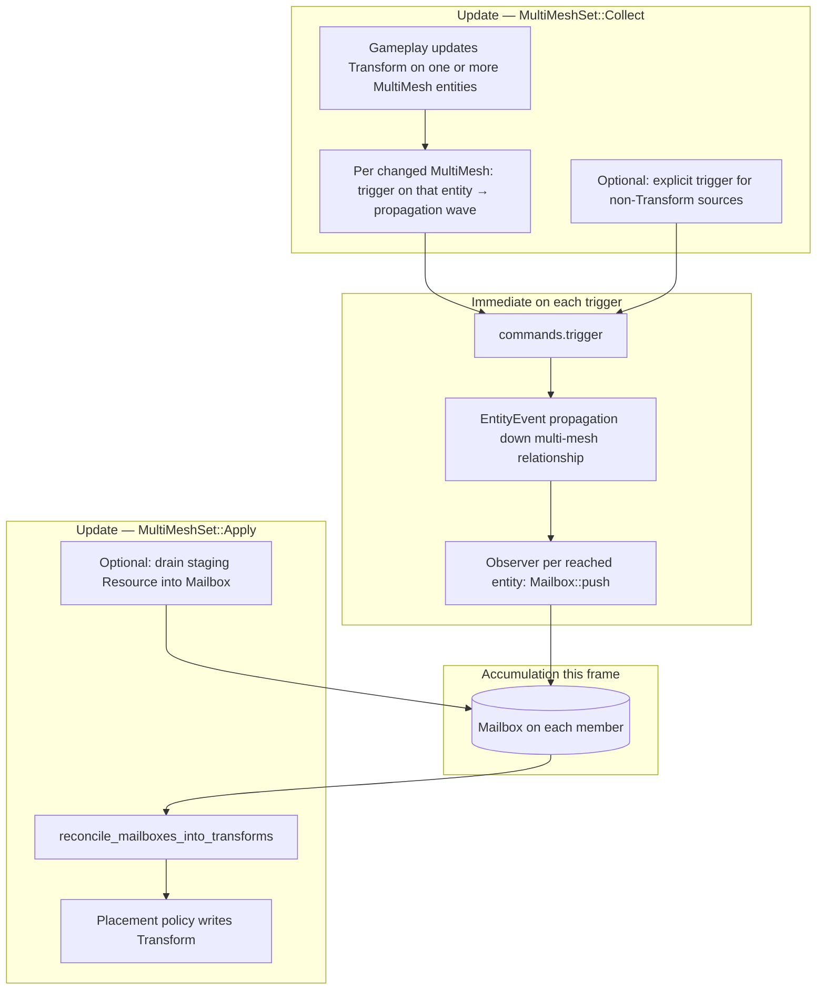
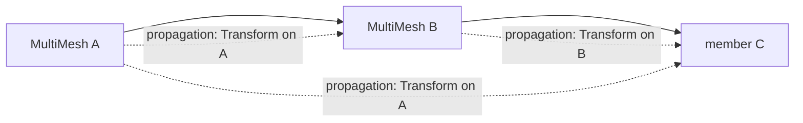

# RFC-88: Bevy Multi-mesh

## Table of contents

- [1. Motivation](#1-motivation)
- [2. Prior art](#2-prior-art)
    - [2.1 In general](#21-in-general)
    - [2.2 Within `bevy`](#22-within-bevy)
- [3. Approaches considered](#3-approaches-considered)
- [4. Proposed design](#4-proposed-design)
    - [4.1 Core types (illustrative)](#41-core-types-illustrative)
    - [4.2 Why not write `Transform` directly?](#42-why-not-write-transform-directly)
    - [4.3 `EntityEvent`, observers, and aggregation](#43-entityevent-observers-and-aggregation)
    - [4.4 Schedule shape (system piping), traversal, and aggregation](#44-schedule-shape-system-piping-traversal-and-aggregation)
    - [4.5 From spawn to trigger (end-to-end sketch)](#45-from-spawn-to-trigger-end-to-end-sketch)
    - [4.6 Making the schedule easy for developers](#46-making-the-schedule-easy-for-developers)
    - [4.7 Generality](#47-generality)
    - [4.8 Physics (optional lane)](#48-physics-optional-lane)
- [5. References](#5-references)

## 1. Motivation

> [!NOTE]
> Below are some relevant references to this concept which preceded this proposal:
>
> - [#86](https://github.com/ramate-io/maybraid/issues/86)

We propose a means of composing mesh generation, gameplay motion, and future animation when many meshes belong to one logical assembly (`MultiMesh`), including nested attachment. We target a **low-poly, rigid** look: smooth skinning is background context, not the main technique.

Game code should be able to move an assembly by updating a [`Transform`](https://docs.rs/bevy/latest/bevy/prelude/struct.Transform.html) on the **`MultiMesh` entity that owns that motion** (nested assemblies may have several such nodes), while **part-local** state (for example leg angle from kinematics) still merges cleanly. We avoid a single central writer overwriting every child’s final pose. Instead, children receive **suggestions** in a **mailbox**, run **reconciliation** (policy per entity: translation only, preserve rotation, and so on), and only then treat [`Transform`](https://docs.rs/bevy/latest/bevy/prelude/struct.Transform.html) as authoritative for rendering.

## 2. Prior art

### 2.1 In general

Industry practice almost always factors **pose** into a **tree of transforms** (a [scene graph](https://en.wikipedia.org/wiki/Scene_graph)): each node has a local matrix; world matrices multiply down branches.

**Rigid multi-mesh** (our primary target): several meshes under a common logical assembly; motion is rigid transforms, not vertex skinning.

| Pros | Cons |
| --- | --- |
| Simple; matches ECS “entity per part” | Seams at joints unless art hides them |
| Easy LOD per part | More draw calls than one merged mesh |

**Skeletal (skinned) mesh** (context only): joints + weights + GPU skinning—see [glTF `skins`](https://registry.khronos.org/glTF/specs/2.0/glTF-2.0.html#skins), [GPU Gems — Dawn animation](https://developer.nvidia.com/gpugems/gpugems/part-i-natural-effects/chapter-4-animation-dawn-demo), [Unity: Skinned Mesh Renderer](https://docs.unity3d.com/6000.0/Documentation/Manual/class-SkinnedMeshRenderer.html).

> [!NOTE]
> **Tangent — local frame vs “ray only”**  
> A useful parent anchor is an **oriented plane / orthonormal frame**: origin + two in-plane axes; the third axis is the cross product (handedness fixed in code). Children store **local coordinates** in that frame; when the parent frame rotates, children move consistently. A bare **ray + uniform scale** under-specifies **roll** in the perpendicular plane unless the child supplies a reference direction or stores a full local pose.

### 2.2 Within `bevy`

Bevy documents hierarchy and animation through [`Transform`](https://docs.rs/bevy/latest/bevy/prelude/struct.Transform.html), [`GlobalTransform`](https://docs.rs/bevy/latest/bevy/prelude/struct.GlobalTransform.html), [`bevy_animation`](https://docs.rs/bevy/latest/bevy/animation/index.html), and examples such as [transform](https://bevy.org/examples/transforms/transform/) and [animated transform](https://bevy.org/examples/animation/animated-transform/). The engine already provides `ChildOf` / `Children`, transform propagation, and glTF scenes with optional skinned rigs. It does **not** define a standard **procedural `MultiMesh`** contract or a **multi-writer suggestion** path; this RFC fills that gap.

## 3. Approaches considered

Parented [`Transform`](https://docs.rs/bevy/latest/bevy/prelude/struct.Transform.html) alone is enough when one system owns each entity and there is only one writer per tick. It breaks down when several sources suggest motion for the same part, or when nested assemblies need to preserve **who** suggested what.

**Chosen direction:** per-receiver **`Mailbox`**, **[`EntityEvent`](https://docs.rs/bevy/latest/bevy/ecs/event/trait.EntityEvent.html)** routing, **`commands.trigger` / `world.trigger`** (immediate), and **observers** that append to mailboxes. **`#[entity_event(propagate = …)]`** fans each suggestion **downward from the triggered `MultiMesh`** along the multi-mesh graph (separate **`Transform`** changes on different `MultiMesh` nodes produce **separate** waves). Game code never hand-rolls a child loop. A late **reconcile** system drains mailboxes and writes final transforms. The same mailbox pattern can generalize to other multi-source effects in a small crate.

> [!TIP]
> **Concurrency and cost**  
> [`Commands::trigger`](https://docs.rs/bevy/latest/bevy/prelude/struct.Commands.html) and [`World::trigger`](https://docs.rs/bevy/latest/bevy/prelude/struct.World.html) run **immediately**; observers are not deferred like the old `Events` / `EventWriter` path. Parallel systems must not take conflicting `&mut Mailbox` on the same entity; use **schedule order** or a **staging `Resource`** drained by one system. Spawning a marker entity per message is usually more expensive than **`trigger` + observer** or a short staging queue.

> [!TIP]
> **Observer ordering**  
> Observers run when the event fires. You order behavior with **system** scheduling (`chain`, `before` / `after`), not with observer-to-observer ordering ([bevy#14890](https://github.com/bevyengine/bevy/issues/14890)).

## 4. Proposed design

### 4.1 Core types (illustrative)

Each mailbox entry records **who** emitted the suggestion and a **depth** hint along the multi-mesh graph, so one child can merge contributions from an ancestor and an intermediate `MultiMesh` in the same frame without last-write-wins.

```rust
use bevy::prelude::*;

/// Who suggested this transform (logical source entity).
pub type FromEntity = Entity;

/// Distance or generation hint along the MultiMesh graph for merge policy
/// (exact definition TBD: e.g. hops from emitter, or stable rank in an assembly).
pub type Depth = u32;

#[derive(Clone, Debug)]
pub struct TransformSuggestion {
    pub from: FromEntity,
    pub depth: Depth,
    pub transform: Transform,
}

/// Drained each frame (or phase) by a reconcile system; producers only push.
#[derive(Component, Default)]
pub struct Mailbox {
    pub pending: Vec<TransformSuggestion>,
}

impl Mailbox {
    pub fn push(&mut self, suggestion: TransformSuggestion) {
        self.pending.push(suggestion);
    }

    /// Single ordered system calls this after producers for the phase have finished.
    pub fn drain(&mut self) -> Vec<TransformSuggestion> {
        std::mem::take(&mut self.pending)
    }
}
```

> [!NOTE]
> **Tangent — epochs / eviction**  
> Optional `tick: u32` (or epoch) on each entry supports **staleness** rules on drain: drop contributions from an old propagation wave or superseded pass without keyed lookup if we **always drain**.

### 4.2 Why not write `Transform` directly?

After reconciliation, [`Transform`](https://docs.rs/bevy/latest/bevy/prelude/struct.Transform.html) stays the **authoritative** pose for rendering. **Suggestions** live in a separate channel, so each child can decide how to combine translation, rotation, and scale before committing.

### 4.3 `EntityEvent`, observers, and aggregation

We define a(n) [`EntityEvent`](https://docs.rs/bevy/latest/bevy/ecs/event/trait.EntityEvent.html), so Bevy can route a trigger to a target entity and, with **`#[entity_event(propagate = …)]`**, walk the multi-mesh relationship **downward from that target**. Each firing delivers one `TransformSuggestion`; repeated firings in the same frame **append** to the target’s `Mailbox`. [`On<E>`](https://docs.rs/bevy/latest/bevy/ecs/observer/struct.On.html) behaves like a normal system parameter and derefs to `E`, so observers may use `Query`, `Commands`, and the rest of the usual toolkit.

Bevy’s **default** `#[entity_event(propagate)]` follows **`ChildOf` upward** (child to parent). We need **parent-to-member** fan-out, so we follow the same **pattern** as the `Click` + `Clickable` / `ClickableBy` example in the [`EntityEvent` docs](https://docs.rs/bevy/latest/bevy/ecs/event/trait.EntityEvent.html), but with our own relationship type and traversal (see snippet below).

```rust
use bevy::prelude::*; // `EntityEvent`, `On`, `Event` — see Bevy 0.18 prelude / `bevy::ecs::*`

#[derive(EntityEvent, Event, Clone, Debug)]
#[entity_event(propagate = &'static MultiMeshContains)] // illustrative — follow parent → members (see Bevy `Traversal` API)
struct MultiMeshTransformSuggested {
    entity: Entity,
    suggestion: TransformSuggestion,
}

/// Illustrative relationship pair (mirror of `Clickable` / `ClickableBy` in Bevy docs): traversal follows
/// `MultiMeshContains` from a `MultiMesh` entity toward its members. Exact components TBD with Bevy’s
/// `#[relationship]` / `Traversal` constraints (avoid cycles).
#[derive(Component)]
#[relationship(relationship_target = MultiMeshMemberOf)]
struct MultiMeshContains(Vec<Entity>);

#[derive(Component)]
#[relationship_target(relationship = MultiMeshContains)]
struct MultiMeshMemberOf(Entity);

fn plugin(app: &mut App) {
    app.add_observer(append_suggestion_to_mailbox);
}

/// Global observer: on each trigger, push into the *target* entity’s `Mailbox`.
fn append_suggestion_to_mailbox(
    mut on: On<MultiMeshTransformSuggested>,
    mut q: Query<&mut Mailbox>,
) {
    let target = on.entity;
    if let Ok(mut mailbox) = q.get_mut(target) {
        mailbox.push(on.suggestion.clone());
    }
}

/// Secondary path: explicit `trigger` when the suggestion does not come from a `Transform` change on `MultiMesh`.
fn emit_suggestion_to(mut commands: Commands, target: Entity, suggestion: TransformSuggestion) {
    commands.trigger(MultiMeshTransformSuggested {
        entity: target,
        suggestion,
    });
}
```

Pattern reference from Bevy’s [`EntityEvent`](https://docs.rs/bevy/latest/bevy/ecs/event/trait.EntityEvent.html) docs (custom relationship; propagation walks these edges):

```rust
#[derive(Component)]
#[relationship(relationship_target = ClickableBy)]
struct Clickable(Entity);

#[derive(Component)]
#[relationship_target(relationship = Clickable)]
struct ClickableBy(Vec<Entity>);

#[derive(EntityEvent)]
#[entity_event(propagate = &'static Clickable)]
struct Click {
    entity: Entity,
}
```

[Observers](https://bevy.org/examples/ecs-entity-component-system/observers/) perform entity-targeted delivery. The global observer appends each payload to the target `Mailbox`. **`#[entity_event(propagate = …)]`** fans out **from the entity that was triggered** (the `MultiMesh` whose **`Transform` changed**, or the explicit `trigger` target) **down** the multi-mesh relationship, so each wave carries **that** node’s suggestion to **its** members only. Nested `MultiMesh` nodes therefore issue **separate** waves when their own transforms change; gameplay never implements a manual “for each child” loop.

### 4.4 Schedule shape (system piping), traversal, and aggregation

[`Commands::trigger`](https://docs.rs/bevy/latest/bevy/prelude/struct.Commands.html) and [`World::trigger`](https://docs.rs/bevy/latest/bevy/prelude/struct.World.html) are **immediate**: the mailbox observer runs as soon as the trigger fires. Each **`Transform`** change on a given **`MultiMesh`** produces a **trigger on that same entity**; propagation then visits **that entity’s** members (for example **B** and **C** after **A** moves, and **C** again after **B** moves—see the diagram below). Mailboxes still end up **complete** before reconcile because **nothing drains** them until the **Apply** phase, and every producer (including per-`MultiMesh` **`Transform`** watchers) runs in **Collect**, which is ordered **before** **Apply** via [`SystemSet`](https://docs.rs/bevy/latest/bevy/ecs/schedule/trait.SystemSet.html).



Solid edges in the assembly graph are ordinary hierarchy (`ChildOf` / `Children`) for rendering. Dashed edges in the diagram below are **event propagation**. Each wave is tied to **one** `MultiMesh` whose **`Transform` changed** (or that was the explicit `trigger` target): the suggestion derived from **A** reaches **A’s** descendants in the multi-mesh graph; a change on **B** produces a separate propagation that reaches **B’s** descendants (here, **C**). **C** may therefore receive **both** in the same frame, which is why mailboxes merge by provenance.



Section **4.5** describes **what** is spawned and how the primary `Transform` path ties to `trigger`. Section **4.6** describes **where** systems sit in the schedule.

### 4.5 From spawn to trigger (end-to-end sketch)

Tag assembly roots and nested nodes with **`MultiMesh`**. Every entity that accumulates suggestions needs a **`Mailbox`**. Rendering can keep using [`ChildOf`](https://docs.rs/bevy/latest/bevy/prelude/struct.ChildOf.html) / [`Children`](https://docs.rs/bevy/latest/bevy/prelude/struct.Children.html) while **`MultiMeshContains` / `MultiMeshMemberOf`** (see **4.3**) define the graph that **`EntityEvent` propagation** follows. That graph may differ from `ChildOf` if the design requires it.

The **primary path** is that **when a given `MultiMesh` entity’s `Transform` changes**, the multi-mesh crate reacts (system, observer on change, or equivalent hook) and calls **`commands.trigger(MultiMeshTransformSuggested { … })`** **on that same entity**, with a `TransformSuggestion` that describes the motion attributable to **that** node. Bevy then propagates **that** event **down** the multi-mesh relationship, so **only that node’s subtree** receives this wave: members run **`Mailbox::push`** for the suggestion tied to **A’s** transform, **B’s** transform, and so on independently. Gameplay usually **only** edits `Transform` on the `MultiMesh` that should move; it does not enumerate children.

**Explicit `trigger`** remains available when the suggestion is **not** derived from a `Transform` change on `MultiMesh` (for example a purely logical offset from an explosion entity). The trigger still targets **one** entity; propagation behaves the same way from that target.

```rust
use bevy::prelude::*;

#[derive(Component)]
struct MultiMesh;

fn spawn_assembly(mut commands: Commands) {
    let root = commands.spawn((MultiMesh, Transform::default())).id();

    let torso = commands
        .spawn((
            Mailbox::default(),
            Transform::default(),
            ChildOf(root),
            MultiMeshMemberOf(root),
        ))
        .id();

    commands.entity(root).insert(MultiMeshContains(vec![torso]));
}

/// Runs in Collect: compares current vs previous `Transform` on `MultiMesh`, triggers when changed.
fn multimesh_transform_changed_triggers_suggestions(
    mut commands: Commands,
    // e.g. `Changed<Transform>` + `With<MultiMesh>` — sketch only
) {
    // commands.trigger(MultiMeshTransformSuggested { entity, suggestion });
}

/// Collect — secondary path: explicit trigger without going through MultiMesh Transform.
fn explosion_triggers_suggestion(mut commands: Commands, roots: Query<Entity, With<MultiMesh>>) {
    for entity in &roots {
        commands.trigger(MultiMeshTransformSuggested {
            entity,
            suggestion: TransformSuggestion {
                from: entity,
                depth: 0,
                transform: Transform::from_translation(Vec3::Y),
            },
        });
    }
}

/// Apply: drain, merge, write Transform.
fn reconcile_mailboxes_into_transforms(mut q: Query<(&mut Mailbox, &mut Transform)>) {
    for (mut mailbox, mut transform) in &mut q {
        let _suggestions = mailbox.drain();
        // Merge `_suggestions` by policy, then assign `*transform`.
    }
}
```

Reconciliation can live entirely inside `reconcile_mailboxes_into_transforms` or split into a small follow-up system for entities with a dedicated policy component.

### 4.6 Making the schedule easy for developers

The multi-mesh crate should own **observer registration** and the **Collect / Apply** split, so game crates only register producers into the right set instead of hand-wiring long `before` / `after` chains.

Use two chained sets on `Update` (names are examples). **Collect** runs anything that may end up calling **`trigger`**—including the system that watches **`Transform`** on **`MultiMesh`**. **Apply** runs optional staging drain, then **`reconcile_mailboxes_into_transforms`**. Document that rule, and optionally provide **`MultiMeshPlugin::register_producer`**, so third-party systems cannot accidentally land in the wrong set.

Illustrative registration ([`configure_sets`](https://docs.rs/bevy/latest/bevy/prelude/struct.App.html#method.configure_sets), [`in_set`](https://docs.rs/bevy/latest/bevy/prelude/trait.IntoScheduleConfigs.html)):

```rust
use bevy::prelude::*;

#[derive(SystemSet, Debug, Clone, PartialEq, Eq, Hash)]
enum MultiMeshSet {
    /// All systems that may trigger suggestions or append to staging.
    Collect,
    /// Staging drain (optional) + reconcile + placement — one coherent “apply” block.
    /// Downward fan-out uses `EntityEvent` propagation (see sections 4.3 and 4.5), not a user traversal system.
    Apply,
}

fn multimesh_plugin(app: &mut App) {
    // Register the mailbox observer once per app (see section 4.3).
    app.add_observer(append_suggestion_to_mailbox)
        .configure_sets(
            Update,
            (MultiMeshSet::Collect, MultiMeshSet::Apply).chain(),
        )
        // Gameplay / animation plugins add their producers with `.in_set(MultiMeshSet::Collect)`:
        .add_systems(
            Update,
            (
                multimesh_transform_changed_triggers_suggestions,
                explosion_triggers_suggestion,
            )
                .in_set(MultiMeshSet::Collect),
        )
        // Multimesh crate owns apply block — single place, runs late within Update:
        .add_systems(
            Update,
            (
                drain_staging_queue_into_mailboxes, // optional; no-op if unused
                reconcile_mailboxes_into_transforms,
            )
                .chain()
                .in_set(MultiMeshSet::Apply),
        );
}
```

During **Collect**, every `trigger` (including the one issued after a **`Transform`** change on **`MultiMesh`**) runs **immediately** and fills mailboxes through observers and propagation. During **Apply**, **`reconcile_mailboxes_into_transforms`** is the first place mailboxes are drained, so reconcile always sees the **full** set of suggestions from that frame.

1. **`MultiMeshSet::Collect`** — gameplay, **`Transform` watchers** on **`MultiMesh`**, and any explicit **`trigger`** or staging producer.
2. **Optional** — `drain_staging_queue_into_mailboxes` at the start of **Apply**.
3. **`reconcile_mailboxes_into_transforms`** — `drain()`, merge, write **`Transform`**.

> [!TIP]
> **Tangent — nested `MultiMesh` and overwrite**  
> A single `Transform` slot on a child would **lose** contributions when both **A’s** and **B’s** `Transform` updates fire in the same tick (as in the **A–B–C** diagram: **C** may get one suggestion wave from **Transform on A** and another from **Transform on B**). The **mailbox + `(FromEntity, Depth)`** (and a defined **merge order**) preserves provenance, so reconciliation can compose rather than overwrite.

### 4.7 Generality

The same **push / drain / reconcile** pattern generalizes to a generic **`Mailbox<T>`** (or a small family of types) for other multi-source effects such as forces, damage, or animation hints. Multi-mesh transforms are the first use case.

### 4.8 Physics (optional lane)

Physics-based **forces** or **placement** helpers can coexist with this design: impulses stay in the physics world while **kinematic** assembly motion continues to flow through **mailbox suggestions**, so nothing forces every motion through the solver.

## 5. References

- [`maybraid`#86 — Multi-mesh manipulation](https://github.com/ramate-io/maybraid/issues/86)
- [Bevy `EntityEvent`](https://docs.rs/bevy/latest/bevy/ecs/event/trait.EntityEvent.html)
- [Bevy observers example](https://bevy.org/examples/ecs-entity-component-system/observers/)
- [Observer ordering discussion](https://github.com/bevyengine/bevy/issues/14890)
