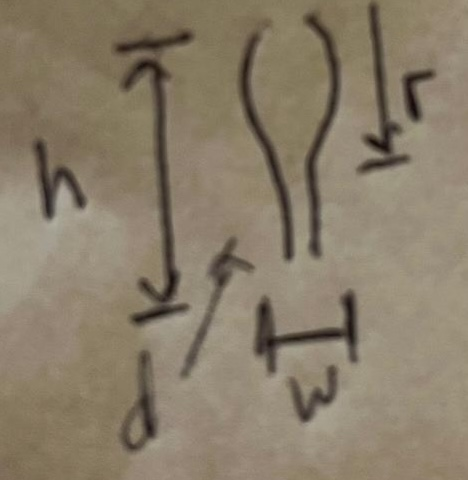

# Drumstick

The drumstick lower limb mesh or multi-mesh is a simple design found in nature. It is roughly a cylinder, but with a bulbous region.

**Semantics.** In local space, `height` runs along the limb segment (long axis). `width` and `depth` are the two cross-section extents orthogonal to that axis (ellipse or box); keep the same convention as the generator (half-extents vs full width) everywhere. **Top** is the **proximal** end of this asset (toward the body/trunk joint); **bottom** is distal.

## Parameters

- `height`: total extent along the limb axis.
- `depth`: cross-section depth (orthogonal to `height`).
- `width`: cross-section width (orthogonal to `height`).
- `drop`: distance from the proximal end (**top**) to the distal end of the bulbous region (where the bulge ends toward the distal side).
- `offset`: optional shift along the limb axis of the bulbous region (e.g. moves where the bulb begins relative to the proximal end).

**Optional:** geodesic refinement or noise-driven bumps for surface detail—extras on top of the base silhouette, not required for the primitive shape.
