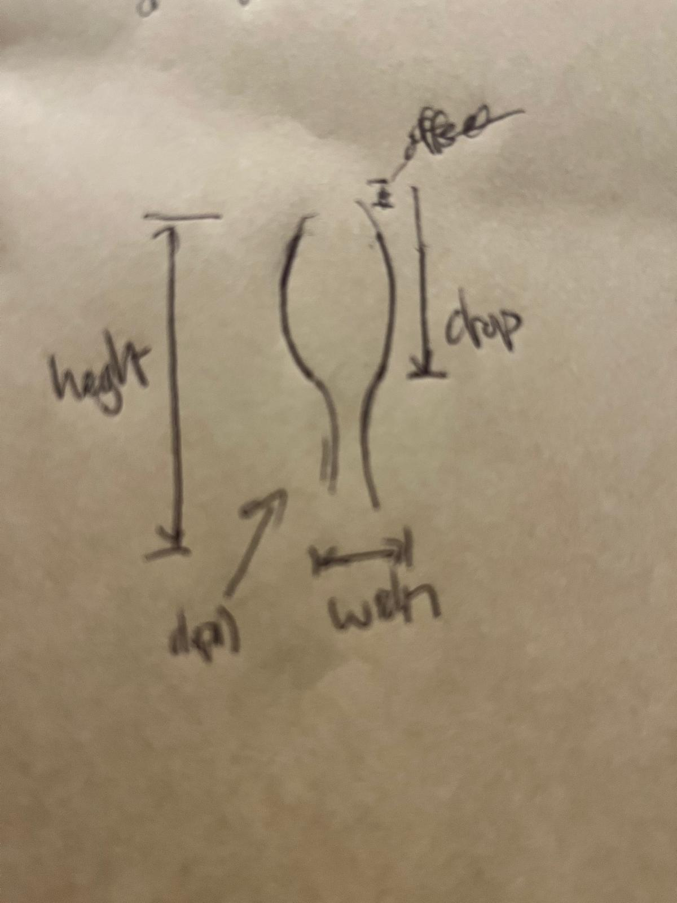

# Drumstick

An elongated primitive: roughly a **cylinder** with a **bulbous** region along the primary axis—common in natural limbs and useful anywhere a single segment should read as “shaft + swell.”

**Semantics.** In local space, `height` runs along the segment **long axis**. `width` and `depth` are cross-section extents orthogonal to that axis (ellipse or box); keep half-extents vs full width consistent with the generator. **Top** and **bottom** label the two ends along `height`; when embedded in a limb, **top** is usually **proximal** (toward the body) and **bottom** **distal**—other features may parent either end differently.

Treat the segment as a **bulge** run plus a **non-bulge** (**shaft**) run along `height`. Axial bulge length can be given as `drop` (from the reference end along the axis) or implied by `bulge_to_shaft_ratio` with `height`; if both are supplied, enforce one consistent split.

## Parameters

**API note:** Names and shapes here are **suggestive**—they document intent until a generator or schema fixes the real types. In particular, bulge taper will likely need a **polynomial** (or coefficient list) over normalized position along the bulge, not a single scalar; the scalar below is a placeholder for “how much pinch.”

- `height`: total extent along the long axis.
- `depth`: cross-section depth (orthogonal to `height`).
- `width`: cross-section width (orthogonal to `height`); interpret as the maximum across the bulge unless tapering pulls it down toward the bulge ends.
- `drop`: distance from the reference end (**top**) to the far end of the bulbous region along the axis—i.e. axial length of the bulge from that reference.
- `bulge_to_shaft_ratio`: ratio of axial bulge length to axial non-bulge length (bulge divided by shaft). For a simple two-part segment, bulge length = `height * bulge_to_shaft_ratio / (1 + bulge_to_shaft_ratio)`.
- `bulge_width_taper`: placeholder for bulge **width** falloff from maximum toward the two ends of the bulge (`0` ≈ constant; `1` ≈ full pinch to shaft width at the ends). Expect replacement by a polynomial (or similar) taper later. Use the same curve for `depth` when the profile is isotropic; otherwise split tapers explicitly later.
- `offset`: optional shift along the long axis of the bulbous region (moves where the bulb begins relative to the reference end).

**Optional:** geodesic refinement or noise-driven bumps for surface detail—extras on top of the base silhouette, not required for the primitive shape.

## Crozon feature uses

- [Lower limb](../../lower-limb/drumstick/README.md)
- [Upper limb](../../upper-limb/drumstick/README.md)
- [Torso](../../torso/drumstick/README.md)
- [Nose and snout](../../nose-snout/drumstick/README.md)
- [Eye](../../eye/drumstick/README.md)
